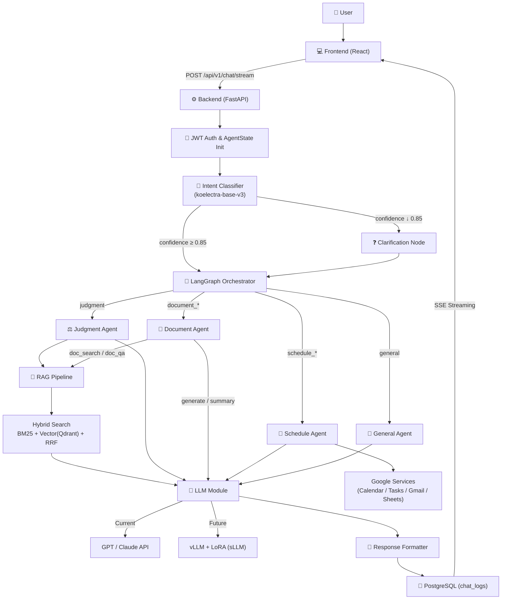
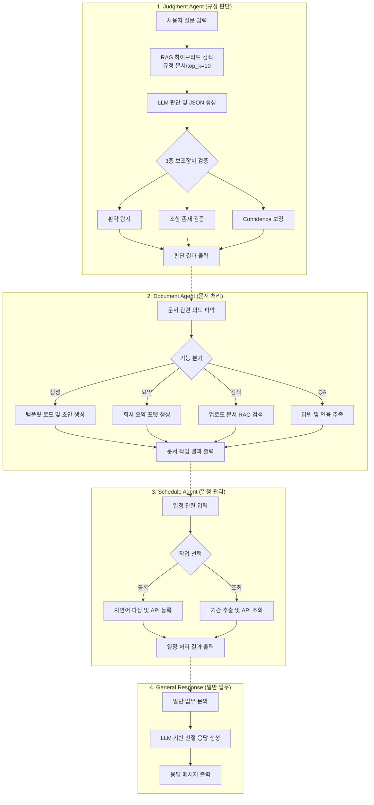
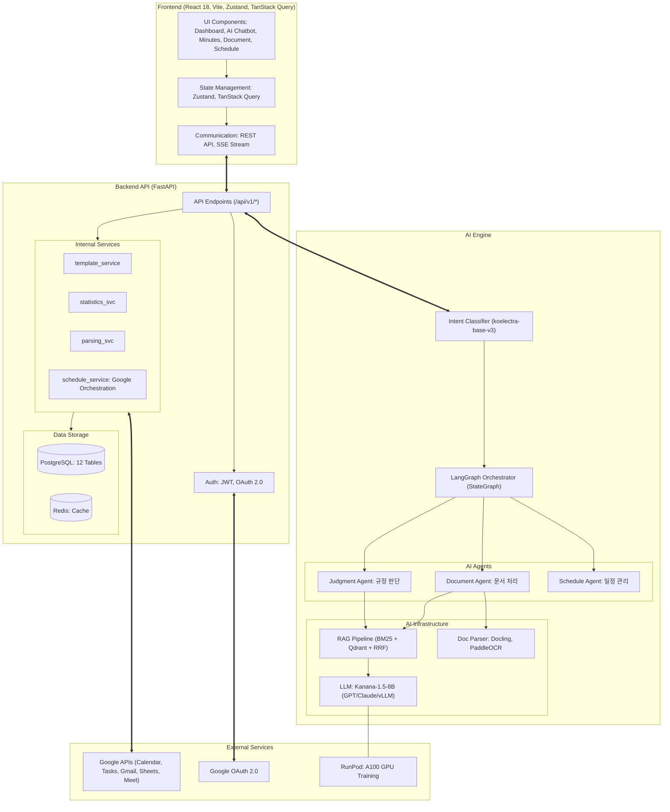
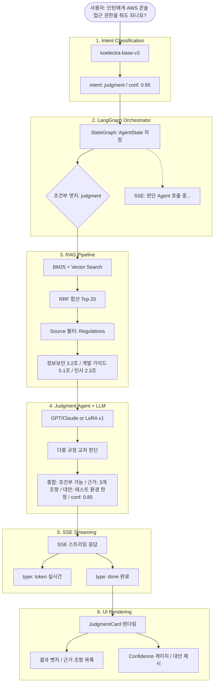
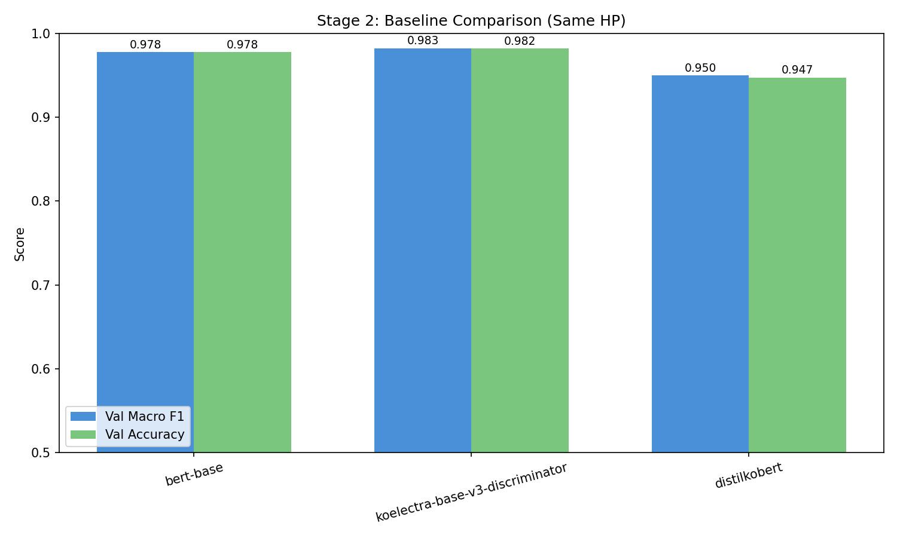
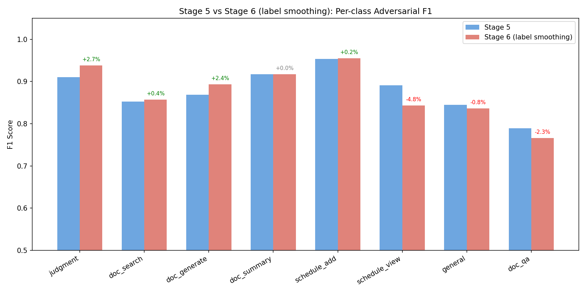
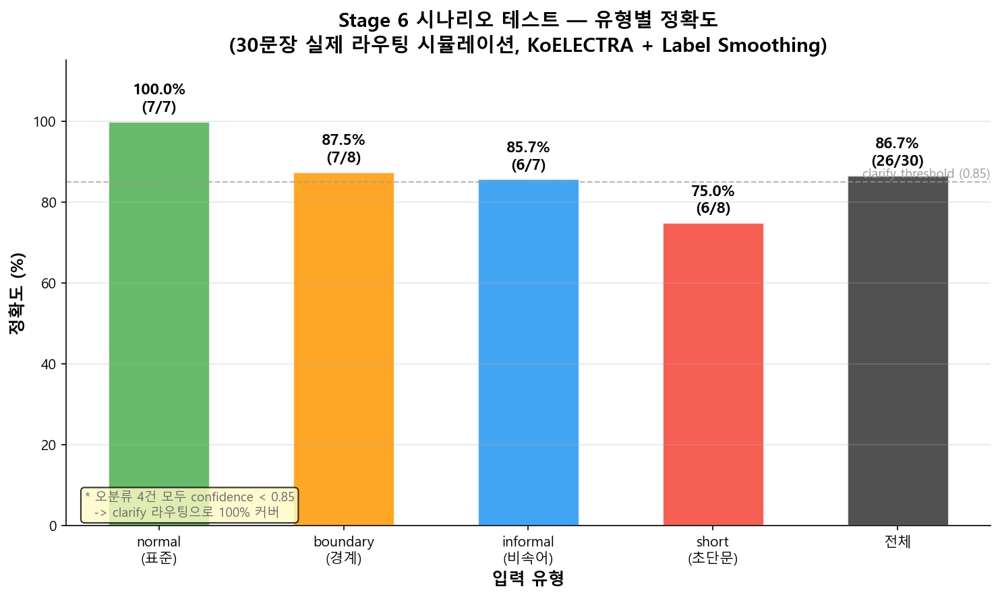
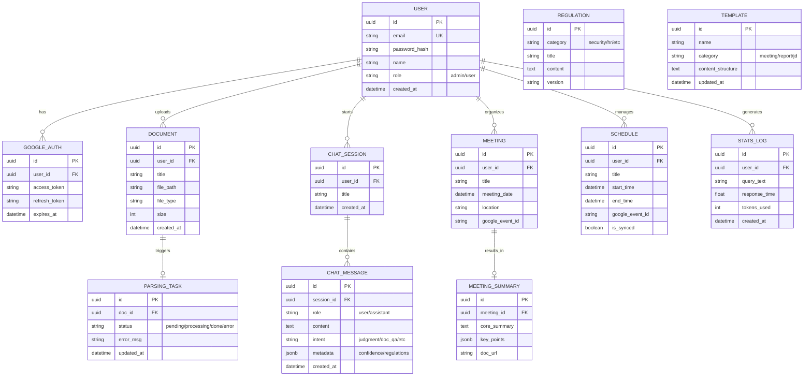

# WorkFlow Agent (듀듀)

> LangGraph 기반 멀티 Agent 업무 자동화 시스템

**멘토**: 최민수

**팀원**: 신지용(PM) | 윤경은(AI Engineer) | 진승언(AI Engineer) | 안혜빈(Backend) | 문지영(Frontend)

---

## 목차

1. [프로젝트 배경 및 문제 정의](#프로젝트-배경-및-문제-정의)
2. [프로젝트 목표](#프로젝트-목표)
3. [핵심 성과](#핵심-성과)
4. [시스템 아키텍처](#시스템-아키텍처)
5. [기술 스택](#기술-스택)
6. [개발 전략](#개발-전략-llm-api-먼저--sllm은-나중에)
7. [파인튜닝 현황](#파인튜닝-현황)
8. [DB ERD](#db-erd-12-테이블)
9. [RAG 파이프라인 상세](#rag-파이프라인-상세)
10. [프로젝트 구조](#프로젝트-구조)
11. [팀원별 담당](#팀원별-담당)
12. [Git 브랜치 전략](#git-브랜치-전략)
13. [빠른 시작](#빠른-시작)
14. [문서 참고 & API 문서](#문서-참고--api-문서)

---

## 프로젝트 배경 및 문제 정의

### 사내 업무 환경의 한계와 변화

- **LLM 및 AI Agent 도입 가속화**: 기업 내 단순 반복 업무를 지능형 AI를 통해 자동화하여 실무자의 생산성을 극대화하려는 시장의 니즈가 급증하고 있습니다.
- **복잡해진 사내 규정과 정보의 파편화**: 인사, 보안 등 사내 규정이 방대해져, 기존의 시스템으로는 정확한 규정검색, 판단 그리고 예외 상황 대응이 어렵습니다.
- **수작업 중심의 행정 업무 병목**: 회의록 작성, 문서 초안 기획, 복수의 앱(메일, 캘린더 등)을 오가는 수동적인 일정 관리 등 비핵심 행정 업무에 과도한 리소스가 소모되고 있습니다.

| 지표 | 수치 | 설명 |
|------|------|------|
| 충분한 집중 시간 부족 | **68%** | 방해받지 않고 핵심 업무에 몰입할 수 있는 Focus Time이 없다고 응답 |
| 과도한 정보 탐색 소요 | **62%** | 업무 중 필요한 정보나 데이터를 찾는 데 너무 많은 시간이 낭비됨 |
| 커뮤니케이션 소모 비중 | **57%** | 평균 업무 시간 중 회의, 이메일, 채팅에 쓰이는 시간 (실제 생산 활동은 43%) |

> *출처: Microsoft Work Trend Index (2023)*

---

## 프로젝트 목표

### 사내 업무 자동화의 혁신

사내 규정 판단, 문서 분석, 일정 관리를 지능형 AI 에이전트가 처리합니다. 단순 LLM 호출을 넘어, **LangGraph**를 통한 유연한 오케스트레이션과 **sLLM 파인튜닝**으로 도메인 특화 성능을 극대화합니다.

- **보안**: 사내 데이터 외부 유출 차단을 위한 프라이빗 sLLM 운영
- **정밀**: RAG 기반의 근거 중심 규정 교차 판단
- **통합**: Google 워크스페이스(Calendar, Tasks, Gmail, Sheets) 연동

### Solution: 자연어로 업무 자동화

```
사용자 입력 → Intent 분류(KoELECTRA) → Orchestrator(LangGraph 라우팅) → Agent 처리(규정/문서/일정)
```

| Agent | 기능 | 상세 |
|-------|------|------|
| **Judgment Agent** | 규정 판단 | RAG 기반 다중 규정 교차 판단 + 근거 + 대안 제시 |
| **Document Agent** | 문서 처리 | 생성 / 요약 / 검색 / QA |
| **Schedule Agent** | 일정 관리 | 일정 등록·조회 + Google 연동 |

### 핵심 기능

| 기능 | 설명 |
|------|------|
| **규정 판단** | "인턴에게 AWS 접근 줘도 돼?" → 다중 규정 교차 판단 + 근거 + 대안 제시 |
| **문서 생성** | 등록된 템플릿에 맞춰 초안 생성 → 초안 + 추가 입력 항목 반환 |
| **문서 요약** | 사용자가 선택한 문서를 회사 요약 포맷으로 요약 |
| **문서 검색 / QA** | RAG 하이브리드 검색으로 문서 추천 + 근거 기반 답변·인용 반환 |
| **일정 관리** | 자연어 → 일정 자동 등록/조회 + Google Calendar·Tasks·Gmail·Sheets 통합 |

---

## 핵심 성과

| 영역 | 성과 |
|------|------|
| **Intent 분류** | KoELECTRA 파인튜닝 — Test F1 97.88%, Adversarial F1 87.58%, 추론 7.9ms |
| **RAG 파이프라인** | BM25 + Vector(Qdrant) + RRF 하이브리드 검색 구현 |
| **Google 4종 연동** | Calendar + Tasks + Gmail + Sheets 통합 OAuth |
| **Backend** | 12 테이블 DB + JWT 인증 + SSE 실시간 스트리밍 |
| **Frontend** | 11 페이지 + 챗봇 카드 UI + FullCalendar 일정 관리 |
| **실험** | 7단계 체계적 실험 (32-point Grid Search → Label Smoothing → 시나리오 검증) |

---

## 시스템 아키텍처

### 전체 파이프라인



### 각 Agent 워크플로우



### Intent 분류 체계 (8개)

```
judgment       → Judgment Agent    (규정 판단/정보)
doc_search     → Document Agent    (문서 검색)
doc_generate   → Document Agent    (문서 생성, 회의록 포함)
doc_summary    → Document Agent    (문서 요약)
doc_qa         → Document Agent    (문서 QA)
schedule_add   → Schedule Agent    (일정 추가)
schedule_view  → Schedule Agent    (일정 조회)
general        → General Response  (일반 대화)
```

### 전체 구조



### Agent 처리 흐름 (예: 규정 판단)



---

## 기술 스택

### AI / ML

| 구분 | 기술 | 용도 |
|------|------|------|
| Agent Framework | **LangGraph** | StateGraph 기반 Agent 오케스트레이션 |
| LLM API (현재) | **GPT-4o-mini / Claude Sonnet 4** | 기능 구현 단계에서 사용, 추후 sLLM 교체 |
| Base sLLM (예정) | **Kanana-1.5-8B** | 벤치마크 선정 완료 (종합 0.652) |
| Fine-tuning (예정) | **LoRA (PEFT)** + QLoRA 4-bit | 판단/문서 Agent 특화 (LLM API 기능 확정 후 진행) |
| 모델 서빙 | **vLLM** | OpenAI 호환 API + LoRA 핫스왑 + 스트리밍 |
| Vector DB | **Qdrant** | 문서 임베딩 저장 + 유사도 검색 |
| Embedding | **jhgan/ko-sbert-nli** | 한국어 문장 임베딩 (768차원) |
| Reranker | **BAAI/bge-reranker-v2-m3** | 구현 완료, 현재 비활성 (성능 최적화 후 적용 예정) |
| 키워드 검색 | **BM25 (rank_bm25)** | Hybrid Search의 키워드 매칭 |
| Intent 분류 | **koelectra-base-v3** (파인튜닝) | 8개 카테고리, Adversarial F1 87.58%, 추론 7.9ms |
| 문서 파싱 | **Docling + PaddleOCR** | PDF 구조화 + 스캔 OCR |

### Backend

| 구분 | 기술 |
|------|------|
| Framework | FastAPI + SSE (StreamingResponse) |
| Database | PostgreSQL (12 tables) |
| ORM | SQLAlchemy + Alembic |
| 인증 | JWT (PyJWT) + Google OAuth 2.0 |
| 캐시 | Redis |
| 암호화 | AES-256 (cryptography) |

### Frontend

| 구분 | 기술 |
|------|------|
| Framework | React 18 (Vite) |
| 상태관리 | Zustand + TanStack Query |
| 스트리밍 | EventSource (SSE) |
| 스타일 | Tailwind CSS + Lucide Icons |
| 캘린더 | FullCalendar |
| 애니메이션 | framer-motion |
| 차트 | Recharts |
| E2E 테스트 | Playwright |

### Infra

| 구분 | 기술 |
|------|------|
| Cloud | AWS (EC2 + S3 + RDS) |
| GPU (학습) | RunPod (A100 40GB) |
| Container | Docker + Docker Compose |
| CI/CD | GitHub Actions |

> **현재 배포 상태**: Backend만 AWS EC2에 CI/CD(GitHub Actions) 배포 중. Frontend는 로컬에서 Backend API에 연결하여 개발 중.

---

## 개발 전략: LLM API 먼저 → sLLM은 나중에

```
1단계  설계 · 환경 세팅                                          ✅ 완료
2단계  LLM API(GPT/Claude)로 전체 기능 먼저 구현                  ✅ 완료
3단계  Agent 개발 — LLM API 기반으로 실제 동작 확인                ✅ 대부분 완료
4단계  Intent 파인튜닝 (단일질문 분류)                             ✅ 완료 (v2 7단계 실험)
       Agent 파인튜닝 (판단/문서 특화)                              ← 중간발표 후 진행
5단계  복합질문 강화 + sLLM(vLLM) 교체                             ← 예정
6단계  통합 테스트 → 배포
```

- **왜?** 파인튜닝 먼저 하면 input/output이 바뀔 때마다 데이터를 다시 만들어야 함
- LLM API로 기능을 완성하면서 실제 형태를 확정한 뒤, 그에 맞는 데이터를 수집하는 게 효율적
- Agent 코드는 LLM 호출 인터페이스만 바꾸면 되는 구조 (공통 모듈 #39)

---

## 파인튜닝 현황

### Intent 분류 — 완료

> 7단계 체계적 실험을 통해 KoELECTRA + Label Smoothing 조합 확정. 현재 단일질문 분류에 적용 중이며, 복합질문 강화는 중간발표 후 진행 예정.

### Intent 분류 데이터 (v2 실험 완료)

| 구분 | 건수 | 비고 |
|------|------|------|
| 기본 데이터 (GPT-4o + Claude) | 2,299개 | 8개 intent × 2 LLM |
| 경계 쌍 데이터 | 600개 | 10쌍 × 30개 × 2 LLM |
| 타겟 보강 데이터 | 98개 | 오분류 패턴 기반 |
| **학습 합계 (Train)** | **2,425개** | Val 285 / Test 286 |
| Adversarial 테스트셋 | 450개 | 7단계 실험 완료 |

**최종 모델**: koelectra-base-v3 (Label Smoothing 0.1)
- Test F1: **97.88%** / Adversarial F1: **87.58%**
- 과신뢰 오분류 69% 감소 (Stage 6 Label Smoothing 적용)
- 추론 속도: 7.9ms (GPU)
- 현재 적용: 단일질문 분류 / 복합질문 강화: 중간발표 후 진행

> 6단계 실험: Baseline → Grid Search → 최종 평가 → 오분류 분석 → 보강 재학습 → Label Smoothing

#### 3모델 Baseline 비교



#### Label Smoothing 적용 효과 (Stage 5 vs Stage 6)



#### 시나리오 테스트 (유형별 정확도)



### Agent 파인튜닝 — 중간발표 후 진행 예정

> LLM API로 기능을 완성한 뒤, 확정된 input/output 형태에 맞춰 데이터 수집 → sLLM 교체

| 대상 | 방식 | 상태 |
|------|------|------|
| LoRA v1 — 판단 Agent 특화 | 규정 판단 input/output 기반 학습 | LLM API 기능 확정 후 진행 |
| LoRA v2 — 문서 Agent 특화 | 문서 생성/요약 input/output 기반 학습 | LLM API 기능 확정 후 진행 |
| Base 모델 | Kanana-1.5-8B (벤치마크 종합 0.652) | 선정 완료 |
| 서빙 | vLLM (OpenAI 호환 API + LoRA 핫스왑) | 구조 설계 완료 |

---

## DB ERD (12 테이블)



---

## RAG 파이프라인 상세

### RAG 검색 대상

| Agent/기능 | RAG | 검색 대상 | Qdrant Filter | 비고 |
|-----------|-----|----------|---------------|------|
| Judgment | O | 사내 규정 | `source="regulations"` | 규정만 검색 |
| doc_search | O | 업로드 문서 | `source="documents"` | 업로드 문서만 검색 |
| doc_qa | O | 업로드 문서 | `source="documents"` | 업로드 문서만 검색 |
| doc_generate | X | - | - | 사용자 입력 기반 생성 |
| doc_summary | X | - | - | 대상 문서가 명시적으로 주어짐 |
| Schedule | X | - | - | |
| General | X | - | - | |

### Qdrant 메타데이터 구조

```
source (2개 고정)         doc_type (확장 자유)
├── "regulations"         ├── "HR"              (급여, 교육, 복리후생, 출장, 징계)
│                         ├── "IT"              (정보보안, 개발 가이드라인)
│                         └── "governance"       (윤리강령)
└── "documents"           ├── "general"          (업로드 문서)
                          └── "meeting_minutes"  (회의록)
```

- **source**: Agent 라우팅용 (judgment → regulations, doc_search/doc_qa → documents)
- **doc_type**: 세부 분류용 (향후 필터링·통계에 활용)
- 재정립 스크립트: `python -m scripts.rebuild_qdrant` (backend 디렉토리에서 실행)

---

## 프로젝트 구조

```
SKN21-FINAL-3TEAM/
│
├── backend/                     # FastAPI 백엔드
│   ├── app/
│   │   ├── main.py              # 앱 진입점
│   │   ├── config.py            # 환경변수
│   │   ├── api/v1/              # REST API 엔드포인트
│   │   │   ├── chat.py          # 챗봇 + SSE 스트리밍
│   │   │   ├── auth.py          # JWT + 비밀번호 재설정 + Google 소셜 로그인
│   │   │   ├── documents.py     # 문서 CRUD + 생성/다운로드
│   │   │   ├── meetings.py      # 회의 관리
│   │   │   ├── schedules.py     # 일정 CRUD
│   │   │   ├── calendar.py      # Google Calendar + Meet
│   │   │   ├── google_connect.py # 통합 OAuth
│   │   │   ├── tasks.py         # Google Tasks API
│   │   │   ├── gmail.py         # Gmail 발송 API
│   │   │   ├── sheets.py        # Google Sheets API
│   │   │   ├── regulations.py   # 규정 목록 조회 (공개)
│   │   │   ├── admin.py         # 관리자 + 통계 + 로그 + 규정 CRUD
│   │   │   └── router.py        # API 라우터 통합
│   │   ├── models/              # ORM 모델 (12개 테이블)
│   │   ├── schemas/             # Pydantic 스키마
│   │   └── services/            # 비즈니스 로직
│   │       ├── chat_service.py       # 챗봇 세션/대화 관리
│   │       ├── document_service.py   # 문서 업로드/파싱 + Qdrant 인덱싱
│   │       ├── meeting_service.py    # 회의 CRUD + AI 분석
│   │       ├── template_service.py   # 문서 생성/다운로드
│   │       ├── statistics_service.py # 통계/로그
│   │       ├── parsing_service.py    # 파싱 상태 관리
│   │       ├── google_base_service.py # Google API 공통 베이스
│   │       ├── calendar_service.py   # Calendar + Meet 연동
│   │       ├── tasks_service.py      # Google Tasks 동기화
│   │       ├── gmail_service.py      # 알림/초대 메일 발송
│   │       ├── sheets_service.py     # Sheets 추적 시트
│   │       └── schedule_service.py   # 4개 서비스 오케스트레이션
│   ├── alembic/                 # DB 마이그레이션 (Alembic, 3개 버전)
│   ├── create_tables.py         # DB 테이블 생성 스크립트
│   └── scripts/                 # 유틸리티 스크립트
│       ├── rebuild_qdrant.py    # Qdrant 전체 재정립
│       ├── migrate_docs_to_qdrant.py # 기존 문서 마이그레이션
│       └── seed_sample_documents.py  # 샘플 데이터 시딩
│
├── ai/                          # AI/ML 모듈
│   ├── agents/                  # LangGraph Agent
│   │   ├── state.py             # AgentState 공유 상태
│   │   ├── config.py            # 분류 임계값 설정 (0.85 / 0.4)
│   │   ├── orchestrator.py      # StateGraph 오케스트레이터
│   │   ├── intent_classifier.py # Intent 분류 (koelectra-base-v3)
│   │   ├── preprocessing.py     # 한국어 전처리 (kiwipiepy)
│   │   ├── judgment_agent.py    # 판단 Agent
│   │   ├── document_agent.py    # 문서 Agent
│   │   ├── schedule_agent.py    # 일정 Agent
│   │   ├── train_intent.py      # Intent 모델 학습
│   │   └── test_intent.py       # Intent 테스트
│   ├── llm/                     # LLM 공통 모듈
│   │   ├── base.py              # BaseLLM 인터페이스
│   │   ├── factory.py           # LLM 팩토리 (openai/anthropic/vllm)
│   │   ├── openai_provider.py   # OpenAI (GPT)
│   │   ├── anthropic_provider.py # Anthropic (Claude)
│   │   └── prompts.py           # 프롬프트 관리
│   ├── rag/                     # RAG 파이프라인
│   │   ├── hybrid_search.py     # BM25 + Vector (RRF 합산)
│   │   ├── reranker.py          # bge-reranker-v2-m3
│   │   ├── embeddings.py        # ko-sbert-nli 임베딩
│   │   ├── query_refiner.py     # 쿼리 정제
│   │   ├── qdrant_pipeline.py   # Qdrant 파이프라인 (싱글톤)
│   │   ├── qdrant_store.py      # Qdrant 벡터스토어
│   │   ├── pipeline.py          # RAG 파이프라인 통합
│   │   ├── vectorstore.py       # 벡터스토어 인터페이스
│   │   └── inspect_sources.py   # 소스 검사 유틸리티
│   ├── templates/               # 문서 템플릿
│   │   ├── base.py              # BaseTemplate
│   │   ├── meeting_minutes.py   # 회의록
│   │   ├── report.py            # 보고서
│   │   ├── jd.py                # 채용 공고
│   │   └── proposal.py          # 제안서
│   ├── document_parser/         # 문서 파싱
│   │   ├── docling_parser.py    # Docling (디지털 PDF)
│   │   ├── ocr_parser.py        # PaddleOCR (스캔 문서)
│   │   ├── docx_parser.py       # DOCX 파싱
│   │   ├── parser.py             # 파서 오케스트레이터
│   │   ├── manual_parser.py     # 수동 파싱 지원
│   │   └── regulation_parser.py # 규정 파싱 (조문 기반 청킹)
│   ├── skills/                  # 문서 생성 스킬 (회의록, 보고서, 제안서)
│   ├── serving/vllm_client.py   # vLLM 클라이언트
│   ├── finetuning/              # LoRA 학습
│   ├── models/                  # 학습된 모델 체크포인트
│   ├── tests/                   # AI 테스트
│   ├── experiments/             # ML 실험 v1 (BERT, QA 비교)
│   └── experiments_v2/          # ML 실험 v2 (6단계 실험 파이프라인)
│
├── frontend/                    # React 프론트엔드
│   ├── src/
│   │   ├── components/
│   │   │   ├── chat/            # 챗봇 UI + 응답 카드 (17개 컴포넌트)
│   │   │   ├── common/          # 공통 UI (Sidebar, Header, Layout, ThemeToggle 등)
│   │   │   ├── dashboard/       # 대시보드 위젯 (14개)
│   │   │   ├── documents/       # 문서 관리
│   │   │   ├── meetings/        # 회의 관리
│   │   │   ├── schedules/       # 일정 (FullCalendar + Google 연동)
│   │   │   ├── auth/            # 로그인/회원가입
│   │   │   └── admin/           # 관리자 (사용자/규정/통계)
│   │   ├── api/                 # API 클라이언트 모듈 (9개: chat, auth, documents 등)
│   │   ├── hooks/               # useAuth, useSSE, useChat, useGoogleServices
│   │   ├── store/               # Zustand (auth, chat, ui, google, scheduleType)
│   │   └── pages/               # 11개 페이지 (대시보드, 챗봇, 회의록, 문서생성, 문서관리, 일정, 마이페이지, 관리자 등)
│   └── e2e/                     # Playwright E2E 테스트
│
├── data/                        # 학습/평가 데이터
│   ├── training/
│   │   ├── intent/              # Intent 데이터 v1 (원본 1,405 + 증강 463)
│   │   ├── intent_v2/           # Intent 데이터 v2 (GPT-4o + Claude, 2,425 train)
│   │   ├── v1_judgment/         # 판단 데이터 (1,500개)
│   │   └── v2_document/         # 문서 데이터 (1,700개)
│   ├── evaluation/              # 벤치마크 리포트 + 결과
│   ├── proceedings/             # 회의록 샘플 데이터 (8개 JSON)
│   └── regulations/             # 규정 원본 문서 (7개 규정 + PDF)
│
├── docs/                        # 기획/설계 문서
│   ├── agent/architecture.md    # 아키텍처 설계
│   ├── TASK_BOARD.md            # 작업 보드 (일일 참고)
│   ├── logs/                    # 팀원별 작업 로그 (5명)
│   ├── 복합질문_설계서.md        # 복합 질문 처리 설계
│   ├── 프로젝트_구조_학습가이드.md # 프로젝트 구조 가이드
│   └── 역할분배_기술스택_v5_final.md # 기술 참고서
│
├── docker/                     # Docker 설정
│   ├── docker-compose.yml      # 컴포즈 설정
│   ├── Dockerfile.backend      # 백엔드 이미지
│   ├── Dockerfile.frontend     # 프론트엔드 이미지
│   └── Dockerfile.vllm         # vLLM 서빙 이미지
│
├── .github/workflows/
│   ├── ci.yml                  # CI 파이프라인
│   └── deploy.yml              # 배포 파이프라인
```

---

## 팀원별 담당

| 팀원 | 역할 | 핵심 담당 |
|------|------|----------|
| **신지용** (PM) | Intent + 오케스트레이션 | `ai/agents/orchestrator.py`, SSE 스트리밍, API 스키마, 배포 |
| **윤경은** (AI Engineer) | 파인튜닝 v1 + 판단 + RAG | `judgment_agent.py`, `ai/rag/*`, LoRA v1, vLLM 서빙 |
| **진승언** (AI Engineer) | 파인튜닝 v2 + 문서 Agent | `document_agent.py`, `ai/templates/*`, `document_parser/*`, LoRA v2 |
| **안혜빈** (Backend) | DB + 인증 + 일정 Agent | `models/*`, `services/*`, JWT, Google Services 통합, 관리자 API |
| **문지영** (Frontend) | React UI 전담 | `frontend/src/` 전체, SSE 수신, 카드 UI, 반응형 |

---

## Git 브랜치 전략

> 1인 1브랜치 원칙 — 브랜치 5개로 충돌 최소화

```
main (배포용 - PM 지용만 머지)
 └── develop (통합 개발 - PR 머지 대상)
      ├── feat/jiyong            Intent, 오케스트레이터, SSE, 스키마
      ├── feat/ai-경은          LLM API, RAG, 판단 Agent, 파인튜닝
      ├── feat/ai-승언          문서 Agent, 파서, 템플릿, 파인튜닝
      ├── feat/backend-혜빈     DB, 인증, API, Google Services
      └── feat/frontend-지영    전체 UI
```

### 커밋 컨벤션

```
<type>: <설명> #이슈번호

feat: 판단 Agent LLM API 연동 #12
fix: Intent 분류 confidence 임계값 조정 #5
docs: API 스키마 문서 업데이트 #2
```

### PR 규칙

```
1. 자기 브랜치에서 작업 후 push
2. GitHub PR 생성 (develop ← feat/xxx-이름)
3. PR 본문에 "Closes #이슈번호"
4. 리뷰 승인 후 Squash and merge
5. develop → main은 PM(지용)만 머지
```

---

## 빠른 시작

```bash
# 1. 환경변수 설정
# .env 파일을 프로젝트 루트에 생성 (OPENAI_API_KEY, DATABASE_URL, QDRANT_URL 등)

# 2. Docker로 실행
cd docker && docker-compose up -d

# 3. 또는 로컬 개발
# Backend
pip install -r requirements.txt   # 루트의 requirements.txt
cd backend && uvicorn app.main:app --reload

# Frontend
cd frontend && npm install && npm run dev
```

---

## 문서 참고 & API 문서

| 문서 | 용도 |
|------|------|
| `docs/agent/architecture.md` | 아키텍처 설계 (Agent 워크플로우, RAG 대상, 파인튜닝 전략) |
| `docs/TASK_BOARD.md` | 일일 작업 참고 (체크리스트, 이슈 매핑) |
| `docs/역할분배_기술스택_v5_final.md` | 기술 결정 배경, 멘토 피드백, 아키텍처 상세 |
| `docs/복합질문_설계서.md` | 복합 질문 처리 설계 (Smart Hybrid 아키텍처) |
| `docs/프로젝트_구조_학습가이드.md` | 프로젝트 구조 및 팀원별 가이드 |
| `docs/logs/` | 팀원별 작업 로그 (세션 기록) |
| Swagger UI (`/docs`) | API 스펙 확인 (서버 실행 후) |
| ReDoc (`/redoc`) | API 문서 대체 뷰어 |

서버 실행 후:
- Swagger UI: http://localhost:8000/docs
- ReDoc: http://localhost:8000/redoc
