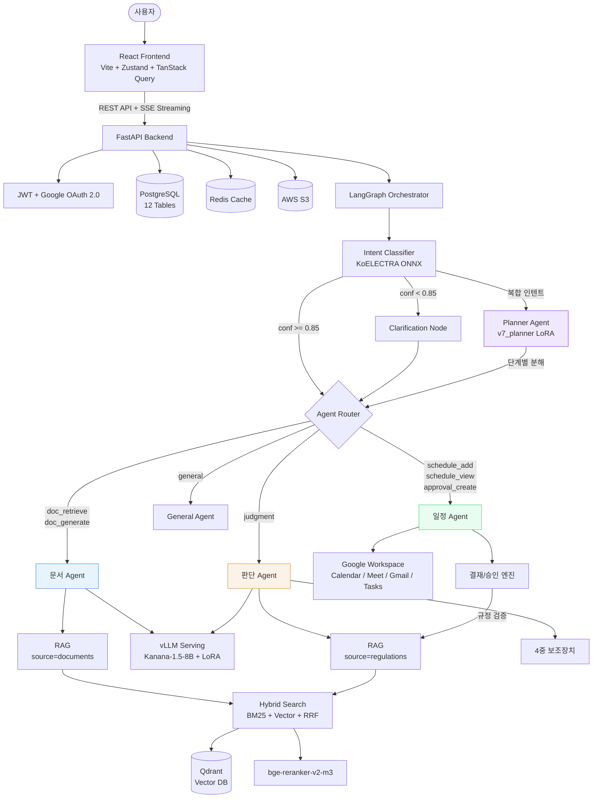
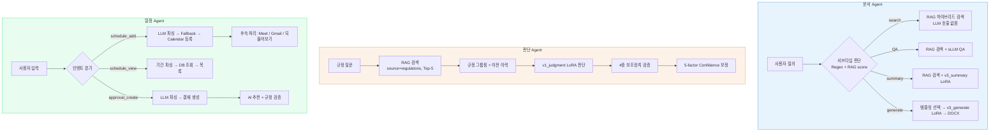
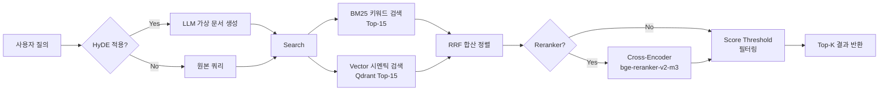
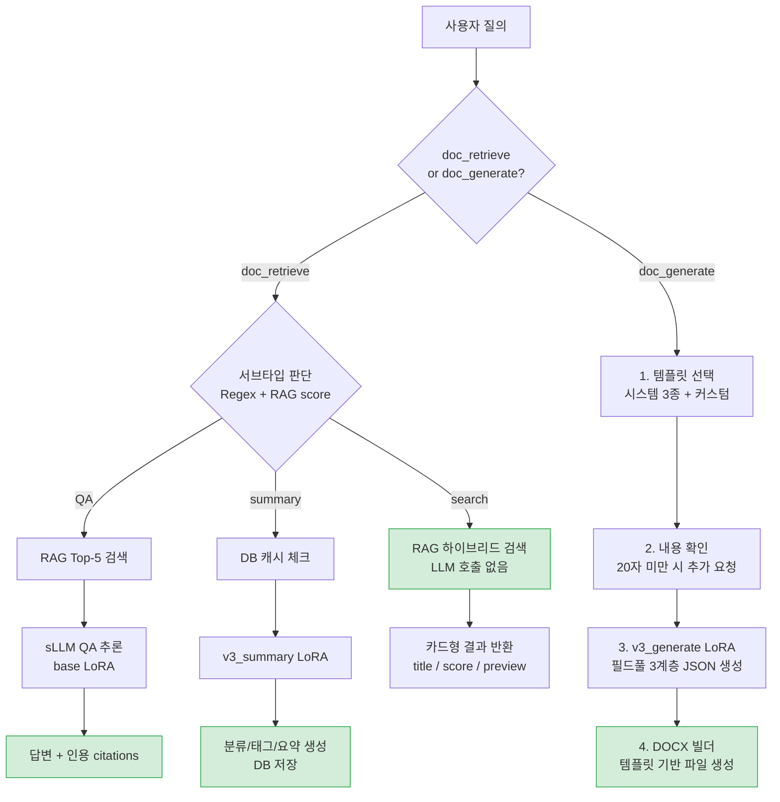
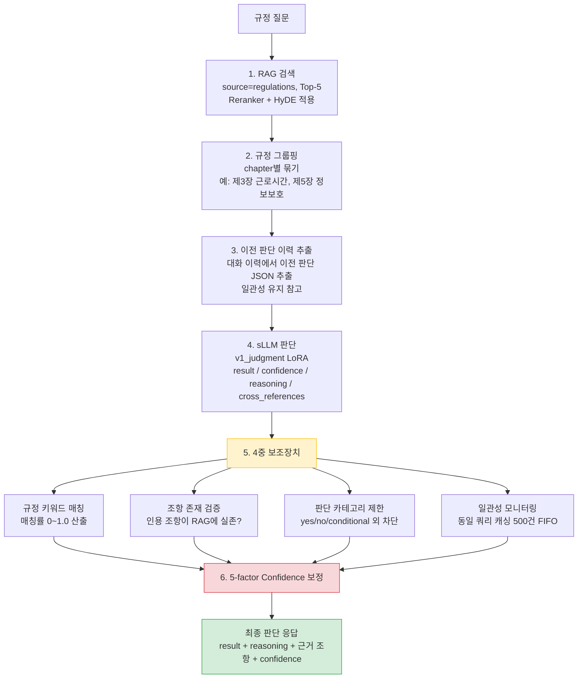
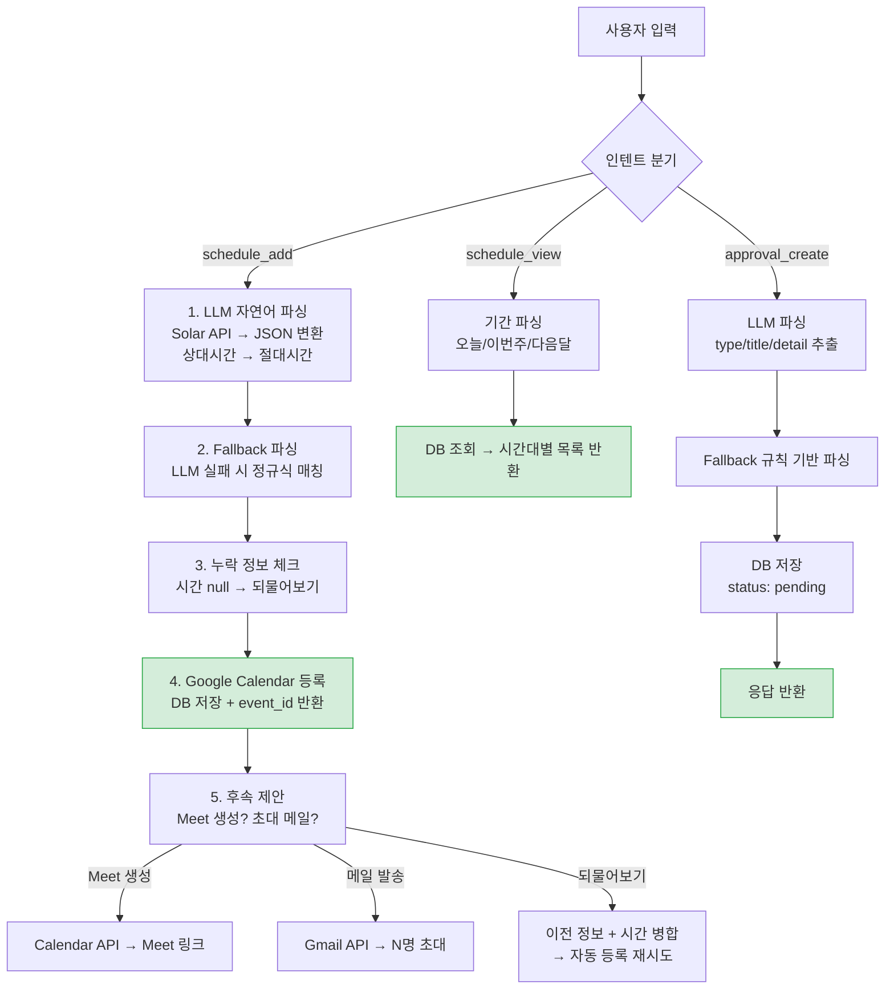
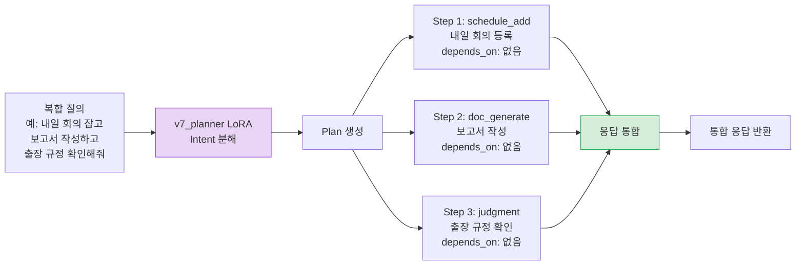
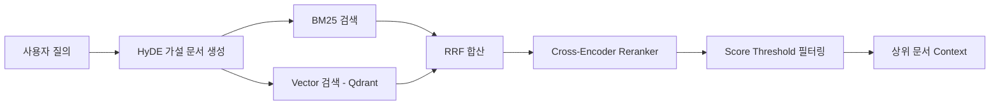

# DUDE — WorkFlow Agent

> **하나의 채팅으로 업무의 모든 것을**
>
> 사내 규정 / 문서 / 일정을 하나로 — Multi Agent 팀 워크스페이스

**SKN21 FINAL 3TEAM** | 멘토: 최민수 | 2026.03.31

---

## 목차

1. [프로젝트 개요](#1-프로젝트-개요)
2. [핵심 성과](#2-핵심-성과)
3. [시스템 아키텍처](#3-시스템-아키텍처)
4. [에이전트 상세](#4-에이전트-상세)
5. [데이터셋 및 파인튜닝](#5-데이터셋-및-파인튜닝)
6. [RAG 파이프라인](#6-rag-파이프라인)
7. [기술 스택](#7-기술-스택)
8. [프로젝트 구조](#8-프로젝트-구조)
9. [팀 구성](#9-팀-구성)
10. [빠른 시작](#10-빠른-시작)

---

## 1. 프로젝트 개요

### 배경

Microsoft Work Trend Index 2023에 따르면, 현대 직장인의 업무 환경에는 다음과 같은 문제가 존재합니다.

| 문제 | 비율 |
|------|------|
| 충분한 집중 시간 부족 | 68% |
| 과도한 정보 탐색 소요 | 62% |
| 커뮤니케이션 소모 비중 | 57% |

### DUDE가 해결하는 것

DUDE는 **3개의 전문 Agent + 1개의 Planner**로 구성된 Multi-Agent 시스템입니다. 사내 규정 확인, 문서 작성, 일정 관리를 하나의 채팅 인터페이스에서 자연어로 처리합니다.

### 4대 핵심 기능

| 기능 | 설명 |
|------|------|
| **AI 챗봇** | Multi-Agent 라우팅 + SSE 실시간 스트리밍 |
| **규정 판단 자동화** | sLLM + RAG + 4중 Guardrail |
| **문서 처리** | 템플릿 기반 자동 생성 + 검색 / 요약 / QA |
| **일정 및 결재 관리** | Google Workspace 4종 연동 |

### 기대 효과

| 업무 영역 | AS-IS | TO-BE |
|-----------|-------|-------|
| 규정 확인 | 수동 검색 10~15분 | 자연어 질의 10초 이내 |
| 문서 작성 | 수동 30분~1시간 | AI 자동 생성, 검토만 5분 |
| 일정 관리 | 3~4개 앱 수동 전환 | 채팅 한 줄로 등록/조회/알림 |
| 정보 탐색 | 여러 문서 직접 검색 | RAG 하이브리드 즉시 답변 |

---

## 2. 핵심 성과

### 모델별 성능 지표

| 모델 | 핵심 지표 | 수치 | 평가 방법 | 데이터 규모 |
|------|---------|------|---------|-----------|
| 판단 Agent (v1_judgment) | 정확도 | **85.4%** | 328건 eval (yes/no/cond/no_reg) | RAFT 80:10:10 |
| 문서 생성 (v3_generate) | eval_loss / Token Acc | **0.508 / 85.8%** | 150건 eval | 1,500건 학습 |
| 문서 요약 (v3_summary) | BERTScore F1 | **0.8594** | 100건 eval (Base 대비 +0.03) | 1,000건 학습 |
| Planner | usable_rate | v5 채택 | v3~v7 반복 실험 | ~1,471건 |
| Intent 분류 | F1 (macro) | **90.07%** | ONNX 앙상블 5-seed | ~5,177건 |
| RAG 검색 | Context Recall (RAGAS) | **0.944** | 30건 벤치마크 | 670건 테스트셋 |
| RAG 검색 | Context Precision (RAGAS) | **0.889** | 30건 벤치마크 | Reranker ON |
| RAG 검색 | Hit Rate / MRR | **93.3% / 0.838** | 30건 벤치마크 | kiwipiepy ON |

### GPT 대비 sLLM 비교

| 항목 | GPT-4o-mini | Kanana sLLM |
|------|------------|-------------|
| 템플릿 품질 | 100/100 | 100/100 |
| 응답 시간 | 2.4~3.5초 | 7.3초 |
| 자연어 품질 | 우수 | 약간 경직됨 |
| API 비용 | 종량제 (과금) | 무료 (자체 서빙) |
| 데이터 보안 | 외부 전송 | 프라이버시 보장 |

### 주요 성과 요약

| 항목 | 결과 |
|------|------|
| API 비용 | sLLM 전환으로 **과금 0원** (GPT fallback 자동 전환, 서비스 중단 0건) |
| RAG 검색 품질 | RAGAS Context Recall **0.944**, Reranker MRR **0.636 → 0.952** |
| Google Workspace | Calendar + Tasks + Gmail + Meet **4종 연동 완료** |
| 이슈 해결 | 23건 이슈 중 **100% 해결** |
| LoRA 파인튜닝 | 판단(v1) + 문서생성(v3) + 문서요약(v3) + Planner(v7) **4종 완료** |

---

## 2-1. 핵심 문제 해결 사례

### AI / 모델

| 문제 | 원인 | 해결 |
|------|------|------|
| Intent vs Adversarial F1 10%p 격차 | 학습 데이터 vs 적대적 데이터 분포 차이 | 7단계 체계적 실험 + Label Smoothing |
| 문서 생성 필드 0건 출력 | 3줄 입력 시 필드 누락 | 자동화 파싱 + meta/body 분리, 완성도 100% 달성 |
| Confidence 과신 문제 | LLM raw 점수만으로 환각 판별 불가 | 4중 보조장치 도입 (환각탐지/조항검증/카테고리제한/일관성), 0.95 → 0.72 현실 반영 |
| RAG 청킹 너무 단순 | 12청크만 존재, no_reg vs conditional 불명확 | 44청크로 세분화, 규정 조항별 정밀 분리 |

### Backend / Infra

| 문제 | 원인 | 해결 |
|------|------|------|
| 테이블 파싱 100% 누락 | python-docx paragraphs만 조회 | doc.tables 순회 추가, 환경 무관 동작 |
| Qdrant 벡터 19건 미동기 | document_id 불일치 (83/86건) | reindex 스크립트로 자동 복구 |
| CI/CD SIGTERM 반복 | nohup SSH 종료 시 프로세스 kill | systemd 서비스로 전환, EC2 자동 재시작 확보 |
| bcrypt 호환성 오류 | passlib + bcrypt 5.0 충돌 | bcrypt 4.0.1 다운그레이드 |
| Google 2중 인증 불편 | 로그인 + OAuth 별도 = UX 저하 | 로그인 1회로 4종 서비스 동시 인증 |

### Frontend

| 문제 | 원인 | 해결 |
|------|------|------|
| SSE 스트리밍 State 손실 | Stale Closure로 스트리밍 중단 | Ref 기반의 배열 관리로 전환 |

---

## 2-2. 한계점 및 향후 발전 방향

### 현재 한계

| 한계 | 상세 |
|------|------|
| conditional 카테고리 정확도 78% | "조건부 허용"의 판단 경계가 모호, 목표 85% 대비 +7%p 추가 개선 필요 |
| Planner v5 수렴 한계 | v6/v7 실험 시도했으나 성능 정체, 데이터 품질 개선 및 재수집 필요 |
| vLLM LoRA 전환 일부 이슈 | v3_summary, v3_generate 어댑터에서 발생, peft 버전 로드맵 회피 중 |
| Reranker 지연 시간 +5.7초 | Cross-Encoder 적용 시 정확도 향상 vs 속도 트레이드오프 |
| 멀티턴 대화 미지원 | 현재 단건 질문-응답 구조, 대화 이력 기반 맥락 유지 미구현 |

### 발전 로드맵

**단기 (1~2주)**
- vLLM 전환 이슈 완전 해결 (peft 버전 업그레이드 또는 우회)
- conditional 데이터 추가 수집 (레이블 표준 + 경계 사례 집중)

**중기 (1~2개월)**
- RAG + LoRA 통합 최적화 (하드코딩 없이 RAG 컨텍스트 기반 판단)
- Planner 데이터 품질 개선 후 v8 재학습
- 멀티턴 대화 지원 (대화 이력 + 컨텍스트 윈도우 설계)

**장기 (3~6개월)**
- 모델 경량화 (4-bit 양자화 + 배치 최적화)
- 프라이버시 GPU 서빙 전환 (RunPod 탈피)
- 추가 Agent 확장 (HR봇, 경비 자동화 등)
- 사용자 피드백 기반 RLHF 적용

---

## 3. 시스템 아키텍처

### 전체 시스템 흐름



### Agent별 처리 워크플로우



### RAG 파이프라인 상세



### Intent 분류 체계 (9개 + Planner)

```
judgment         — 규정 판단 요청
doc_search       — 문서 검색
doc_generate     — 문서 생성
doc_summary      — 문서 요약
doc_qa           — 문서 QA
schedule_add     — 일정 등록
schedule_view    — 일정 조회
approval_create  — 결재/승인 요청
general          — 일반 대화
+ Planner        — 복합 인텐트 분해 및 병렬 처리
```

---

## 4. 에이전트 상세

### 에이전트 비교 테이블

| 구분 | 문서 Agent | 판단 Agent | 일정 Agent | Planner |
|------|-----------|-----------|-----------|---------|
| **입력** | doc_retrieve, doc_generate | judgment (규정 질문) | schedule_add, schedule_view, approval_create | 복합 요청 (멀티 인텐트) |
| **핵심 기술** | LoRA 라우팅 (v3_generate / v3_summary) | 4중 보조장치, 5-factor confidence | LLM+Regex 2-layer 파싱, Google 4종, 결재 자동화 | 템플릿 합성, depends_on 병렬 처리 |
| **RAG 사용** | 검색/QA만 (source=documents) | 항상 (source=regulations) | 결재 규정 검증 시 연동 | X |
| **sLLM / LoRA** | v3_generate, v3_summary, QA는 base | v1_judgment | Solar API (파싱용) | v7_planner |
| **출력 포맷** | JSON + DOCX, 카드/파일 | JSON (result / conf / reasoning) | JSON + Google event link + 결재 객체 | JSON (plan: steps) |
| **특징** | 검색은 LLM 호출 없음 (최고속) | LLM 판단을 맹신하지 않음 (다중 검증) | 멀티스텝 인터랙션 + 결재/승인/추천 | 최대 4단계 의존성 관리 |

---

### 4-1. 문서 Agent

4가지 오퍼레이션으로 구성되며, LoRA 어댑터로 라우팅합니다.



**LoRA 라우팅 + 출력 포맷**

| 서브모듈 | LoRA 어댑터 | 출력 포맷 |
|---------|-----------|---------|
| generate | v3_generate | JSON (필드 명세 기반 문서) |
| summary | v3_summary | 텍스트 (분류/태그/요약) |
| qa | base model | JSON (answer + citations) |
| search | 없음 (RAG only) | 카드형 (title/score/preview) |

지원 템플릿: 회의록, 보고서, 제안서, JD 등

---

### 4-2. 판단 Agent

규정 기반 yes/no/conditional 판단을 수행하며, LLM 결과를 **맹신하지 않는** 다중 검증 구조입니다.



**4중 보조장치 (Guardrail)**

| 장치 | 역할 |
|------|------|
| 규정 키워드 매칭 | LLM이 인용한 조항이 RAG 결과에 실제 있는지, 매칭률 0~1.0 산출 |
| 조항 존재 검증 | 각 인용 조항(제N조)이 RAG에 존재하는지, 미존재 시 환각 의심 플래그 |
| 판단 카테고리 제한 | yes/no/conditional/no_regulation 외 값 자동 대체, conf 0.3 이하 처리 |
| 일관성 모니터링 | 동일 쿼리 캐싱 (max 500건 FIFO), 이전과 다른 결과 시 경고 플래그 |

**5-factor Confidence 산출**

```
Confidence = (LLM raw x 0.60) + (RAG avg score x 0.25) + (규정 커버리지 x 0.15)
             - 규정 충돌 감점 (-0.1/건)
             - 환각 감점 (보조1 기반)
             - 미존재 조항 감점 (-0.05/건, 보조2)

Hard Cap: RAG < 0.2 → max 0.4 | keyword < 0.2 → max 0.3 | 전부 미존재 → max 0.25
```

---

### 4-3. 일정 Agent

자연어를 일정 데이터로 변환하고, Google Workspace 4종 연동 및 결재/승인 자동화를 처리합니다.



**approval_create (결재 요청)**

| 키워드 | 결재 타입 |
|--------|----------|
| 연차, 휴가, 반차, 조퇴, 병가 | leave |
| 코드 리뷰, PR, 검토 | review |
| 예산, 품의, 비용, 구매 | budget |
| 출장 | business_trip |
| 배포 승인 | deploy |
| 기타 | general |

**결재 API 기능**

| 기능 | 설명 |
|------|------|
| 결재 생성 | 자연어 또는 직접 입력, 파일 첨부 지원 (PDF/DOCX/이미지) |
| 승인/거절 | 팀원이 수신한 pending 요청을 승인 또는 거절 |
| 수신 목록 | 내 팀 대상 pending 요청 자동 필터링 |
| 발신 이력 | 내가 보낸 요청 상태 추적 (pending/approved/rejected) |
| AI 결재 추천 | 파이프라인 + 캘린더 분석 → 결재 항목 자동 추천 (sLLM → API → 규칙 기반 3단계 fallback) |
| 일정 추천 | 파이프라인 태스크 현황 기반 일정 제안 |
| 체크리스트 | 일정 + 태스크 분석 → 할 일 자동 생성 |
| 규정 검증 연동 | 추천 항목에 대해 regulation_check 수행, 위반 시 경고 태그 부착 |

**Google Workspace 연동 4종**

| 서비스 | 기능 |
|--------|------|
| Calendar | 일정 등록/조회/수정, event_id 연동 |
| Meet | 화상 회의 링크 자동 생성 |
| Gmail | 참석자 초대 메일 자동 발송 (N명 일괄) |
| Tasks | 파이프라인 태스크 생성/관리 |

---

### 4-4. Planner Agent

3개 Agent를 하나의 LangGraph 오케스트레이터로 융합합니다.



- 최대 4단계 의존성 관리 (depends_on으로 순차/병렬 자동 결정)
- v7_planner LoRA 파인튜닝
- 멀티 인텐트 요청을 단계별 plan으로 분해하여 순차/병렬 실행

---

## 5. 데이터셋 및 파인튜닝

### 데이터 구성 총괄

| 구분 | Train | Eval | 출처 |
|------|-------|------|------|
| Intent 분류 | 3,954 | 610 | 자체 제작 + Adversarial 463 |
| Planner | 1,471 | 150 | 자체 제작 + GPT 증강 |
| 판단 LoRA | 3,468 | 328 | 수동 제작(Excel) + RAG 증강 |
| 문서 요약 | 900 | 100 | AI Hub SN 582 + GPT 증강 |
| 문서 생성 | 1,350 | 150 | AI Hub + 합성(회의록/보고서/제안서) |

### 데이터 수집 전략 (2-Track)

**Track 1 — 수동 제작 (고품질)**

| 데이터 | 수량 |
|--------|------|
| 규정 판단 쌍 | 1,000 |
| 규정 QA 쌍 | 1,000 |
| Intent 분류 | 1,453 |
| Adversarial | 463 |
| 복합 질문 | 780 |

**Track 2 — AI Hub + 합성 (대량)**

- AI Hub SN 582, SN 569 활용
- GPT-4o 빈 필드 증강
- 합성 회의록 / 보고서 / 제안서
- 최대 50% 합성 비율 유지 (품질 관리)

### 파인튜닝 모델

| 모델 | Base | 용도 |
|------|------|------|
| v1_judgment | Kanana-1.5-8B | 규정 판단 (yes/no/conditional + 근거 + 대안) |
| v3_generate | Kanana-1.5-8B | 문서 생성 (회의록, 보고서, 제안서) |
| v3_summary | Kanana-1.5-8B | 문서 요약 |
| v7_planner | Kanana-1.5-8B | 복합 인텐트 분해 및 plan 생성 |
| KoELECTRA | KoELECTRA-base | Intent 멀티라벨 분류 (8클래스) |

---

## 6. RAG 파이프라인



| 구성 요소 | 기술 |
|-----------|------|
| Embedding | jhgan/ko-sbert-nli (768d) |
| Vector DB | Qdrant |
| Sparse Search | BM25 |
| 합산 | RRF (Reciprocal Rank Fusion) |
| Reranker | bge-reranker-v2-m3 (Cross-Encoder) |
| Query 확장 | HyDE (Hypothetical Document Embeddings) |
| 후처리 | Score Threshold 기반 필터링 |

---

## 7. 기술 스택

### AI / ML

| 기술 | 용도 |
|------|------|
| LangGraph | Agent 오케스트레이션 |
| Kanana-1.5-8B + LoRA | sLLM 파인튜닝 (판단/문서/Planner) |
| vLLM | 모델 서빙 |
| Qdrant | 벡터 DB |
| BM25 | 희소 검색 |
| bge-reranker-v2-m3 | Cross-Encoder Reranker |
| KoELECTRA | Intent 분류 |
| Docling + PaddleOCR | 문서 파싱 |
| jhgan/ko-sbert-nli | 임베딩 (768d) |

### Backend

| 기술 | 용도 |
|------|------|
| FastAPI + SSE | API 서버 + 실시간 스트리밍 |
| PostgreSQL | 메인 DB (12 테이블) |
| SQLAlchemy + Alembic | ORM + 마이그레이션 |
| JWT + Google OAuth 2.0 | 인증 |
| Redis | 캐시 / 세션 |
| AES-256 | 데이터 암호화 |

### Frontend

| 기술 | 용도 |
|------|------|
| React 18 (Vite) | UI 프레임워크 |
| Zustand + TanStack Query | 상태 관리 + 데이터 페칭 |
| Tailwind CSS + Lucide Icons | 스타일링 |
| FullCalendar | 일정 캘린더 UI |
| framer-motion | 애니메이션 |

### Infra

| 기술 | 용도 |
|------|------|
| AWS EC2 + S3 + RDS | 클라우드 인프라 |
| RunPod (A100 40GB) | GPU 서빙 |
| Docker | 컨테이너화 |
| GitHub Actions | CI/CD |

---

## 8. 프로젝트 구조

```
backend/app/              — FastAPI 백엔드
  api/v1/                 — REST API
  models/                 — ORM 모델 (12개 테이블)
  services/               — 비즈니스 로직 (Google Services 포함)
  schemas/                — Pydantic 스키마

ai/                       — AI/ML 모듈
  agents/                 — LangGraph Agent (orchestrator, judgment, document, schedule)
  llm/                    — LLM 공통 모듈 (factory, providers, prompts)
  rag/                    — RAG 파이프라인 (hybrid_search, reranker, qdrant)
  templates/              — 문서 템플릿 (회의록, 보고서, JD, 제안서)
  document_parser/        — 문서 파싱 (Docling, PaddleOCR, DOCX)
  finetuning/             — LoRA 학습
  serving/                — vLLM 클라이언트

frontend/src/             — React 프론트엔드
  components/             — UI 컴포넌트
  pages/                  — 11개 페이지
  store/                  — Zustand
  hooks/                  — useAuth, useSSE, useChat, useGoogleServices
```

---

## 9. 팀 구성

| 이름 | 역할 | 담당 |
|------|------|------|
| **신지용** | PM | 프로젝트 관리, 의도 분류, 오케스트레이터, 문서 Agent |
| **문지영** | FE / AI | React UI, SSE 실시간 채팅, Intent 멀티라벨 분류, Planner LoRA 파인튜닝 |
| **안혜빈** | BE | FastAPI, DB, 인증, Google API 연동, 멀티 Agent 기능 강화 |
| **윤경은** | AI | 판단 Agent, RAG, LoRA 파인튜닝, 팀스페이스 기능 |

---

## 10. 빠른 시작

### Backend

```bash
cd backend
pip install -r requirements.txt
uvicorn app.main:app --reload
```

### Frontend

```bash
cd frontend
npm install
npm run dev
```

### 환경 변수

Backend와 Frontend 각각의 `.env` 파일을 구성해야 합니다. `.env.example` 파일을 참고하여 설정하십시오.

---

> **DUDE** — 하나의 채팅으로 업무의 모든 것을
