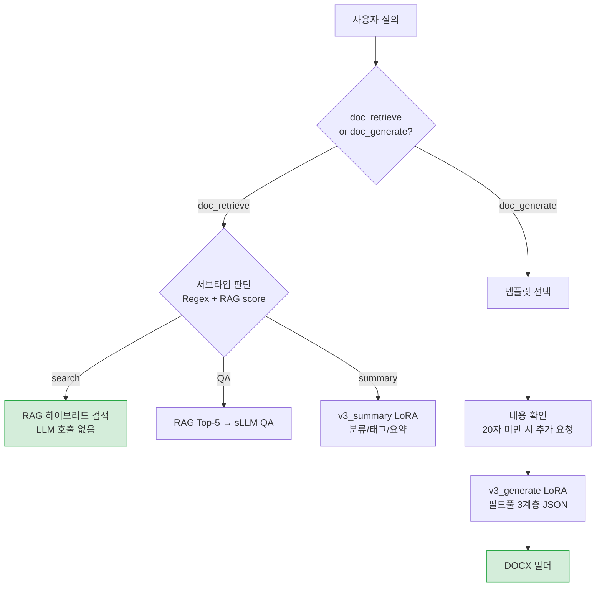
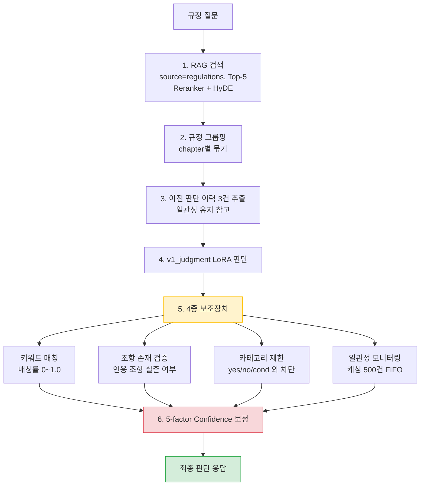
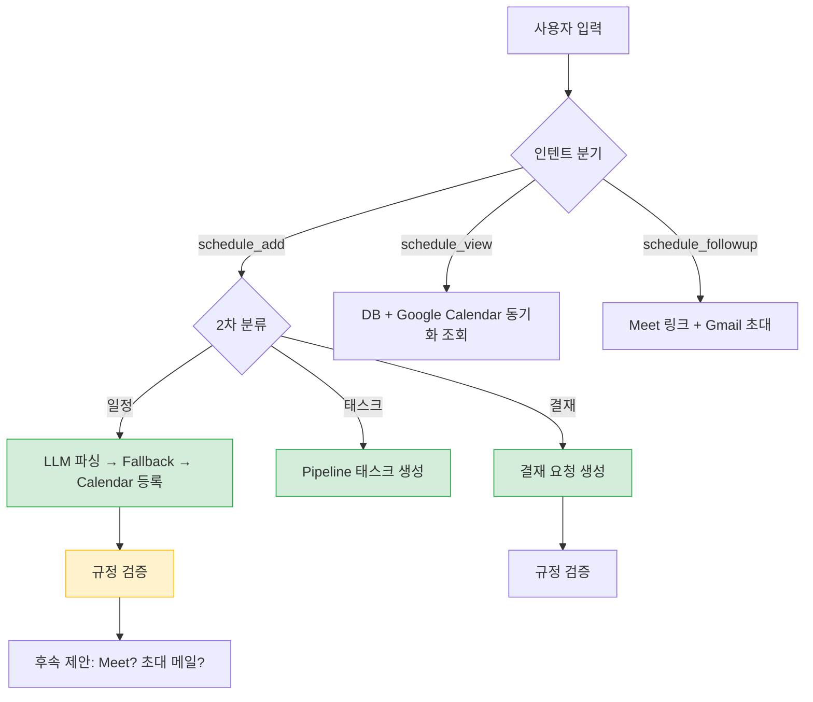
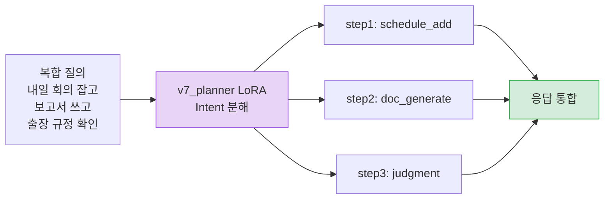
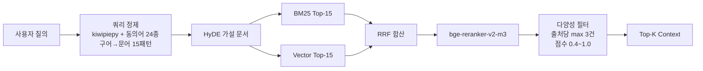

# DUDE — WorkFlow Agent


> **하나의 채팅으로 업무의 모든 것을**
>
> 사내 규정 / 문서 / 일정을 하나로 — Multi Agent 팀 워크스페이스

**SKN21 FINAL 3TEAM** | 멘토: 최민수 | 2026.03.31

<!-- TODO: 스크린샷 갤러리 — 아래 위치에 새 스크린샷 추가 예정 -->

---

## 목차

1. [프로젝트 개요](#1-프로젝트-개요)
2. [왜 온프레미스 sLLM인가?](#2-왜-온프레미스-sllm인가)
3. [시스템 아키텍처](#3-시스템-아키텍처)
4. [에이전트 상세](#4-에이전트-상세)
5. [데이터셋 및 파인튜닝](#5-데이터셋-및-파인튜닝)
6. [RAG 파이프라인](#6-rag-파이프라인)
7. [핵심 성과](#7-핵심-성과)
8. [트러블슈팅](#8-트러블슈팅)
9. [한계점 및 향후 계획](#9-한계점-및-향후-계획)
10. [기술 스택](#10-기술-스택)
11. [배포 아키텍처](#11-배포-아키텍처)
12. [프로젝트 구조](#12-프로젝트-구조)
13. [팀 구성](#13-팀-구성)
14. [빠른 시작](#14-빠른-시작)

---

## 1. 프로젝트 개요

### 배경

| 문제 (MS Work Trend Index 2023) | 비율 |
|------|------|
| 충분한 집중 시간 부족 | 68% |
| 과도한 정보 탐색 소요 | 62% |
| 커뮤니케이션 소모 비중 | 57% |

DUDE는 **3개의 전문 Agent + 1개의 Planner**로 구성된 Multi-Agent 시스템입니다. 사내 규정 확인, 문서 작성, 일정 관리를 하나의 채팅 인터페이스에서 자연어로 처리합니다.

| 기능 | 설명 |
|------|------|
| **AI 챗봇** | Multi-Agent 라우팅 + SSE 실시간 스트리밍 |
| **규정 판단 자동화** | sLLM + RAG + 4중 Guardrail |
| **문서 처리** | 템플릿 기반 자동 생성 + 검색 / 요약 / QA |
| **일정 및 결재 관리** | Google Workspace 5종 연동 (Calendar, Meet, Tasks, Gmail, Sheets) |

| 업무 영역 | AS-IS | TO-BE |
|-----------|-------|-------|
| 규정 확인 | 수동 검색 10~15분 | 자연어 질의 10초 이내 |
| 문서 작성 | 수동 30분~1시간 | AI 자동 생성, 검토만 5분 |
| 일정 관리 | 3~4개 앱 수동 전환 | 채팅 한 줄로 등록/조회/알림 |

---

## 2. 왜 온프레미스 sLLM인가?

| 이유 | 설명 |
|------|------|
| **보안** | 사내 규정·문서가 외부 API로 전송되지 않음 |
| **비용** | 종량제 API 과금 0원 — 자체 GPU 서빙으로 고정 비용만 발생 |
| **도메인 특화** | LoRA 파인튜닝으로 사내 규정/문서 도메인에 최적화 |

**핵심**: 하나의 Base 모델(Kanana-1.5-8B)에 **LoRA 어댑터만 교체**하여 4가지 태스크 수행 — GPU 재시작 없이 ~100ms 핫스왑

| 항목 | GPT-4o-mini | Kanana sLLM |
|------|:---:|:---:|
| 템플릿 품질 | 100/100 | 100/100 |
| 응답 시간 | 2.4~3.5초 | 7.3초 |
| API 비용 | 종량제 (과금) | **무료** (자체 서빙) |
| 데이터 보안 | 외부 전송 | **프라이버시 보장** |

---

## 3. 시스템 아키텍처


---

## 4. 에이전트 상세

| 구분 | 문서 Agent | 판단 Agent | 일정 Agent | Planner |
|------|-----------|-----------|-----------|---------|
| **입력** | doc_retrieve, doc_generate | judgment | schedule_add/view/followup | 복합 인텐트 |
| **핵심 기술** | LoRA 라우팅 (v3_generate / v3_summary) | 4중 보조장치 + 5-factor confidence | 2차 분류(일정/태스크/결재) + Google 5종 | depends_on 병렬 처리 |
| **sLLM** | v3_generate, v3_summary | v1_judgment | Solar API + sLLM (추천) | v7_planner |
| **특징** | 검색은 LLM 호출 없음 (최고속) | LLM 맹신 방지 (다중 검증) | AI 결재/일정 추천 + 파이프라인 칸반 | 최대 4단계 의존성 |

### 4-1. 문서 Agent



| 서브모듈 | LoRA 어댑터 | 출력 포맷 |
|---------|-----------|---------|
| generate | v3_generate | JSON → DOCX (회의록/보고서/제안서) |
| summary | v3_summary | 분류/태그/요약 |
| qa | base model | answer + citations |
| search | 없음 (RAG only) | 카드형 결과 (LLM 호출 없음, 최고속) |

---

### 4-2. 판단 Agent

규정 기반 yes/no/conditional 판단 + **LLM 결과를 맹신하지 않는** 다중 검증 구조



**4중 보조장치 (Guardrail)**

| 장치 | 역할 |
|------|------|
| 규정 키워드 매칭 | LLM 인용 조항이 RAG 결과에 실제 있는지, 매칭률 0~1.0 산출 |
| 조항 존재 검증 | 인용 조항(제N조)이 RAG에 존재하는지, 미존재 시 환각 플래그 |
| 판단 카테고리 제한 | yes/no/conditional/no_regulation 외 값 자동 대체 |
| 일관성 모니터링 | 동일 쿼리 캐싱 (max 500건 FIFO), 이전과 다른 결과 시 경고 |

**5-factor Confidence 산출**

```
Confidence = (LLM raw × 0.60) + (RAG avg score × 0.25) + (규정 커버리지 × 0.15)
             - 규정 충돌 감점 (-0.1/건)
             - 환각 감점 (키워드 매칭 기반)
             - 미존재 조항 감점 (-0.05/건)

Hard Cap (과신 방지):
  RAG 품질 < 0.2 → max 0.4 | 키워드 매칭 < 0.2 → max 0.3 | 인용 전부 미존재 → max 0.25
```

---

### 4-3. 일정 Agent

`schedule_add` 시 **2차 분류**로 일정/태스크/결재 자동 분기



| 서브타입 | 키워드 | 기능 |
|----------|--------|------|
| 일정 (기본) | — | LLM 파싱 → Google Calendar 등록 → Meet/Gmail 후속 제안 |
| 태스크 | 태스크, pipeline, 칸반 | 파이프라인 칸반보드 (todo → in_progress → review → done) |
| 결재 | 결재, 연차, 휴가, 품의, 출장 | 결재 요청 (leave/review/budget/business_trip/deploy) |

**AI 추천** (sLLM → OpenAI → 규칙 기반 3단계 fallback)

| 기능 | 설명 |
|------|------|
| 결재 추천 | 캘린더 + 파이프라인 분석 → 결재 항목 자동 추천 |
| 일정 추천 | 파이프라인 + 프로젝트 분석 → 추천 일정 생성 |
| 체크리스트 | 일정 + 태스크 분석 → 할 일 자동 생성 |
| 규정 검증 | 모든 추천에 regulation_check 적용, 위반 시 경고 태그 |

**Google Workspace 5종 연동**

| 서비스 | 기능 | 양방향 |
|--------|------|:---:|
| Calendar | 일정 CRUD, event_id 연동 | O |
| Meet | 화상 회의 링크 자동 생성 | — |
| Gmail | 참석자 초대 메일 (N명 일괄), 마감 알림 | — |
| Tasks | Action Item ↔ Google Tasks 동기화 | O |
| Sheets | 프로젝트 → WBS/Gantt/Dashboard/Risk 내보내기, 인라인 편집 | O |

---

### 4-4. Planner Agent



- 최대 4단계 의존성 관리 (depends_on으로 순차/병렬 자동 결정)
- v7_planner LoRA + Hybrid 프롬프트 + knowledge_query 매핑

---

## 5. 데이터셋 및 파인튜닝

### 데이터 구성

| 구분 | Train | Eval | 출처 |
|------|-------|------|------|
| Intent 분류 | 3,954 | 610 | 자체 제작 + Adversarial 463 |
| Planner | 1,471 | 150 | 자체 제작 + GPT 증강 |
| 판단 LoRA | 2,949 | 328 | 수동 제작(Excel) + RAG 증강 |
| 문서 생성 | 1,350 | 150 | AI Hub + 합성(회의록/보고서/제안서) |
| 문서 요약 | 900 | 100 | AI Hub SN 582 + GPT 증강 |

### 5-1. Base 모델 한계 (파인튜닝 전)

| Agent | 문제 | 수치 |
|-------|------|------|
| 판단 | 정확도 / JSON 유효율 / Confidence 과신 | 37.2% / 70.4% / 항상 0.9+ |
| 문서생성 | False Fill / content 채움률 | 44.3% / 34% |
| 문서요약 | 잘못된 분류("뉴스기사") / 장황 | 85% 유효 / 274자 |
| Planner | usable_rate | 71.0% |

---

### 5-2. Intent 분류 — 41.7% → 91.0% (+49.3%p)

| 단계 | 모델 | F1 | 비고 |
|------|------|:---:|------|
| 1단계 | 규칙 기반 Regex | 41.7% | 키워드 매칭 한계 |
| 2단계 | KoELECTRA (112M) | 76.7% | 과적합 gap -13.3%p |
| 3단계 | roberta-large + KD | 88.3% | 과적합 gap -3.3%p로 해소 |
| **최종** | **5-Seed 앙상블 + ONNX INT8** | **91.0%** | Focal Loss, FGM, KD |

```
[Base — Regex (41.7%)]  "내일 3시에 회의 잡아줘" → doc_generate 오분류
[LoRA — 앙상블 (91.0%)] "내일 3시에 회의 잡아줘" → schedule_add (conf: 0.94) 정확 분류
```

---

### 5-3. Planner — 71.0% → 87.0% (+16%p)

| 항목 | Kanana-1.5-8B | Qwen3-8B |
|------|:---:|:---:|
| 유효 응답률 | **94.7%** | 68.4% |
| 추론 속도 | **2.3s** | 11.8s |
| Complex 15건 | **15건 전부** | 5건만 |

성능 추이: baseline 71.0% → +Few-shot 75.0% → +매핑 82.0% → **Hybrid 87.0%** | Step별: 1-step 91.5% / 2-step 84.9% / 3-step 66.7%

```
[Base (71.0%)] "회의 잡고 보고서 쓰고 출장 규정 확인" → 3개 인텐트를 1개로 뭉침
[LoRA (87.0%)] → step1: schedule_add + step2: doc_generate + step3: judgment (정확 분해)
```

---

### 5-4. 판단 Agent — 37.2% → 85.4% (+48.2%p)

**3단계 실험 스토리**

| 실험 | 정확도 | 결과 | 인사이트 |
|------|:---:|:---:|-------------|
| v1 하드코딩 3ep | 86.6% | 채택 | 하드코딩 = 깨끗한 학습 신호 |
| v2 +98건 보강 | 83.4% | 폐기 | 데이터 양 < 질 (라벨 오염) |
| v1 RAG 전환 | 76.8% | 폐기 | RAG 노이즈 → conditional 84%→55% |
| **v3 약점 타겟** | **85.4%** | **채택** | 19건 정밀 보강 (재량표현 14 + 경계 5) |

카테고리별: no_regulation 6%→**97%** / yes 42%→**86%** / no 48%→**84%** / conditional 47%→**78%** / JSON 유효율 70.4%→**97.6%**

```
[Base] "인턴에게 AWS 접근 권한 줘도 되나요?"
→ result: "yes" (오답), confidence: 0.92 (과신), 제12조 인용 (환각)

[LoRA] → result: "conditional" (정답), confidence: 0.78 (적절)
→ 정보보안규정 제25조 + 인사규정 제8조 (실존), conditions: "보안교육 이수 + 부서장 승인"
```

---

### 5-5. 문서생성 — BERTScore 0.896 → 0.926 / False Fill 44.3% → 17.9%

| 항목 | 값 |
|------|-----|
| 데이터 | 회의록 461 + 보고서 484 + 제안서 555 = **1,500건** |
| LoRA | r=32, alpha=64, 4-bit QLoRA, 5ep (Best:2), LR 1e-4 |

| 지표 | Base | LoRA | 변화 |
|------|:---:|:---:|:---:|
| BERTScore F1 | 0.896 | **0.926** | +0.030 |
| ROUGE-L | 0.465 | **0.665** | +0.200 |
| False Fill | 44.3% | **17.9%** | -26.4%p |
| content 채움률 | 34% | **100%** | +66%p |

```
[Base] "연말 성과 평가 회의" → content: "" (빈칸), budget: "500만원" (환각)
[LoRA] → content: "매출 8% 달성, 물류비 절감...", decisions: ["우수사원 포상 기준 확립"]
```

---

### 5-6. 문서요약 — 분류 유효율 85% → 100% / 274자 → 132자

| 항목 | 값 |
|------|-----|
| 데이터 | AI Hub 300건 + GPT-4o 700건 = **~1,000건** |
| LoRA | r=16, alpha=32, 4-bit QLoRA, 5ep (Best:2), max_length 8,192 |

| 지표 | Base | LoRA | 변화 |
|------|:---:|:---:|:---:|
| BERTScore F1 | 0.828 | **0.859** | +0.031 |
| 분류 유효율 | 85% | **100%** | +15%p |
| 평균 길이 | 274자 | **132자** | 2배 간결 |

```
[Base] 분류: "뉴스기사" (존재하지 않는 카테고리), 274자 장황한 서술
[LoRA] 분류: "보고서" (정확), 132자 핵심만 간결
```

> BERTScore 분포 (Eval 100건): 0.9이상 16% / 0.8~0.9 76% / 0.7~0.8 8%

---

### 파인튜닝 모델 총괄

| 모델 | 용도 | LoRA 설정 | Before → After |
|------|------|----------|:---:|
| roberta-large (338M) | Intent 분류 9클래스 | 5-Seed 앙상블, ONNX INT8 | F1: 41.7% → **91.0%** |
| v7_planner | 복합 인텐트 분해 | QLoRA r=16, Hybrid | usable: 71.0% → **87.0%** |
| v1_judgment | 규정 판단 | r=16, alpha=32 | 정확도: 37.2% → **85.4%** |
| v3_generate | 문서 생성 | r=32, alpha=64, 4-bit QLoRA | BERTScore: 0.896 → **0.926** |
| v3_summary | 문서 요약 | r=16, alpha=32, 4-bit QLoRA | 분류: 85% → **100%** |

> Base: Kanana-1.5-8B · A100 80GB (RunPod) · vLLM 어댑터 핫스왑 (~100ms)

---

## 6. RAG 파이프라인

| 구분 | 규모 | 파싱 |
|------|------|------|
| 사내 규정 | 9개 TXT + 1개 PDF | RegulationParser (조문 인식) |
| 업로드 문서 | 77건 | DoclingParser + PaddleOCR |



청킹: **제N조 단위** (max 400자) + 불릿 서브분할 + 메타데이터 (chapter/article/title/category)

---

## 7. 핵심 성과

| 항목 | 결과 |
|------|------|
| API 비용 | sLLM 전환으로 **과금 0원** (GPT fallback, 서비스 중단 0건) |
| RAG 검색 | RAGAS Recall **0.944** · Precision **0.889** · MRR **0.636→0.952** |
| Google Workspace | Calendar + Tasks + Gmail + Meet + Sheets **5종 연동** |
| 이슈 해결 | 23건 중 **100% 해결** |
| LoRA | 판단 + 문서생성 + 문서요약 + Planner **4종 완료** |

---

## 8. 트러블슈팅

| 영역 | 문제 | 해결 |
|------|------|------|
| Intent | KoELECTRA 과적합 (Dev 90% vs Held-out 76.7%) | roberta-large(338M) 교체, gap -13.3%p → -3.3%p |
| Planner | judgment 인텐트 혼동 | judgment 단독 요청을 학습 데이터에서 제거 |
| 판단 | vLLM 한글 깨짐 | LORA_DTYPE=auto로 변경 |
| 판단 | RAG 학습 시 -9.8%p 급락 | 학습은 하드코딩, 서빙은 RAG 정제 삽입 |
| 판단 | Confidence 과신 (0.95→실제 틀림) | 5-factor 보정 + 4중 보조장치 |
| 문서생성 | 3줄 입력 시 필드 0건 | meta/body 분리, 완성도 100% |
| Backend | Qdrant 19건 미동기 | reindex 스크립트 자동 복구 |
| Backend | CI/CD SIGTERM 반복 | systemd 서비스 전환 |
| Frontend | SSE State 손실 | Ref 기반 배열 관리 |

---

## 9. 한계점 및 향후 계획

| 한계 | 상세 |
|------|------|
| conditional 정확도 78% | 판단 경계 모호, 목표 85% 대비 +7%p 필요 |
| Planner v5 수렴 | v6/v7 정체, 데이터 품질 개선 필요 |
| Reranker +5.7초 | 정확도↑ vs 속도↓ 트레이드오프 |
| 멀티턴 미지원 | 단건 질문-응답 구조, 맥락 유지 미구현 |

**로드맵**: 단기 — conditional 데이터 수집, vLLM 이슈 해결 / 중기 — RAG+LoRA 통합, 멀티턴 / 장기 — 4-bit 경량화, 추가 Agent, RLHF

---

## 10. 기술 스택

| 분류 | 기술 |
|------|------|
| **AI/ML** | LangGraph, Kanana-1.5-8B + LoRA, vLLM, Qdrant, BM25, bge-reranker-v2-m3, roberta-large (ONNX), Docling + PaddleOCR, jhgan/ko-sbert-nli |
| **Backend** | FastAPI + SSE, PostgreSQL (12 tables), SQLAlchemy + Alembic, JWT + Google OAuth 2.0, Redis, AES-256 |
| **Frontend** | React 18 (Vite), Zustand + TanStack Query, Tailwind CSS, FullCalendar, framer-motion |
| **Infra** | AWS EC2 + S3 + RDS, RunPod A100 40GB, Qdrant Cloud, Docker, GitHub Actions |

---

## 11. 배포 아키텍처

```
┌─────────────────────────────────────────────────────┐
│                     사용자 (브라우저)                    │
└──────────────────────┬──────────────────────────────┘
                       │ HTTPS
┌──────────────────────▼──────────────────────────────┐
│              AWS EC2 (Backend + Frontend)             │
│  ┌─────────────┐  ┌─────────────┐  ┌──────────────┐ │
│  │  FastAPI     │  │  React      │  │  Redis       │ │
│  │  (SSE/REST)  │  │  (Vite)     │  │  (Cache)     │ │
│  └──────┬──────┘  └─────────────┘  └──────────────┘ │
│         │                                            │
│  ┌──────▼──────┐  ┌─────────────┐  ┌──────────────┐ │
│  │  PostgreSQL  │  │  AWS S3     │  │  GitHub      │ │
│  │  (RDS)       │  │  (파일저장) │  │  Actions CI  │ │
│  └─────────────┘  └─────────────┘  └──────────────┘ │
└──────────────────────┬──────────────────────────────┘
                       │ API
┌──────────────────────▼──────────────────────────────┐
│              RunPod (A100 40GB GPU)                   │
│  ┌─────────────────────────────────────────────────┐ │
│  │  vLLM Serving (Kanana-1.5-8B)                   │ │
│  │  LoRA 어댑터: v1_judgment / v3_generate /        │ │
│  │              v3_summary / v7_planner             │ │
│  └─────────────────────────────────────────────────┘ │
└─────────────────────────────────────────────────────┘
                       │ API
┌──────────────────────▼──────────────────────────────┐
│              Qdrant Cloud (Vector DB)                 │
│  규정 670건 + 업로드 문서 77건 벡터 저장               │
└─────────────────────────────────────────────────────┘
```

---

## 12. 프로젝트 구조

```
backend/app/              — FastAPI 백엔드
  api/v1/                 — REST API (chat, documents, schedules, approvals, pipeline, calendar, gmail, tasks, sheets)
  models/                 — ORM 모델 (12개 테이블)
  services/               — 비즈니스 로직 (Google Services 5종 포함)
  schemas/                — Pydantic 스키마

ai/                       — AI/ML 모듈
  agents/                 — LangGraph Agent (orchestrator, judgment, document, schedule)
  llm/                    — LLM 공통 모듈 (factory, providers, prompts)
  rag/                    — RAG 파이프라인 (hybrid_search, reranker, qdrant)
  templates/              — 문서 템플릿 (회의록, 보고서, JD, 제안서)
  document_parser/        — 문서 파싱 (Docling, PaddleOCR, DOCX)
  finetuning/             — LoRA 학습
  serving/                — vLLM 클라이언트

frontend/src/             — React 프론트엔드
  components/             — UI 컴포넌트
  pages/                  — 11개 페이지
  store/                  — Zustand
  hooks/                  — useAuth, useSSE, useChat, useGoogleServices
```

---

## 13. 팀 구성

| 이름 | 역할 | 담당 |
|------|------|------|
| **신지용** | PM | 프로젝트 관리, 의도 분류, 오케스트레이터, 문서 Agent |
| **문지영** | FE / AI | React UI, SSE 채팅, Intent 분류, Planner LoRA |
| **안혜빈** | BE | FastAPI, DB, 인증, Google API, 멀티 Agent 기능 |
| **윤경은** | AI | 판단 Agent, RAG, LoRA 파인튜닝, 팀스페이스 |

### 회고

| 이름 | 회고 |
|------|------|
| **신지용** | |
| **문지영** | |
| **안혜빈** | |
| **윤경은** | |

---

## 14. 빠른 시작

```bash
# Backend
cd backend && pip install -r requirements.txt
cp .env.example .env && uvicorn app.main:app --reload

# Frontend
cd frontend && npm install
cp .env.example .env && npm run dev

# Docker (선택)
docker-compose up -d
```

**주요 환경 변수**: `DATABASE_URL` · `REDIS_URL` · `QDRANT_URL` · `GOOGLE_CLIENT_ID/SECRET` · `VLLM_BASE_URL` · `AWS_ACCESS_KEY_ID/SECRET` · `JWT_SECRET_KEY`

---

## License

This project is licensed under the [MIT License](LICENSE).

---

> **DUDE** — 하나의 채팅으로 업무의 모든 것을
