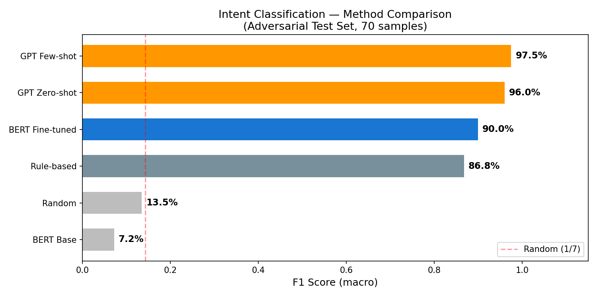
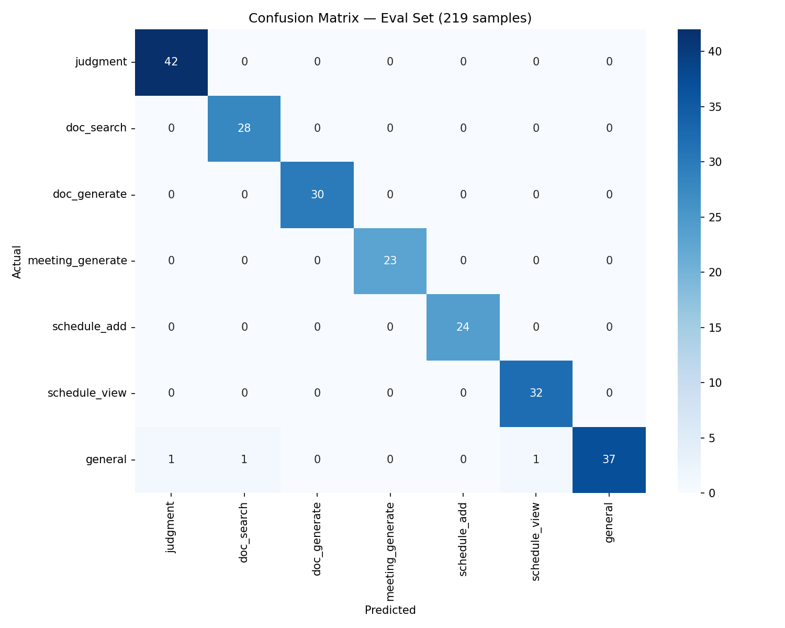
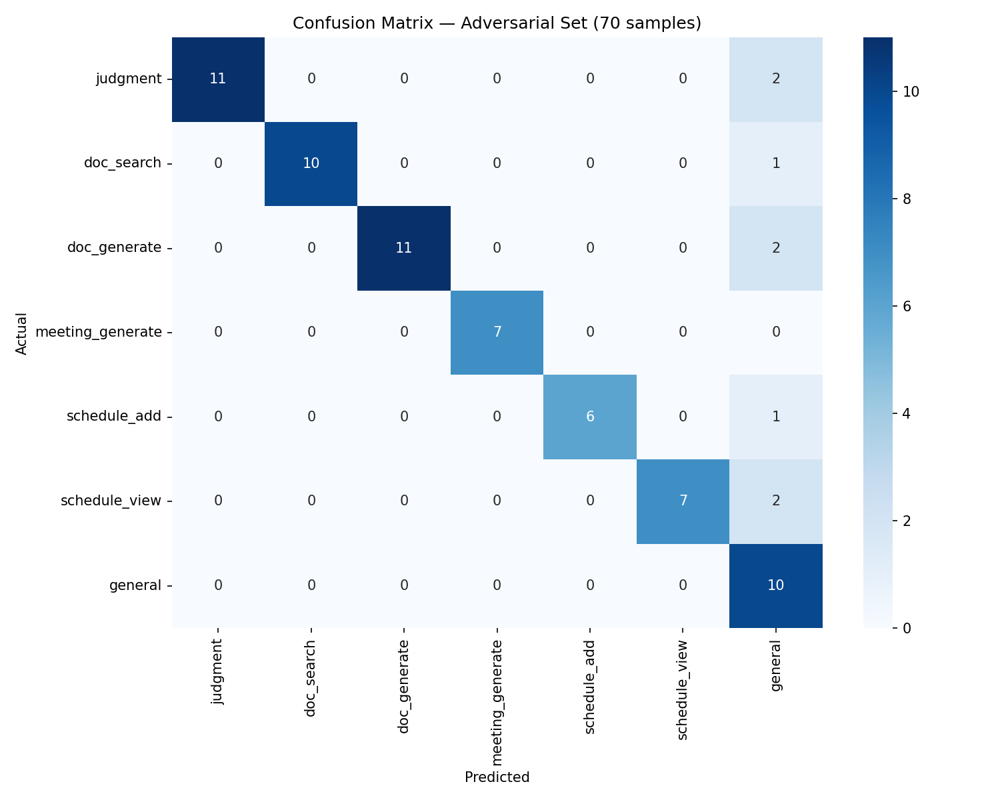
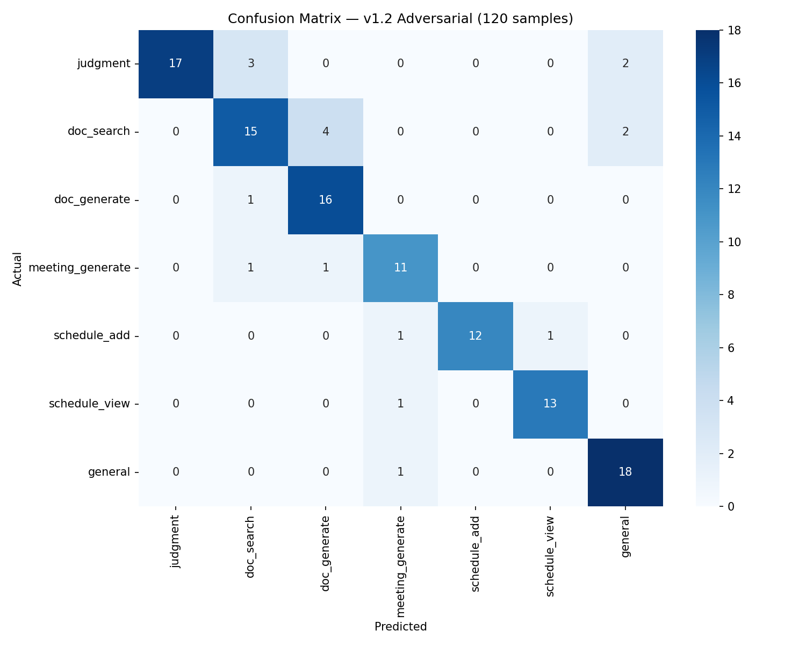
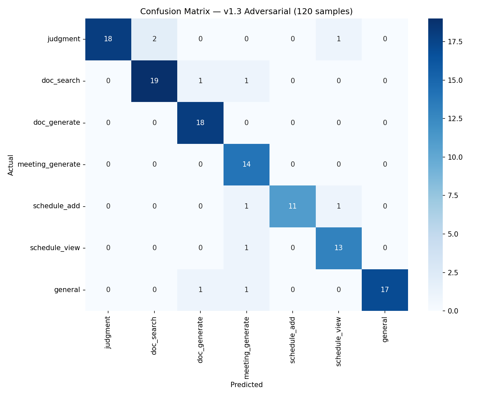
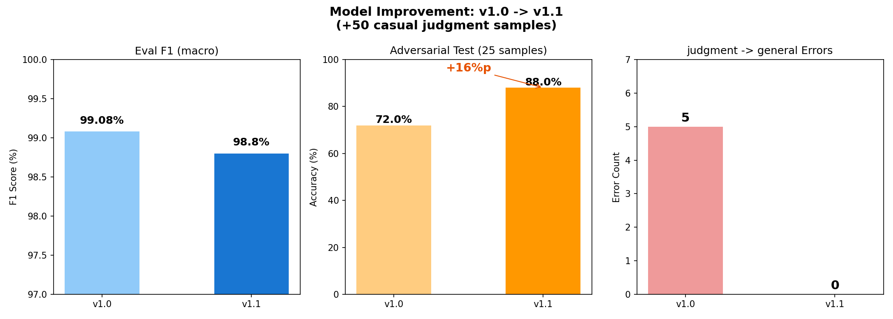
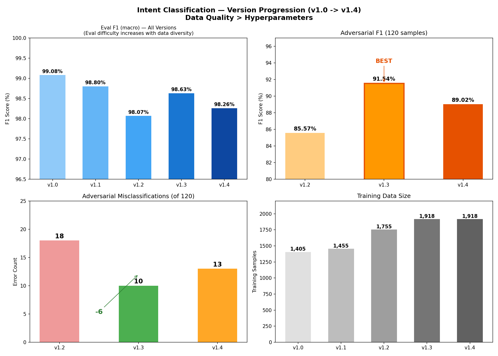

# ML 비교 실험 기획서

> Intent Classification 모델의 성능을 다각도로 검증하고, 중간발표용 시각 자료를 생성하기 위한 실험 계획.
> **최종 업데이트: 2026-02-11 (실험 1~4 완료, 실험 5~6 기획)**

---

## 실험 목적

발표에서 답해야 할 6가지 질문:

1. **"왜 이 방법을 선택했나?"** → 실험 1 (방법론 비교) ✅
2. **"어디가 약하고 어떻게 대응하나?"** → 실험 2 (혼동행렬) ✅
3. **"개선할 줄 아나?"** → 실험 3 (v1.0→v1.1 개선 차트) ✅
4. **"체계적으로 개선했나?"** → 실험 4 (v1.2~v1.4 버전별 학습) ✅
5. **"다른 모델도 해봤나? 충분히 탐색했나?"** → 실험 5 (다중 모델 × 하이퍼파라미터 전탐색) 📋
6. **"실서비스에서도 되나? 최대한 끌어올렸나?"** → 실험 6 (전처리 파이프라인 + 최종 성능) 📋

---

## 데이터 현황

### 기본 데이터
| 용도 | 파일 | 크기 |
|------|------|:----:|
| 학습 (원본) | `data/training/intent/{category}.jsonl` × 7 | 1,455문장 |
| 정규 평가 | 학습 데이터에서 15% 층화 분할 | 버전별 상이 |
| Adversarial 평가 | `data/training/intent/adversarial_test.json` | **120문장 → 200문장 확장 예정** |

> ⚠️ **Adversarial 테스트셋 변천**: 실험 1~3은 25~70문장, 실험 4는 120문장으로 진행 완료. 실험 5~6에서는 **200문장으로 확장**하여 통계적 신뢰성을 높입니다. (1건당 0.5%p 변동 → 기존 120개 0.83%p 대비 안정적)

### 증강 데이터
| 버전 | 파일 패턴 | 건수 | 내용 |
|------|----------|:----:|------|
| v1.2 | `augment_v12_*.jsonl` × 6 | 300 | 비정형/인터넷 슬랭/초성 (카테고리별 50) |
| v1.3 | `augment_v13_*.jsonl` × 7 | 163 | boundary 타겟 (혼동 패턴별 20~30) |
| **합계** | | **463** | |

### 버전별 총 데이터
| 버전 | Base | +Augment | 총계 | Train | Eval |
|------|:----:|:--------:|:----:|:-----:|:----:|
| v1.0 | 1,405 | - | 1,405 | 1,194 | 211 |
| v1.1 | 1,455 | - | 1,455 | 1,236 | 219 |
| v1.2 | 1,455 | +300 | 1,755 | 1,495 | 260 |
| v1.3/v1.4 | 1,455 | +463 | 1,918 | 1,632 | 286 |

---

## 실험 1: 방법론 비교 ✅

**질문**: 파인튜닝이 다른 방법보다 나은가?

### 비교 대상 (6가지)

| # | 방법 | 설명 |
|---|------|------|
| 1 | **Random** | 7개 중 무작위 선택 (이론값 14.3%) |
| 2 | **Rule-based** | 키워드 매칭 (회의→meeting, 규정→judgment 등) |
| 3 | **BERT Base (학습 전)** | klue/bert-base에 classification head만 붙인 상태 |
| 4 | **GPT Zero-shot** | GPT-4o-mini + 시스템 프롬프트만 |
| 5 | **GPT Few-shot** | GPT-4o-mini + 카테고리별 3개 예시 (21문장) |
| 6 | **BERT Fine-tuned** | 우리 모델 (v1.1) |

### 결과

| 방법 | F1 (macro) | Accuracy | 속도 (ms) | 비용 |
|------|:----------:|:--------:|:---------:|:----:|
| GPT Few-shot | **97.53%** | 97.14% | 456.6 | ~$0.03/70문장 |
| GPT Zero-shot | 96.02% | 95.71% | 519.7 | ~$0.01/70문장 |
| **BERT Fine-tuned** | **89.97%** | 88.57% | **6.7** | **$0** |
| Rule-based | 86.81% | 84.29% | 0.0 | $0 |
| Random | 13.48% | 12.86% | 0.0 | $0 |
| BERT Base | 7.22% | 12.86% | 10.4 | $0 |

### 핵심 인사이트
- GPT가 accuracy 7.5%p 우위, 하지만 BERT가 **68배 빠르고 비용 $0 + 데이터 보안**
- **sLLM 선택 정당성**: 정확도 7.5%p를 속도 68배 + 비용 $0 + 로컬 추론으로 교환



---

## 실험 2: 혼동행렬 ✅

**질문**: 어떤 카테고리끼리 헷갈리는가?

| 항목 | 내용 |
|------|------|
| 방법 | eval + adversarial 각각 혼동행렬 |
| 출력 | 히트맵 이미지 — v1.1(2장) + v1.2(1장) + v1.3(1장) = **4장** |

### 결과 요약
- **v1.1 Eval (219문장)**: 오분류 3건, 거의 완벽한 대각선
- **v1.1 Adversarial (70문장)**: 오분류 8건, **전부 general로 폴백** (안전한 실패 방향)
- **v1.3 Adversarial (120문장)**: 오분류 10건, 주로 multi-intent와 ultra-short

| v1.1 Eval 혼동행렬 | v1.1 Adversarial 혼동행렬 |
|:---:|:---:|
|  |  |

| v1.2 Adversarial 혼동행렬 | v1.3 Adversarial 혼동행렬 (최종) |
|:---:|:---:|
|  |  |

---

## 실험 3: v1.0 → v1.1 개선 차트 ✅

**질문**: 문제를 발견하고 개선할 수 있는가?

| 지표 | v1.0 | v1.1 | 변화 |
|------|:----:|:----:|:----:|
| Eval F1 | 99.08% | 98.80% | -0.3%p (트레이드오프) |
| Adversarial (25문장) | 72% (18/25) | 88% (22/25) | **+16%p** |
| judgment→general 오분류 | 5건 | 0건 | **완전 해결** |

> ⚠️ 이 실험의 adversarial은 **25문장 기준**입니다. 실험 4의 120문장 셋과 난이도·크기가 다르므로 직접 비교 불가.

### 핵심 인사이트
- 원인 분석 → 타겟 증강 → 문제 해결의 체계적 프로세스 입증



---

## 실험 4: v1.2 ~ v1.4 버전별 학습 ✅

**질문**: 체계적으로 모델을 개선할 수 있는가?

### 전략 (Strategy C: 약점 기반 점진적 개선)

```
v1.2  비정형 데이터 증강 (+300)
  ↓   오분류 패턴 분석 (18건)
v1.3  Boundary 타겟 증강 (+163) + 라벨 QA (3건 수정)
  ↓   "데이터 품질 vs 하이퍼파라미터" 검증
v1.4  하이퍼파라미터 그리드 서치 (6가지 조합)
```

### 결과

| 버전 | Eval F1 | Adv Acc (120개) | Adv F1 | 오분류 | 핵심 |
|------|:-------:|:---------------:|:------:|:------:|------|
| v1.2 | 98.07% | 85.0% | 85.57% | 18 | 비정형 증강, 더 어려운 셋 기준 |
| **v1.3** | **98.63%** | **91.67%** | **91.54%** | **10** | **boundary 증강 + 라벨 QA** |
| v1.4 | 98.26% | 89.2% | 89.02% | 13 | 그리드 서치 (과적합 발생) |

### v1.4 그리드 서치 상세

| epochs | lr | Eval F1 |
|:------:|:-----:|:-------:|
| 3 | 2e-5 | 0.9754 |
| 5 | 1e-5 | 0.9653 |
| 5 | 2e-5 | 0.9754 |
| 5 | 5e-5 | 0.9791 |
| 7 | 2e-5 | 0.9754 |
| **10** | **2e-5** | **0.9826** |

Best config(epochs=10)는 Eval 최고지만 Adversarial 하락 → **과적합 확인**



### 핵심 인사이트
1. **데이터 품질 > 하이퍼파라미터**: boundary 증강(+6%p) >> 그리드 서치(효과 없음)
2. **라벨 QA의 중요성**: 모호한 라벨 3건 수정만으로 오분류 3건 감소
3. **klue/bert-base 기준 최적 데이터 = v1.3**: epochs=5, lr=2e-5, 1,918 데이터
4. → 이 데이터를 다른 모델에도 적용하여 최종 모델을 확정하는 것이 실험 5의 목적

---

## 실험 5~6 사전 작업: Adversarial 테스트셋 확장 (120 → 200)

### 확장 목적
- 120개에서 1건 = 0.83%p 변동 → 200개에서 1건 = 0.5%p 변동 → **통계적 안정성 향상**
- 실험 5에서 모델 3개 비교 시, 작은 차이가 의미 있는지 판단 가능

### 추가할 80문장 유형 분배

| 유형 | 추가 건수 | 설명 |
|------|:--------:|------|
| multi-intent (복합 의도) | 15 | "규정 검색해서 판단해줘" 류 — 기존 약점 보강 |
| ultra-short (극단적 짧은 입력) | 15 | 1~2어절 ("규정", "일정", "문서 줘") |
| 오타/비정형 입력 | 15 | "연챠 귝정", "ㅎㅇㄹ 만듦" — 전처리 효과 측정용 |
| formal (격식체/존칭) | 10 | "~해주실 수 있으신지요", "검토 부탁드립니다" |
| context-dependent (맥락 의존) | 10 | "아까 그거", "위에 말한 거" |
| category boundary (경계) | 15 | doc_search↔doc_generate, judgment↔general 등 |

### 제작 규칙
- 기존 120문장과 중복 없음
- 카테고리별 최소 2문장 이상 포함
- 정답 라벨은 "최종 의도" 기준 (multi-intent 규칙 동일)
- 제작 후 라벨 QA 필수 (2인 교차 검증 또는 Claude 검증)

---

## 실험 5: 다중 모델 × 하이퍼파라미터 전탐색 (예정)

**질문**: 다른 모델도 해봤나? 파라미터를 충분히 탐색했나?

### 실험 목적
1. klue/bert-base 외 다른 한국어 사전학습 모델과의 성능 비교
2. 모델별 최적 하이퍼파라미터 탐색 → 최종 모델 선택의 정당성 강화
3. "충분히 다양하게 실험했다"는 근거 확보

### 비교 모델 (3종)

| # | 모델 | 파라미터 수 | 특징 |
|---|------|:---------:|------|
| 1 | **klue/bert-base** | 111M | 현재 사용 중, KLUE 벤치마크 학습 |
| 2 | **klue/roberta-base** | 111M | BERT 변형, 동적 마스킹 + 더 많은 데이터로 학습 |
| 3 | **monologg/koelectra-base-v3** | 111M | 한국어 특화, replaced token detection 방식 |

### 하이퍼파라미터 탐색 범위

| 파라미터 | 값 | 개수 | 근거 |
|---------|-----|:---:|------|
| epochs | [3, 5, 7, 10] | 4 | 부족~과적합 범위 커버 |
| learning_rate | [1e-5, 2e-5, 3e-5, 5e-5] | 4 | BERT 원논문 권장 범위 포함 |
| batch_size | [8, 16, 32] | 3 | 소형 데이터셋 표준 범위 |
| warmup_ratio | [0.0, 0.06, 0.1] | 3 | 학습 안정성 영향 확인 |
| weight_decay | 0.01 (고정) | - | BERT 표준값 |
| max_length | 64 (고정) | - | 평균 입력 길이 대비 충분 |
| seed | 42 (고정) | - | 재현성 보장 |

### 실험 진행 방식 (2단계)

**Step 1: 모델별 주요 파라미터 탐색 (warmup 고정 0.06)**
```
epochs × lr × batch_size = 4 × 4 × 3 = 48 조합
× 3모델 = 144번 학습
예상 시간: ~3~5시간 (RunPod A100)
```

**Step 2: best config 근처 warmup 미세 조정**
```
모델별 best config에서 warmup [0.0, 0.06, 0.1] 변경
3모델 × 3 = 9번 학습
예상 시간: ~15분
```

**총 153번 학습, 약 3~5시간**

### 고정 조건

| 항목 | 값 |
|------|-----|
| 학습 데이터 | v1.3 (1,918개) — 모든 모델 동일 |
| Train/Eval 분할 | 85:15 층화 분할 — 동일 seed로 동일 분할 |
| Eval 테스트셋 | 286문장 (학습 데이터에서 분할) |
| Adversarial 테스트셋 | **200문장** (기존 120 + 신규 80 확장) |
| 평가 지표 | Eval F1 (macro), Adversarial Accuracy, Adversarial F1 (macro) |
| GPU | RunPod A100 (On-Demand) |

### 예상 결과물

| 출력 | 설명 |
|------|------|
| `results/model_comparison.json` | 3모델 × best config 수치 |
| `results/grid_search_full.json` | 153번 전체 결과 |
| `results/model_comparison.png` | 모델별 성능 비교 차트 |
| `results/heatmap_*.png` | 모델별 lr×epochs 히트맵 (3장) |
| `results/confusion_adv_*.png` | 모델별 best config 혼동행렬 (3장) |
| `results/inference_speed.png` | 모델별 추론 속도 비교 차트 |

### 예상 결과 테이블

| 모델 | Best Config | Eval F1 | Adv Acc | Adv F1 | 추론 속도 |
|------|------------|:-------:|:-------:|:------:|:---------:|
| klue/bert-base | (실험 후 기입) | | | | |
| klue/roberta-base | (실험 후 기입) | | | | |
| koelectra-base-v3 | (실험 후 기입) | | | | |

### 최종 모델 선정 기준 (우선순위)

```
1순위: Adversarial F1 (실전 성능)
2순위: Eval F1 (기본 성능)
3순위: 추론 속도 (서비스 응답성)
```

### 스크립트

| 파일 | 역할 |
|------|------|
| `run_model_comparison.py` | Step 1~2 전체 그리드 서치 + 평가 자동화 |
| `run_visualize.py` (업데이트) | 실험 5 차트 추가 생성 |

---

## 실험 6: 전처리 파이프라인 + 최종 성능 검증 (예정)

**질문**: 실서비스에서도 되나? 최대한 끌어올렸나?

### 실험 목적
1. 실험 5에서 확정된 최적 모델에 전처리를 추가하여 **최종 성능 상한선** 확인
2. 전처리 단계별 기여도를 개별 측정 → "어떤 전처리가 얼마나 효과 있는지" 정량화
3. seed 3개 반복 실행 → 결과 신뢰성(안정성) 검증

### 전제 조건
- 실험 5 완료 후 확정된 **최적 모델 + best config** 사용
- 모델 자체는 재학습하지 않음 — **추론 시 입력만 전처리**

### 전처리 파이프라인 (4단계)

| 단계 | 처리 | 예시 |
|:---:|------|------|
| P1 | **맞춤법 교정** | "연챠 규정" → "연차 규정" |
| P2 | **초성 복원** | "ㅎㅇㄹ 만들어줘" → "회의록 만들어줘" |
| P3 | **슬랭/축약어 정규화** | "걍 그거 해주셈" → "그냥 그거 해주세요" |
| P4 | **공백/특수문자 정리** | "회의록 ㅋㅋ   만들어줘!!" → "회의록 만들어줘" |

### 실험 설계: Ablation Study (제거 실험)

각 전처리를 하나씩 켜면서 **어떤 단계가 얼마나 기여하는지** 측정:

| # | 조합 | 설명 |
|---|------|------|
| A | 없음 (baseline) | 전처리 없이 모델만 (실험 5 best 그대로) |
| B | P4만 | 공백/특수문자 정리만 |
| C | P4 + P1 | + 맞춤법 교정 |
| D | P4 + P1 + P2 | + 초성 복원 |
| E | P4 + P1 + P2 + P3 | 전체 파이프라인 (풀 전처리) |

### 신뢰성 검증: seed 3개 반복

```
실험 5 best config를 seed 3개(42, 123, 456)로 재학습
→ 각각 전처리 조합 A~E 평가
→ 평균 ± 표준편차 보고
```

| 조합 | seed=42 | seed=123 | seed=456 | 평균±std |
|------|:-------:|:--------:|:--------:|:--------:|
| A (baseline) | (실험 후) | | | |
| B (P4) | | | | |
| C (P4+P1) | | | | |
| D (P4+P1+P2) | | | | |
| E (전체) | | | | |

### 고정 조건

| 항목 | 값 |
|------|-----|
| 모델 | 실험 5 최적 모델 |
| 하이퍼파라미터 | 실험 5 best config |
| 학습 데이터 | v1.3 (1,918개) — 전처리 적용하지 않음 (원본 학습) |
| 테스트 데이터 | Eval 286문장 + Adversarial **200문장** — **추론 시에만 전처리 적용** |
| 평가 지표 | Eval F1, Adversarial Acc, Adversarial F1 |

> **중요**: 학습 데이터는 그대로 두고, **테스트 입력에만 전처리를 적용**합니다. 실서비스에서 사용자 입력이 들어올 때 전처리하는 것과 동일한 상황을 재현합니다.

### 예상 결과물

| 출력 | 설명 |
|------|------|
| `results/preprocessing_ablation.json` | 조합 A~E × seed 3개 전체 결과 |
| `results/preprocessing_ablation.png` | 전처리 단계별 성능 변화 차트 |
| `results/seed_stability.png` | seed별 결과 분포 (에러 바 차트) |
| `results/final_confusion_adv.png` | 최종(풀 전처리) 혼동행렬 |

### 예상 최종 결과

```
실험 5 best (전처리 없음):  Adversarial ~91-93% (200문장 기준)
실험 6 풀 전처리 적용 후:   Adversarial ~93-96% (예상)
```

### 스크립트

| 파일 | 역할 |
|------|------|
| `preprocessing.py` | 전처리 파이프라인 모듈 (P1~P4 각각 on/off 가능) |
| `run_preprocessing_ablation.py` | 조합 A~E × seed 3개 자동 평가 |
| `run_visualize.py` (업데이트) | 실험 6 차트 추가 생성 |

---

## 실험 전체 요약

| 실험 | 질문 | 상태 | 예상 시간 |
|:---:|------|:---:|:---------:|
| 1 | 왜 이 방법? (6가지 비교) | ✅ 완료 | - |
| 2 | 어디서 틀리나? (혼동행렬) | ✅ 완료 | - |
| 3 | 고칠 줄 아나? (v1.0→v1.1) | ✅ 완료 | - |
| 4 | 체계적 개선? (v1.2~v1.4) | ✅ 완료 | - |
| 5 | 다른 모델도? 충분히 탐색? | 📋 예정 | ~3~5시간 |
| 6 | 최대한 끌어올렸나? 실서비스? | 📋 예정 | ~1~2시간 |

**내일 예상 총 소요: 약 5~7시간 (RunPod A100)**

---

## 최종 모델 성능 (v1.3 기준, 실험 5~6 후 갱신 예정)

| 지표 | 값 |
|------|-----|
| Eval F1 (macro) | **98.63%** |
| Adversarial Accuracy (120문장, 실험 5~6에서 200문장으로 확장) | **91.67%** |
| Adversarial F1 (macro) | **91.54%** |
| 추론 속도 | **6.7ms/문장** |
| 운영 비용 | **$0** |
| 남은 오분류 | 10/120건 (대부분 multi-intent, ultra-short 모호 문장) |

---

## 결과 파일 위치

```
ai/experiments/
├── EXPERIMENT_PLAN.md              ← 이 문서
├── run_method_comparison.py        ← 실험1 (Rule+BERT) + 실험2 (혼동행렬)
├── run_gpt_comparison.py           ← 실험1 (GPT zero/few-shot)
├── run_visualize.py                ← 차트 생성 (전체 실험 통합)
├── run_train_versioned.py          ← 실험4 (버전별 학습 파이프라인)
├── run_model_comparison.py         ← 실험5 (다중 모델 그리드 서치)
├── preprocessing.py                ← 실험6 (전처리 파이프라인 모듈)
├── run_preprocessing_ablation.py   ← 실험6 (ablation + seed 반복)
└── results/
    ├── method_comparison.json      ← 실험1 수치
    ├── gpt_comparison.json         ← 실험1 GPT 수치
    ├── method_comparison.png       ← 실험1 막대 그래프
    ├── confusion_eval.png          ← 실험2 혼동행렬 (v1.1 eval)
    ├── confusion_adv.png           ← 실험2 혼동행렬 (v1.1 adversarial)
    ├── confusion_adv_v1.2.png      ← 실험4 혼동행렬 (v1.2)
    ├── confusion_adv_v1.3.png      ← 실험4 혼동행렬 (v1.3)
    ├── improvement_v1.png          ← 실험3 v1.0→v1.1 개선 차트
    ├── improvement_all_versions.png← 실험4 전체 버전 비교 (4패널)
    ├── version_v1.2.json           ← 실험4 v1.2 결과
    ├── version_v1.3.json           ← 실험4 v1.3 결과
    ├── grid_search_v1.3.json       ← 실험4 그리드 서치 결과
    ├── model_comparison.json       ← 실험5 3모델 best config
    ├── grid_search_full.json       ← 실험5 153번 전체 결과
    ├── model_comparison.png        ← 실험5 모델별 비교 차트
    ├── heatmap_*.png               ← 실험5 모델별 히트맵 (3장)
    ├── inference_speed.png         ← 실험5 추론 속도 비교
    ├── confusion_adv_*.png         ← 실험5 모델별 혼동행렬 (3장)
    ├── preprocessing_ablation.json ← 실험6 전처리 조합별 결과
    ├── preprocessing_ablation.png  ← 실험6 단계별 성능 차트
    ├── seed_stability.png          ← 실험6 seed별 안정성 차트
    └── final_confusion_adv.png     ← 실험6 최종 혼동행렬

data/training/intent/
├── adversarial_test.json           ← 공용 테스트셋 (120문장 → 200문장 확장 예정)
├── augment_v12_*.jsonl             ← v1.2 증강 데이터 (6파일, 300건)
└── augment_v13_*.jsonl             ← v1.3 증강 데이터 (7파일, 163건)
```

---

## 결과 기록

모든 결과는 `ai/models/TRAINING_LOG.md`에 기록:
- v1.0 ~ v1.4 버전별 상세 (데이터, 하이퍼파라미터, 성능, 오분류 분석)
- EXP 섹션 (방법론 비교 6가지, 혼동행렬 분석, sLLM 정당성)
- 실험 5~6 결과 (모델 비교, 전처리 ablation, seed 안정성)
- 전체 버전 비교 요약 테이블

---

## 발표 스토리라인

1. **왜 sLLM?** → GPT 97.5% vs BERT 90%, 하지만 속도 68배 + 비용 $0 + 보안 (실험 1)
2. **약점은?** → 혼동행렬로 패턴 분석 — general 폴백, multi-intent 혼동 (실험 2)
3. **개선 과정** → v1.0(72%)→v1.1(88%) judgment 해결, v1.2(85%)→v1.3(91.67%) boundary 해결 (실험 3~4)
4. **데이터 vs 하이퍼파라미터** → 그리드 서치로 "데이터 품질이 핵심" 실험적 증명 (실험 4)
5. **왜 이 모델?** → 최적 데이터(v1.3)를 3개 모델에 적용, 153번 실험으로 최종 모델+파라미터 확정 (실험 5)
6. **검증 강화** → adversarial 200개로 확장하여 더 엄격한 기준에서 재검증 (실험 5~6 공통)
7. **최종 성능** → 전처리 파이프라인(맞춤법+초성+슬랭+공백)으로 실서비스 성능 극대화 + seed 3개 반복으로 신뢰성 증명 (실험 6)
