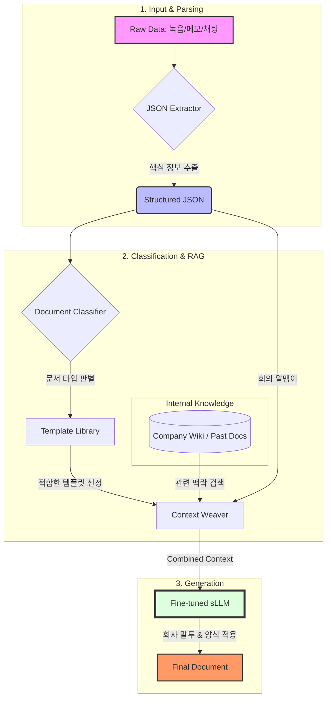

```mermaid
graph TD
%% 1단계: 데이터 입력 및 전처리
subgraph Input_Layer["1. Input & Parsing"]
A["Raw Data: 녹음/메모/채팅"] --> B{"JSON Extractor"}
B -->|"핵심 정보 추출"| C("Structured JSON")
end

%% 2단계: 분류 및 검색
subgraph Intelligence_Layer["2. Classification & RAG"]
C --> D{"Document Classifier"}
D -->|"문서 타입 판별"| E["Template Library"]

subgraph Vector_DB["Internal Knowledge"]
F[("Company Wiki / Past Docs")]
end

E -->|"적합한 템플릿 선정"| G["Context Weaver"]
F -->|"관련 맥락 검색"| G
end

%% 3단계: 생성
subgraph Generation_Layer["3. Generation"]
C -->|"회의 알맹이"| G
G -->|"Combined Context"| H["Fine-tuned sLLM"]
H -->|"회사 말투 & 양식 적용"| I["Final Document"]
end

%% 스타일링
style A fill:#f9f,stroke:#333,stroke-width:2px
style C fill:#bbf,stroke:#333,stroke-width:2px
style H fill:#dfd,stroke:#333,stroke-width:4px
style I fill:#f96,stroke:#333,stroke-width:2px
```