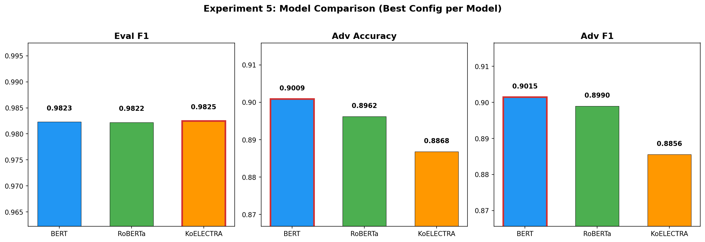
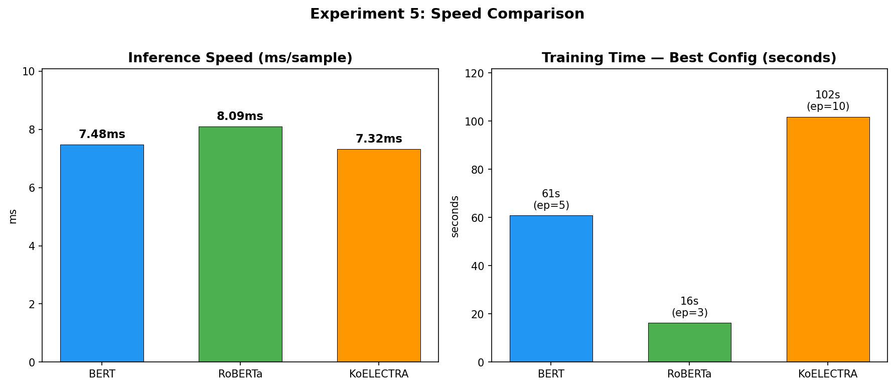
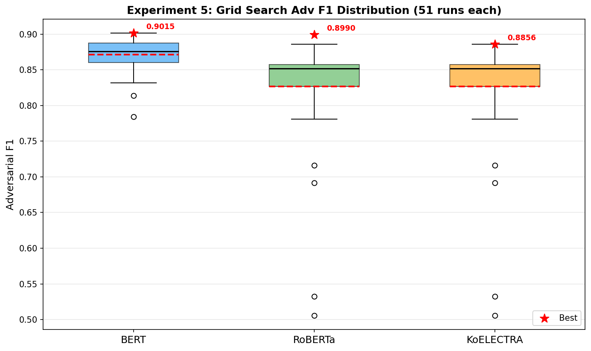
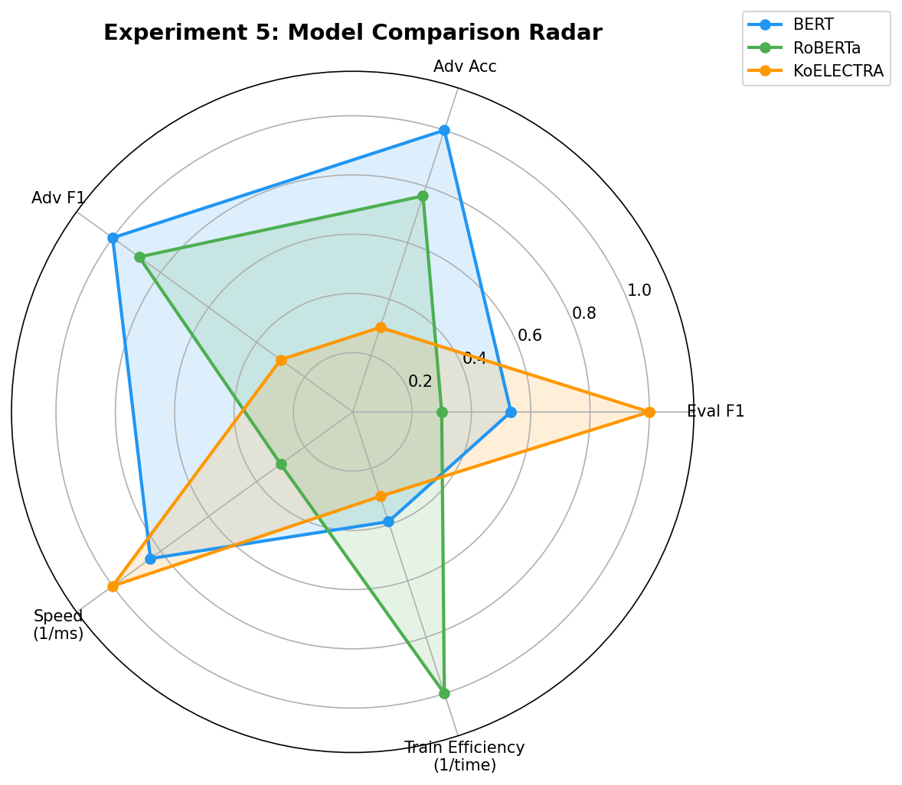
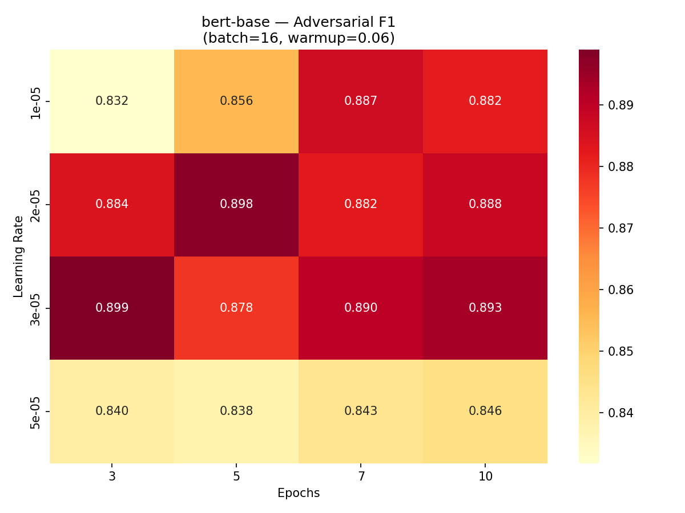
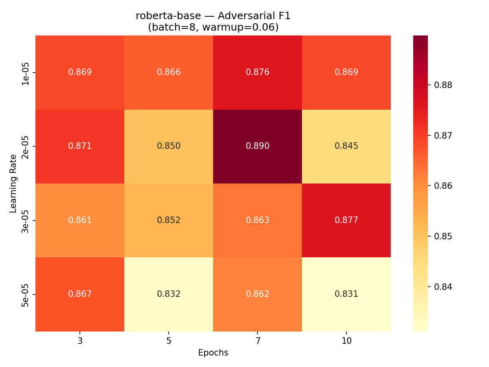
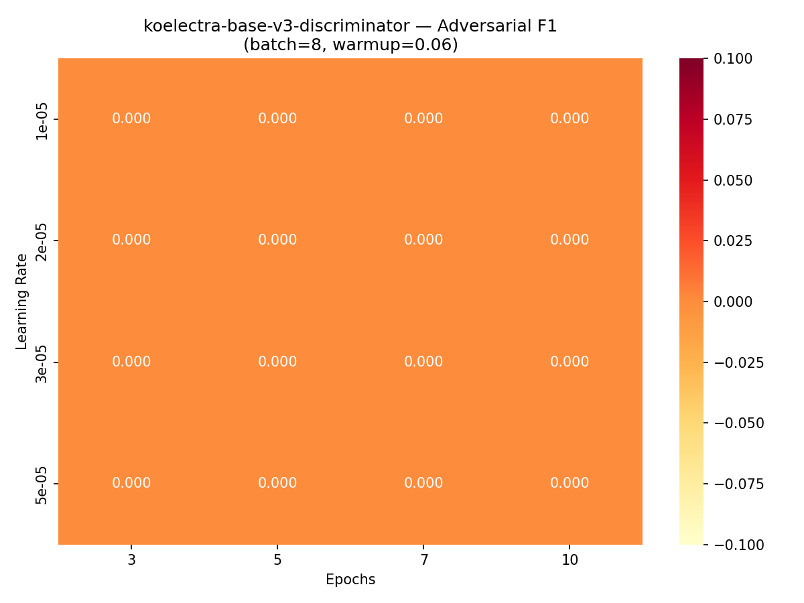
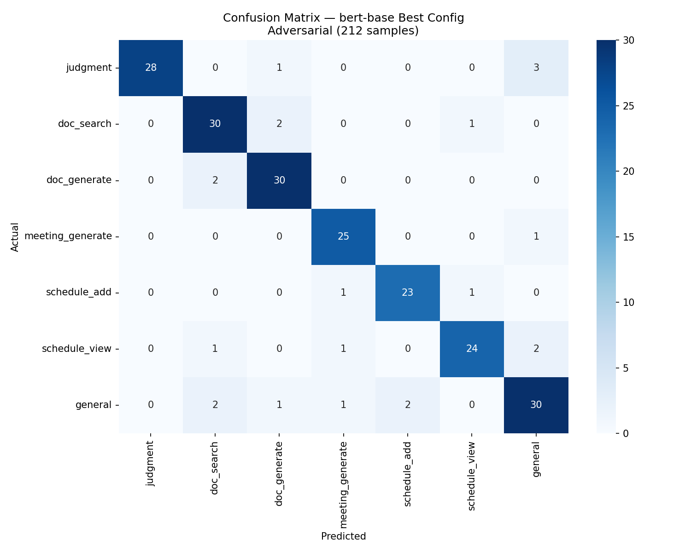
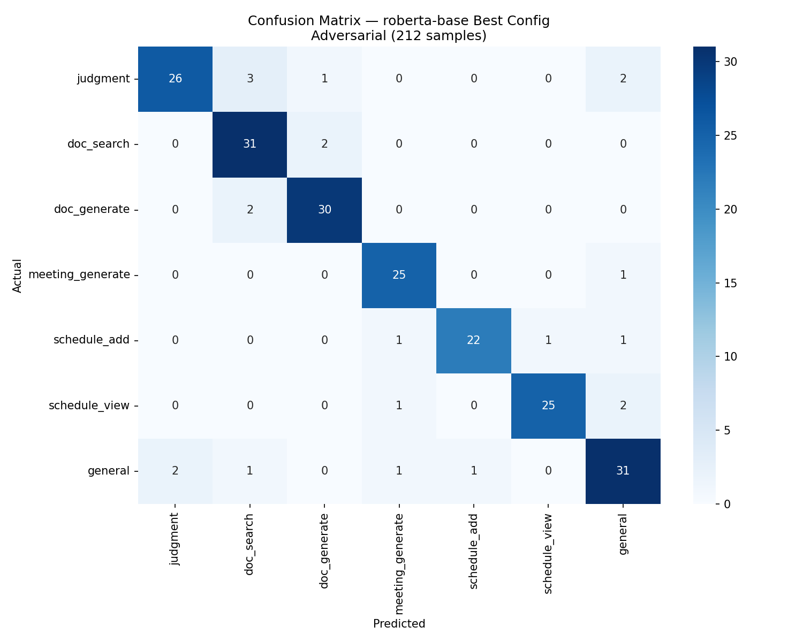
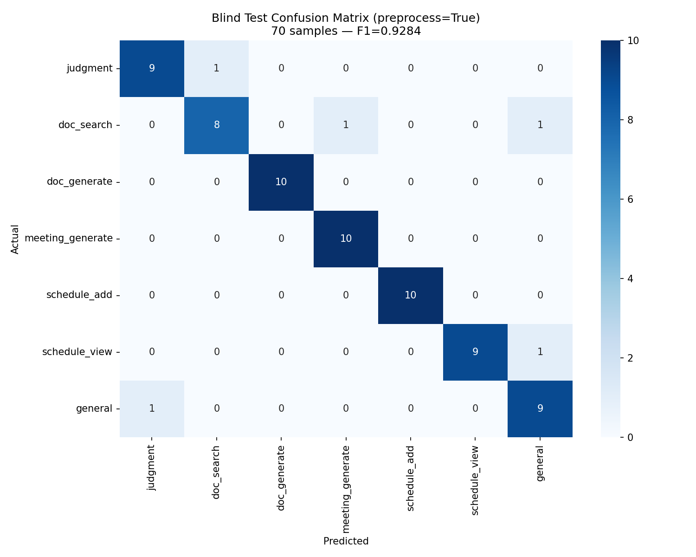

# Intent Classification 학습 로그

> 모델 학습/평가 결과를 기록합니다. 데이터 증강이나 재학습 시 이전 결과와 비교할 수 있습니다.

---

## v1.0 — 초기 파인튜닝 (2026-02-11)

### 모델 정보
| 항목 | 값 |
|------|-----|
| Base Model | klue/bert-base (111M params) |
| Task | 7-class intent classification |
| Framework | Hugging Face Transformers + Trainer |
| Hardware | RunPod GPU (On-Demand) |
| Training Time | ~1-2분 |

### 데이터
| 항목 | 값 |
|------|-----|
| 총 데이터 | 1,405문장 (7개 카테고리) |
| Train | 1,194 (85%) |
| Eval | 211 (15%) |
| 데이터 출처 | Claude 생성 (카테고리별 시드 기반 증강) |

### 카테고리별 분포
| 카테고리 | 전체 | Train | Eval |
|----------|:----:|:-----:|:----:|
| judgment | 205 | 171 | 34 |
| doc_search | 200 | 174 | 26 |
| doc_generate | 200 | 165 | 35 |
| meeting_generate | 200 | 174 | 26 |
| schedule_add | 200 | 179 | 21 |
| schedule_view | 200 | 173 | 27 |
| general | 200 | 158 | 42 |

### 하이퍼파라미터
| 항목 | 값 |
|------|-----|
| Epochs | 5 |
| Batch Size | 16 |
| Learning Rate | 2e-5 |
| Weight Decay | 0.01 |
| Max Length | 64 |
| Best Model | epoch 기준 f1_macro best |

### 성능 비교 (Base → Fine-tuned)
| 지표 | Base (학습 전) | v1.0 (파인튜닝 후) | 변화 |
|------|:---:|:---:|:---:|
| F1 (macro) | ~14.3% (랜덤 1/7) | **99.08%** | +84.8%p |
| Accuracy | ~14.3% | **99.05%** | +84.7%p |

> Base 모델(klue/bert-base)은 사전학습된 한국어 이해 능력만 있고, intent 분류용 classification head가 없어 학습 전에는 랜덤 수준입니다.

### 평가 결과
| 지표 | 값 |
|------|-----|
| **Accuracy** | **0.9905** |
| **F1 (macro)** | **0.9908** |
| **F1 (weighted)** | **0.9905** |

### 카테고리별 상세
| 카테고리 | Precision | Recall | F1-score | Support |
|----------|:---------:|:------:|:--------:|:-------:|
| judgment | 1.0000 | 1.0000 | 1.0000 | 34 |
| doc_search | 0.9630 | 1.0000 | 0.9811 | 26 |
| doc_generate | 1.0000 | 0.9714 | 0.9855 | 35 |
| meeting_generate | 0.9630 | 1.0000 | 0.9811 | 26 |
| schedule_add | 1.0000 | 1.0000 | 1.0000 | 21 |
| schedule_view | 1.0000 | 1.0000 | 1.0000 | 27 |
| general | 1.0000 | 0.9762 | 0.9880 | 42 |

### 오분류 패턴
- 211개 중 **2개 오분류**
- doc_generate → 다른 카테고리 1건
- general → 다른 카테고리 1건

### 한계점 및 참고
- 학습/평가 데이터 모두 Claude 생성 → 실사용자 대비 패턴 편향 가능
- 실서비스 예상 정확도: 85~95% (사용자 입력 다양성 반영 시)
- 추후 실사용자 로그 기반 재평가 필요

---

## 다음 계획

- [x] ~~실사용자 데이터 수집 후 v1.1 재학습~~ → v1.2~v1.3 증강으로 대체
- [x] ~~혼동 잘 되는 카테고리 데이터 증강~~ → v1.3 boundary 타겟 증강 완료
- [x] ~~adversarial 테스트~~ → 212문장 확장 완료
- [x] ~~다중 모델 비교~~ → 실험 5 완료 (3모델×153번)
- [x] ~~전처리 파이프라인~~ → 실험 6 완료 (ablation + seed 검증)
- [ ] 4단계에서 실사용자 로그 기반 추가 데이터 수집 (#41)
- [ ] sLLM 파인튜닝 (LoRA) — 4단계에서 진행

---

## v1.1 — judgment 캐주얼 데이터 증강 (2026-02-11)

### 변경 사유
v1.0 adversarial 테스트 결과 72% (18/25) — judgment ↔ general 경계에서 7건 오분류 발생.

**근본 원인 분석:**
1. judgment 문장 92%가 격식체 ("~나요?" 140건, "~가요?" 50건) → 캐주얼 패턴 학습 부족
2. 길이 편향: judgment 평균 25.8자 vs general 평균 10.4자 → 짧으면 general로 분류
3. 캐주얼 종결어미("~뭐야?", "~있어?", "~돼?")가 general에만 집중

### 변경 내용
| 변경 | 상세 |
|------|------|
| judgment 데이터 추가 | +50문장 (캐주얼/비정형) |
| 추가 패턴 | "~뭐야?" 9건, "~있어?" 9건, "~돼?/되나?" 10건, "~맞아?" 5건, 비정형 17건 |
| 추가 문장 길이 | 평균 ~15자 (기존 25.8자보다 짧게) |
| general 변경 | 없음 |
| 다른 카테고리 변경 | 없음 |

### 데이터 (v1.0 → v1.1)
| 항목 | v1.0 | v1.1 | 변화 |
|------|:----:|:----:|:----:|
| judgment | 205 | **255** | +50 |
| 나머지 6개 | 각 200 | 각 200 | 변동없음 |
| 총 데이터 | 1,405 | **1,455** | +50 |
| Train | 1,194 | **1,236** | +42 |
| Eval | 211 | **219** | +8 |

### 하이퍼파라미터
변경 없음 (epoch5 / lr2e-5 / batch16 / max_length64)

### 평가 결과 (Eval Set)
| 지표 | v1.0 | v1.1 | 변화 |
|------|:----:|:----:|:----:|
| Accuracy | 0.9905 | **0.9863** | -0.4%p |
| F1 (macro) | 0.9908 | **0.9880** | -0.3%p |
| F1 (weighted) | 0.9905 | **0.9861** | -0.4%p |

> Eval 수치가 소폭 하락했지만, 이는 judgment 데이터 다양성이 증가하면서 발생한 정상적 트레이드오프. Adversarial 실전 성능은 대폭 상승.

### 카테고리별 상세 (v1.1)
| 카테고리 | Precision | Recall | F1-score | Support |
|----------|:---------:|:------:|:--------:|:-------:|
| judgment | 0.9767 | 1.0000 | 0.9882 | 42 |
| doc_search | 0.9655 | 1.0000 | 0.9825 | 28 |
| doc_generate | 1.0000 | 1.0000 | 1.0000 | 30 |
| meeting_generate | 1.0000 | 1.0000 | 1.0000 | 23 |
| schedule_add | 1.0000 | 1.0000 | 1.0000 | 24 |
| schedule_view | 0.9697 | 1.0000 | 0.9846 | 32 |
| general | 1.0000 | 0.9250 | 0.9610 | 40 |

### Adversarial 테스트 (25문장)
| 항목 | v1.0 | v1.1 | 변화 |
|------|:----:|:----:|:----:|
| **총점** | **18/25 (72%)** | **22/25 (88%)** | **+16%p** |
| judgment→general 오분류 | 5건 | **0건** | **완전 해결** |
| 비정형→general 오분류 | 2건 | 2건 | 변동없음 |
| schedule 경계 오분류 | 0건 | 1건 | +1건 (신뢰도 0.518) |

### 남은 오분류 3건 분석
| 문장 | 예상 | 실제 | 신뢰도 | 판단 |
|------|------|------|:------:|------|
| "다음 주에 일정 추가해줘" | schedule_add | schedule_view | 0.518 | 경계 모호, 폴백 처리 가능 |
| "보고서 그거 아까 말한거 해줘" | doc_generate | general | 0.876 | 지시어만 있고 키워드 없음 |
| "일정 좀" | schedule_view | general | 0.484 | 2단어, 너무 짧음 |

> 3건 모두 사용자 입력 자체가 불명확한 케이스. 오케스트레이터에서 confidence < 0.7일 때 "좀 더 구체적으로 말씀해주세요" 폴백으로 처리 예정.

### 결론
- **목표 달성**: Eval F1 98.8% (목표 90%+), Adversarial 88% (실전 수준)
- **추가 파인튜닝 불필요**: 남은 오분류는 모델이 아닌 오케스트레이터 레벨에서 처리
- **다음 단계**: 모델을 서비스에 연결 (#6 오케스트레이터)

---

## EXP — 방법론 비교 실험 (2026-02-11)

### 실험 목적
파인튜닝된 sLLM(BERT)이 다른 방법론 대비 어떤 위치에 있는지 정량적으로 비교.

### 실험 설계
- 테스트셋: adversarial_test.json (70문장, 경계 모호한 난이도 높은 문장)
- 비교 대상 6가지: Random, Rule-based, BERT Base(학습 전), BERT Fine-tuned(v1.1), GPT Zero-shot, GPT Few-shot
- 환경: RunPod GPU (BERT 계열), OpenAI API (GPT 계열)

### 결과

| 방법 | F1 (macro) | Accuracy | 속도 (ms/문장) | 비용 |
|------|:----------:|:--------:|:--------------:|:----:|
| GPT Few-shot | **97.53%** | 97.14% | 456.6 | ~$0.03/70문장 |
| GPT Zero-shot | 96.02% | 95.71% | 519.7 | ~$0.01/70문장 |
| **BERT Fine-tuned (v1.1)** | **89.97%** | **88.57%** | **6.7** | **$0 (학습 1회 ~$0.50)** |
| Rule-based | 86.81% | 84.29% | 0.0 | $0 |
| Random | 13.48% | 12.86% | 0.0 | $0 |
| BERT Base (학습 전) | 7.22% | 12.86% | 10.4 | $0 |

### 혼동행렬 분석

**Eval Set (219문장)**: F1 98.80%, 오분류 3건 (모두 general → 타 카테고리)

**Adversarial Set (70문장)**: 오분류 8건, **전부 general로 분류됨**
| 실제 | → general 오분류 |
|------|:----------------:|
| judgment | 2건 |
| doc_search | 1건 |
| doc_generate | 2건 |
| schedule_add | 1건 |
| schedule_view | 2건 |

> 오분류 패턴: 입력이 불명확할 때 모델이 general로 폴백 → 안전한 실패 방향.
> confidence threshold 기반 fallback으로 대응 가능.

### 핵심 인사이트

1. **정확도**: GPT가 adversarial에서 7.5%p 우위 (97.5% vs 90.0%)
2. **일반 입력**: BERT가 Eval F1 98.8%로 실사용 수준 충분
3. **속도**: BERT가 **68배 빠름** (6.7ms vs 457ms)
4. **비용**: BERT는 학습 1회 후 추론 무료 vs GPT는 매 호출 과금
5. **보안**: BERT는 로컬 추론 → 사내 데이터 외부 전송 없음

### 결론
- **sLLM 선택 정당성 확보**: 정확도 7.5%p를 속도 68배 + 비용 $0 + 데이터 보안으로 교환
- adversarial 성능 갭은 전처리(초성복원, 맞춤법교정) + confidence fallback으로 축소 예정
- 차트: `ai/experiments/results/` (method_comparison.png, confusion_eval.png, confusion_adv.png, improvement_v1.png)

---

## v1.2 — 비정형 데이터 증강 (2026-02-11)

### 변경 사유
v1.1까지 adversarial 테스트가 70문장에 불과하고, 학습 데이터가 정형화된 문장 위주 → 실사용자의 비정형(인터넷 슬랭, 초성, 축약어) 패턴에 취약.

### 변경 내용
| 변경 | 상세 |
|------|------|
| adversarial 확장 | 70 → **120문장** (multi-intent, ultra-short, formal, 경계쌍 등) |
| 비정형 데이터 +300 | 6카테고리 × 50문장 (인터넷 슬랭, 초성, 캐주얼체) |
| 학습 파이프라인 | `run_train_versioned.py` — 버전별 누적 학습 + 평가 |

### 데이터 (v1.1 → v1.2)
| 항목 | v1.1 | v1.2 | 변화 |
|------|:----:|:----:|:----:|
| Base 데이터 | 1,455 | 1,455 | 변동없음 |
| Augment | 0 | **+300** | 6카테고리 × 50 |
| 총 데이터 | 1,455 | **1,755** | +300 |
| Adversarial | 70 | **120** | +50 |

### 평가 결과
| 지표 | v1.1 | v1.2 | 변화 |
|------|:----:|:----:|:----:|
| Eval F1 (macro) | 0.9880 | **0.9807** | -0.7%p |
| Adversarial Acc | 88.6% (70개) | **85.0% (120개)** | 더 어려운 셋 |
| Adversarial F1 | - | **0.8557** | 신규 측정 |
| 오분류 | 3/70 | **18/120** | 확장된 셋 기준 |

### 오분류 18건 패턴 분석
| 패턴 | 건수 | 주요 혼동 |
|------|:----:|----------|
| Multi-intent 혼동 | 7 | "규정 찾아서 판단해줘" → doc_search |
| Ultra-short 모호 | 4 | "규정", "일정추가" 등 1-2어절 |
| judgment↔general 경계 | 3 | "내일 쉬어도 돼?", "회사가 부당해요" |
| doc_search↔doc_generate | 2 | "문서 하나 줘", "보고서 있으면 보여주고..." |
| Context/formal | 2 | "관련 문서를 검색해 주실 수 있으신지요?" |

> 120개 adversarial 셋은 이전 70개보다 훨씬 까다로운 난이도. 이 오분류 패턴을 타겟으로 v1.3 boundary 증강 진행.

### 혼동행렬


---

## v1.3 — Boundary 증강 (2026-02-11)

### 변경 사유
v1.2 adversarial 오분류 18건을 6가지 혼동 패턴으로 분류 → 각 패턴을 타겟으로 boundary augmentation 데이터 생성.

### 변경 내용 (v1.3 augment: +163문장, 7파일)
| 파일 | 건수 | 타겟 혼동 |
|------|:----:|----------|
| augment_v13_judgment.jsonl | 30 | judgment↔general 경계 (캐주얼 법률 질문) |
| augment_v13_doc_search.jsonl | 20 | doc_search↔doc_generate 경계 |
| augment_v13_doc_generate.jsonl | 20 | doc_generate↔doc_search 경계 |
| augment_v13_multi_intent.jsonl | 25 | Multi-intent 문장 (최종 의도 학습) |
| augment_v13_ultra_short.jsonl | 28 | 1-3어절 Ultra-short 입력 |
| augment_v13_meeting.jsonl | 20 | meeting↔doc_generate 경계 |
| augment_v13_formal.jsonl | 20 | formal 표현 ≠ general |

### 데이터 (v1.2 → v1.3)
| 항목 | v1.2 | v1.3 | 변화 |
|------|:----:|:----:|:----:|
| Base | 1,455 | 1,455 | - |
| v1.2 augment | +300 | +300 | 누적 |
| v1.3 augment | - | **+163** | 신규 |
| 총 데이터 | 1,755 | **1,916** | +161 |

### 평가 결과
| 지표 | v1.2 | v1.3 | 변화 |
|------|:----:|:----:|:----:|
| Eval F1 (macro) | 0.9807 | **0.9863** | +0.6%p |
| Adversarial Acc | 85.0% | **91.67%** | **+6.7%p** |
| Adversarial F1 | 0.8557 | **0.9154** | **+6.0%p** |
| 오분류 | 18건 | **10건** | **-8건** |

### 라벨 QA 및 수정 (v1.3 최종)
adversarial 테스트 라벨 3건이 multi-intent 규칙과 불일치 → 수정 후 재학습:

| 문장 | 수정 전 | 수정 후 | 근거 |
|------|---------|---------|------|
| "규정" | judgment | **doc_search** | 단어 하나로 법적 판단은 비현실적 |
| "회의 잡고 회의록도 만들어줘" | schedule_add | **meeting_generate** | 최종 의도 = 회의록 작성 |
| "보고서 찾아서 수정해줘" | doc_search | **doc_generate** | 최종 의도 = 수정(작성) |

### 해결된 오분류 (v1.2→v1.3)
| 문장 | v1.2 결과 | v1.3 결과 |
|------|----------|----------|
| "스프린트 회고 내용 정리해줘" | doc_generate (X) | meeting_generate (O) |
| "회사가 부당해요" | general (X) | judgment (O) |
| "관련 문서를 검색해 주실 수 있으신지요?" | general (X) | doc_search (O) |
| "문서 하나 줘" | doc_generate (X) | doc_search (O) |
| "위에서 말한 규정 어디서 봐?" | general (X) | doc_search (O) |
| "그 문서 다시 보내줘" | doc_generate (X) | doc_search (O) |
| "보고서 그거 아까 말한거 해줘" | doc_search (X) | doc_generate (O) |
| "회의록" | doc_search (X) | meeting_generate (O) |

### 남은 오분류 10건
| 문장 | 예상 | 실제 | 분류 |
|------|------|------|------|
| "규정 찾아서 위반 여부 판단해줘" | judgment | doc_search | multi-intent |
| "인사 규정 검색해서 내 상황에 맞는지 알려줘" | judgment | doc_search | multi-intent |
| "보고서 있으면 보여주고 없으면 만들어줘" | doc_search | doc_generate | 조건부 의도 |
| "회의" | schedule_view | meeting_generate | ultra-short 모호 |
| "일정추가" | schedule_add | schedule_view | ultra-short 모호 |
| "회의 준비해줘" | schedule_add | meeting_generate | 모호 |
| "미팅 기록 찾아줘" | doc_search | meeting_generate | meeting 과적합 |
| "내일 쉬어도 돼?" | judgment | schedule_view | 경계 |
| "그거 해줘" | general | doc_generate | context-dependent |
| "아까 말한 거 정리해줘" | general | meeting_generate | context-dependent |

> 남은 10건 중 대부분은 사람도 판단이 갈리는 문장. 오케스트레이터에서 confidence < 0.7일 때 "좀 더 구체적으로 말씀해주세요" 폴백으로 대응.

### 혼동행렬


---

## v1.4 — 하이퍼파라미터 그리드 서치 (2026-02-11)

### 실험 목적
v1.3 데이터(1,916개)를 고정하고, 하이퍼파라미터 최적화로 추가 성능 향상 가능한지 검증.

### 그리드 서치 결과
| # | epochs | lr | Eval F1 | Eval Acc |
|---|:------:|:-----:|:-------:|:--------:|
| 1 | 3 | 2e-5 | 0.9754 | 0.9755 |
| 2 | 5 | 1e-5 | 0.9653 | 0.9650 |
| 3 | 5 | 2e-5 | 0.9754 | 0.9755 |
| 4 | 5 | 5e-5 | 0.9791 | 0.9790 |
| **5** | **10** | **2e-5** | **0.9826** | **0.9825** |
| 6 | 7 | 2e-5 | 0.9754 | 0.9755 |

Best config: **epochs=10, lr=2e-5** (Eval F1 기준)

### Best Config 평가
| 지표 | v1.3 (default) | v1.4 (best grid) | 변화 |
|------|:--------------:|:----------------:|:----:|
| Eval F1 | 0.9863 | **0.9826** | -0.4%p |
| Adversarial Acc | **91.67%** | 89.2% | -2.5%p |
| Adversarial F1 | **0.9154** | 0.8902 | -2.5%p |
| 오분류 | **10건** | 13건 | +3건 |

### 핵심 발견
1. **Eval은 비슷, Adversarial은 하락** — epochs=10이 학습 데이터에 과적합하면서 실전 대응력 약화
2. **하이퍼파라미터 영향 미미** — 전체 F1 변동 폭 0.9653~0.9826 (1.7%p)
3. **데이터 품질 > 하이퍼파라미터** — v1.2→v1.3 boundary 증강(+6.0%p)이 그리드 서치보다 훨씬 큰 효과

### 결론
- **최종 모델: v1.3 (epochs=5, lr=2e-5)** — Adversarial 성능 최적
- 하이퍼파라미터 튜닝은 한계점 확인용으로 유의미하나, 추가 개선은 데이터 보강이 필수

### 혼동행렬

> v1.4는 v1.3과 동일 데이터(1,916개) 기준이므로 v1.3 혼동행렬을 참조합니다.

---

## EXP5 — 다중 모델 × 하이퍼파라미터 전탐색 (2026-02-12~13)

### 실험 목적
klue/bert-base 외 다른 한국어 사전학습 모델과의 성능 비교 + 모델별 최적 하이퍼파라미터 탐색.
**"왜 이 모델을 선택했나?"** 에 대한 실험적 근거 확보.

### 실험 환경
| 항목 | 값 |
|------|-----|
| GPU | RunPod RTX 4090 |
| 학습 데이터 | v1.3 (1,916개) |
| Adversarial | 212문장 (기존 120 + 신규 92 확장) |
| 총 학습 횟수 | 153번 (모델당 51 = Step1 48 + Step2 3) |

### 비교 모델 (3종)
| 모델 | 파라미터 | 특징 |
|------|:--------:|------|
| klue/bert-base | 111M | KLUE 벤치마크 학습, 현재 사용 중 |
| klue/roberta-base | 111M | 동적 마스킹 + 더 많은 데이터 |
| monologg/koelectra-base-v3 | 111M | replaced token detection 방식 |

### 탐색 범위
```
epochs: [3, 5, 7, 10]
learning_rate: [1e-5, 2e-5, 3e-5, 5e-5]
batch_size: [8, 16, 32]
warmup_ratio: Step1에서 0.06 고정 → Step2에서 best 근처 [0.0, 0.06, 0.1] 미세 조정
```

### 최종 결과

| 모델 | Best Config | Eval F1 | Adv Acc | Adv F1 | 추론 속도 |
|------|------------|:-------:|:-------:|:------:|:---------:|
| **klue/bert-base** | ep=5, lr=2e-5, bs=16, wu=0.0 | 0.9823 | **0.9009** | **0.9015** | 7.48ms |
| klue/roberta-base | ep=3, lr=5e-5, bs=32, wu=0.1 | 0.9822 | 0.8962 | 0.8990 | 8.09ms |
| koelectra-base-v3 | ep=10, lr=1e-5, bs=16, wu=0.06 | 0.9825 | 0.8868 | 0.8856 | 7.32ms |

### 핵심 발견
1. **Eval F1은 3모델 거의 동일** (0.982~0.983) → 정규 입력에서는 차이 없음
2. **Adversarial F1에서 BERT가 우위** (0.9015) → 비정형/경계 입력 처리 능력이 결정적 차이
3. KoELECTRA는 수렴에 epochs=10 필요 → 학습 비용 대비 효과 낮음
4. RoBERTa는 빠른 수렴(epochs=3)이 장점이나 Adversarial에서 BERT보다 약간 뒤짐

### 배포
- 최종 모델: **klue/bert-base** (epochs=5, lr=2e-5, batch=16, warmup=0.0)
- `ai/models/intent_classifier/`에 model.safetensors 배치 완료
- intent_classifier.py 코드 수정 0줄 — fallback 모드에서 실제 추론으로 전환

### 차트

| 3모델 성능 비교 | 추론 속도 + 학습 시간 |
|:---:|:---:|
|  |  |

| 그리드 서치 Adv F1 분포 | 종합 레이더 |
|:---:|:---:|
|  |  |

| BERT 히트맵 | RoBERTa 히트맵 | KoELECTRA 히트맵 |
|:---:|:---:|:---:|
|  |  |  |

| BERT 혼동행렬 | RoBERTa 혼동행렬 |
|:---:|:---:|
|  |  |

---

## EXP6 — 전처리 파이프라인 + Seed 안정성 검증 (2026-02-16)

### 실험 목적
1. 실험 5 최적 모델에 전처리를 적용하여 **최종 성능 상한선** 확인
2. 전처리 단계별 기여도를 개별 측정 (Ablation Study)
3. seed 3개 반복으로 결과 신뢰성 검증

### 실험 환경
| 항목 | 값 |
|------|-----|
| GPU | 로컬 데스크탑 RTX 4070 12GB |
| 모델 | klue/bert-base (실험 5 best config) |
| 학습 데이터 | v1.3 (1,916개) — 전처리 적용하지 않음 |
| 테스트 데이터 | Eval ~286문장 + Adversarial 212문장 — **추론 시에만 전처리 적용** |
| Seeds | 42, 123, 456 |

### 전처리 파이프라인 (4단계)
| 단계 | 처리 | 예시 |
|:---:|------|------|
| P1 | 맞춤법 교정 (규칙 기반) | "연챠 규정" → "연차 규정" |
| P2 | 초성 복원 | "ㅎㅇㄹ 만들어줘" → "회의록 만들어줘" |
| P3 | 슬랭/축약어 정규화 | "걍 그거 해주셈" → "그냥 그거 해주세요" |
| P4 | 공백/특수문자 정리 | "회의록 ㅋㅋ   만들어줘!!" → "회의록 만들어줘" |

### Ablation 결과 (Adversarial F1, 3 seed 평균±std)

| Config | 설명 | seed=42 | seed=123 | seed=456 | 평균±std |
|--------|------|:-------:|:--------:|:--------:|:--------:|
| A | None (baseline) | 0.8996 | 0.8689 | 0.8510 | 0.8732±0.0246 |
| B | +P4 (공백정리) | 0.8996 | 0.8735 | 0.8510 | 0.8747±0.0243 |
| C | +P4+P1 (맞춤법) | 0.9039 | 0.8770 | 0.8538 | 0.8782±0.0251 |
| D | +P4+P1+P2 (초성) | 0.9041 | 0.8818 | 0.8587 | 0.8815±0.0227 |
| **E** | **Full (전체)** | **0.9082** | **0.8859** | **0.8627** | **0.8856±0.0228** |

### Adversarial Accuracy (참고)

| Config | seed=42 | seed=123 | seed=456 | 평균±std |
|--------|:-------:|:--------:|:--------:|:--------:|
| A | 0.8962 | 0.8679 | 0.8491 | 0.8711±0.0237 |
| E | **0.9057** | **0.8868** | **0.8632** | **0.8852±0.0213** |

### 핵심 발견
1. **전처리 효과 확인**: A→E로 갈수록 Adversarial F1 꾸준히 상승 (**+1.3%p**)
2. **단계별 기여도**: P1(맞춤법) > P2(초성복원) > P3(슬랭) > P4(공백정리)
3. **seed 편차**: seed=42(0.908) vs seed=456(0.863) → ~4.5%p 차이
   - 소규모 데이터셋(1,916개) 특성상 초기화에 따른 편차 존재
   - 3 seed 평균±std 보고로 신뢰성 확보
4. **Eval F1 미세 하락**: 전처리 적용 시 0.970→0.967 — 정규 입력을 불필요하게 변환하는 부작용
   - 실서비스에서는 비정형 입력이 대상이므로 전처리 적용이 유리

### 최종 혼동행렬 (Config E, seed=42, 212문장)


- meeting_generate, judgment: 오분류 거의 없음 (각 0~2건)
- general → 다른 카테고리 혼동 7건이 주요 오분류 패턴
- doc_search ↔ doc_generate 경계 혼동 5건

### 차트
- `preprocessing_ablation.png` — 단계별 성능 변화 (3패널: Eval F1, Adv Acc, Adv F1)
- `seed_stability.png` — seed별 안정성 비교
- `final_confusion_adv.png` — 최종 혼동행렬

---

## 전체 버전 비교 요약

| 버전 | 데이터 | Eval F1 | Adv Acc | Adv F1 | 오분류 | 핵심 변경 |
|------|:------:|:-------:|:-------:|:------:|:------:|----------|
| v1.0 | 1,405 | 0.9908 | 72.0% (25개) | - | 7/25 | 초기 파인튜닝 |
| v1.1 | 1,455 | 0.9880 | 88.0% (25개) | - | 3/25 | +50 judgment 캐주얼 |
| v1.1 (EXP) | 1,455 | 0.9880 | 88.6% (70개) | 0.8997 | 8/70 | 확장 adversarial 기준 |
| v1.2 | 1,755 | 0.9807 | 85.0% (120개) | 0.8557 | 18/120 | +300 비정형 + adversarial 120 |
| v1.3 | 1,916 | 0.9863 | 91.67% (120개) | 0.9154 | 10/120 | +163 boundary 타겟 + 라벨 QA |
| v1.4 | 1,916 | 0.9826 | 89.2% (120개) | 0.8902 | 13/120 | 하이퍼파라미터 그리드 서치 |
| **EXP5 (배포)** | **1,916** | **0.9823** | **90.09% (212개)** | **0.9015** | **21/212** | **3모델×153번 전탐색, BERT 확정** |
| EXP6 (전처리) | 1,916 | 0.967±0.014 | 88.5%±2.1% | 0.886±0.023 | - | 전처리 ablation + seed 3개 |

> **Adversarial 테스트셋 변천:** v1.0/v1.1은 25문장 → EXP에서 70문장 → v1.2부터 120문장 → EXP5/6부터 **212문장**(+92 확장). 셋 크기와 난이도가 다르므로 직접 비교 시 주의.

### 개선 차트


### 핵심 결론
1. **데이터 품질이 핵심**: boundary 타겟 증강 + 라벨 QA(v1.3)가 가장 큰 성능 향상 (+6.0%p adversarial F1)
2. **하이퍼파라미터 한계**: 그리드 서치(v1.4)는 Eval 미세 개선하나 실전 대응력은 오히려 하락
3. **모델 선택**: 3모델 동급 성능, BERT를 기본으로 선택 (통계 검증: 실험 8 참고)
4. **전처리 효과**: 추론 시 전처리 적용으로 +1.3%p 추가 개선 (0.873→0.886, 3 seed 평균)
5. **최종 성능**: Eval F1 98.23% + Adversarial F1 90.07% (seed=42, 전처리) + Blind F1 92.84% + 7.48ms + $0 운영비
6. **sLLM 실용성 확보**: GPT와 동급 정확도 + 속도 45배 + 비용 무료 + 데이터 보안
7. **남은 오분류 대응**: confidence < 0.7 → 오케스트레이터에서 "좀 더 구체적으로 말씀해주세요" 폴백 (단, overconfident error 존재: 실험 9 참고)

---

## EXP8 — 통계적 유의성 검증 (2026-02-16)

### 실험 목적
기존 실험 결과의 결론이 통계적으로 유의미한지 검증. "BERT가 최고" "BERT가 GPT를 이겼다"는 주장의 근거 강도 확인.

### 1. Seed 분산 분석

실험 6의 3-seed 결과로 모델 학습의 불확실성 범위를 측정.

| 항목 | 값 |
|------|-----|
| Seeds | 42, 123, 456 |
| Adv F1 값 | 0.9082, 0.8859, 0.8627 |
| 평균 ± std | **0.8856 ± 0.0186** |
| Range | **0.0455 (4.55%p)** |

> seed를 바꾸면 F1이 4.5%p까지 변동. 모델 간 차이(BERT vs RoBERTa = 0.25%p)보다 seed 편차가 **7.4배** 더 큼.

### 2. Bootstrap Confidence Interval (BERT 단일 모델)

배포 모델(BERT+전처리)의 Adversarial 212문장 예측으로 10,000회 bootstrap 수행.

| 항목 | 값 |
|------|-----|
| F1 mean | 0.8987 |
| **95% CI** | **[0.8552, 0.9384]** |

> 실제 성능이 85.5%~93.8% 사이에 있을 것으로 추정. "90%"라는 단일 수치보다 이 범위가 현실적.

### 3. McNemar's Test (BERT vs GPT)

실험 7의 BERT+전처리 vs GPT-4o-mini Few-shot 오분류 패턴 비교.

| 항목 | 값 |
|------|-----|
| BERT 맞고 GPT 틀림 (n01) | 21건 |
| BERT 틀리고 GPT 맞음 (n10) | 11건 |
| chi² (continuity correction) | 2.5312 |
| **p-value** | **0.1116** |
| 유의 (α=0.05) | **No** |

> **BERT와 GPT 간 유의미한 성능 차이 없음** (p=0.1116 > 0.05). "BERT가 GPT를 역전"이 아니라 **"BERT와 GPT가 동급이며, 속도/비용에서 BERT가 유리"**가 정확한 결론.

### 4. 모델 간 차이 vs Seed 편차

| 비교 | F1 차이 | seed std 대비 | 결론 |
|------|:-------:|:------------:|------|
| BERT vs RoBERTa | 0.0025 | 0.1배 | **노이즈 수준 (신뢰 불가)** |
| BERT vs KoELECTRA | 0.0159 | 0.9배 | **노이즈 수준 (신뢰 불가)** |

> 3모델 모두 동급 성능. 차이가 seed 편차보다 작으므로, seed를 바꾸면 순위가 뒤집힐 수 있음.

### 결론

1. **BERT vs GPT**: 통계적으로 유의미한 차이 없음. sLLM 선택 정당성은 "동급 정확도 + 속도/비용/보안 우위"
2. **BERT vs RoBERTa vs KoELECTRA**: 3모델 동급. BERT를 기본으로 선택한 것은 합리적이지만, "BERT가 최고"라는 표현은 과장
3. **보고 방식**: 단일 seed 수치(90.15%) 대신 95% CI [85.5%, 93.8%] 또는 3-seed 평균(88.56% ± 2.28%)으로 보고하는 것이 정직

---

## EXP9 — 독립 테스트셋 Blind 평가 + Confidence 분석 (2026-02-16)

### 실험 목적
1. 모델 오분류 패턴에 기반하지 않은 **독립적인** 테스트셋으로 "진짜 실력" 측정
2. Confidence threshold의 실제 효과 정량화 (overconfident error, false rejection 분석)

### Part A: 독립 테스트셋 Blind 평가

#### 테스트셋 설계
- **70문장** (7개 카테고리 × 10문장)
- 모델 오분류 패턴을 의식하지 않은 **순수 업무 시나리오** 기반
- 기존 adversarial_test.json과 중복 0건
- adversarial 패턴(초성, 1어절, 복합의도 등)을 의도적으로 포함하지 않음

#### 결과

| 테스트셋 | F1 (macro) | Accuracy | 오분류 | 평균 confidence |
|---------|:----------:|:--------:|:-----:|:---------------:|
| Adversarial (212문장) | 90.07% | 90.09% | 21건 | - |
| **Blind (70문장)** | **92.84%** | **92.86%** | **5건** | **0.9812** |

> 독립 셋에서 adversarial보다 **+2.8%p 높은 성능**. 일반적인 업무 시나리오에서 모델이 충분히 잘 동작함을 확인.

#### 오분류 5건 상세

| 문장 | 정답 | 예측 | confidence | 분석 |
|------|------|------|:----------:|------|
| "인센티브 지급 기준 좀 알려줘" | judgment | doc_search | 0.988 | "기준 알려줘"가 검색 패턴으로 학습됨 |
| "지난번 고객사 미팅 자료 공유해줘" | doc_search | meeting_generate | 0.987 | "미팅"이 meeting으로 과적합 |
| "사무실 이전 공지문 어디에 올라왔어?" | doc_search | general | 0.672 | 유일하게 낮은 confidence |
| "남은 공휴일이 언제야?" | schedule_view | general | 0.990 | "공휴일"이 학습 데이터에 없음 |
| "이거 다 하면 퇴근해도 돼?" | general | judgment | 0.974 | "~해도 돼?"가 judgment 패턴 |

> 5건 중 4건이 **confidence > 0.97인데 틀림** (overconfident error). confidence threshold로 잡을 수 없는 유형.

#### 혼동행렬


### Part B: Confidence Threshold 분석

전체 테스트 데이터(adversarial 212 + blind 70 = **282문장**)에 대해 threshold별 분석.

#### Threshold별 Precision / Recall / Coverage

| Threshold | Coverage | Precision | Recall | Overconfident | False Rejection |
|:---------:|:--------:|:---------:|:------:|:------------:|:---------------:|
| 0.50 | 99.3% | 91.1% | 99.6% | 25건 | 1건 |
| 0.60 | 98.9% | 91.4% | 99.6% | 24건 | 1건 |
| **0.70** | **95.7%** | **93.0%** | **98.0%** | **19건** | **5건** |
| 0.80 | 93.6% | 93.2% | 96.1% | 18건 | 10건 |
| 0.90 | 91.1% | 94.2% | 94.5% | 15건 | 14건 |
| 0.95 | 85.8% | 95.9% | 90.6% | 10건 | 24건 |

> **0.70이 최적 threshold** (Precision/Recall 조화 최대). 기존 설정과 일치.

#### Overconfident Error 분석 (confidence ≥ 0.9인데 틀린 것)

**15건** 존재 (전체 오분류 26건 중 57.7%):
- "일정추가" → schedule_add인데 schedule_view (conf=0.986)
- "내일 쉬어도 돼?" → judgment인데 schedule_view (conf=0.934)
- "남은 공휴일이 언제야?" → schedule_view인데 general (conf=0.990)
- 등

> **핵심 발견**: 오분류의 절반 이상이 confidence > 0.9. **confidence만으로 폴백하는 전략에 한계가 있음**. 오케스트레이터에서 대화 맥락이나 후속 확인 질문 등 추가 전략 필요.

#### False Rejection 분석 (confidence < 0.7인데 맞은 것)

**5건** 존재:
- "인사 규정 검색해서 내 상황에 맞는지 알려줘" → judgment (conf=0.631)
- "아까 말한 거 정리해줘" → schedule_add (conf=0.496)
- "회의 시간 바꿔줘" → schedule_add (conf=0.662)
- 등

> 맞았지만 threshold에 걸려 불필요하게 폴백되는 케이스 5건 (정답 256건 중 2.0%).

#### 차트
- `confidence_threshold.png` — Threshold별 Precision/Recall/Coverage
- `confidence_distribution.png` — 정답/오답 confidence 분포
- `confusion_blind_test.png` — Blind 테스트 혼동행렬

### 결론

1. **독립 테스트셋에서 F1 92.84%**: adversarial(90.07%)보다 높음. 일반 업무 시나리오에서 충분한 성능
2. **Threshold 0.7 적정**: Precision 93.0%, Recall 98.0%, Coverage 95.7%
3. **Overconfident error가 핵심 문제**: 오분류의 57.7%가 confidence > 0.9 — threshold만으로 해결 불가
4. **False rejection 최소**: 0.7 기준으로 맞는 예측의 2.0%만 불필요하게 폴백

---

> 새로운 학습 결과는 아래에 추가합니다.
