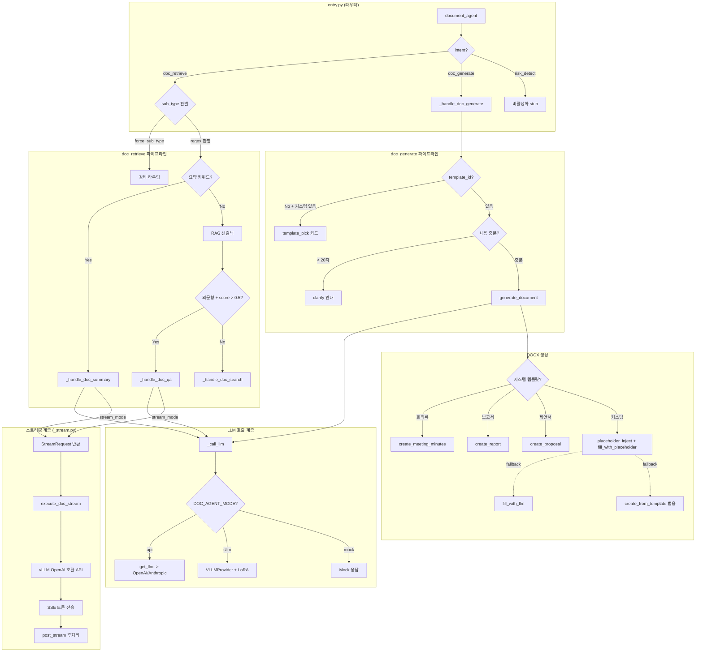

# 문서 Agent 아키텍처 리뷰

**리뷰 일자:** 2026-03-25
**리뷰 범위:** `ai/agents/document/`, `ai/skills/`, `ai/document_parser/`, `ai/templates/`, `ai/llm/`
**리뷰어:** Claude Opus 4.6

---

## Executive Summary

문서 Agent는 검색(search), QA, 요약(summary), 생성(generate) 4가지 파이프라인을 제공하며, LLM API(GPT/Claude)와 sLLM(vLLM+LoRA) 양쪽을 지원하는 이중 모드 아키텍처로 설계되어 있다. 전체적으로 **기능은 동작하고 데이터 플로우는 명확**하나, DOCX 스타일링 코드의 대규모 중복, `_generate.py` 단일 파일의 과도한 책임, 그리고 `ai/templates/` 레거시 코드가 주요 개선 포인트이다.

**핵심 수치:**
- `_generate.py`: 838줄 (정규화 로직만 ~200줄)
- DOCX 스타일 함수: 3개 파일에 걸쳐 동일 코드 반복 (각 ~100줄)
- `ai/templates/*.py`: 4개 클래스 전부 `NotImplementedError` (미구현 레거시)
- `_common.py`의 `_call_llm`: 100줄 이상 (3중 분기: extract/sllm+lora/api)

---

## 데이터 플로우



---

## Critical Issues (반드시 수정)

### C-1. DOCX 스타일링 코드 3중 복사 (DRY 위반)

**파일:** `create_meeting_minutes.py`, `create_report.py`, `create_proposal.py`

세 파일 모두 동일한 함수 6개를 **복사-붙여넣기**로 포함:
- `_set_shading()`, `_set_valign()`, `set_row_height()`
- `style_section_header()`, `style_label_cell()`, `style_value_cell()`
- `_inject()` / `_inject_cell_text()` (이름만 다름, 로직 동일)
- `_add_title_line()`
- 색상 상수: `_BLUE_HEADER`, `_BLUE_LIGHT`, `_BLUE_ALT`, `_NAVY_RGB`, `_WHITE_RGB`

`create_from_template.py`는 이미 `create_meeting_minutes`에서 import해서 사용 중이므로 의존성은 한 방향인데, 나머지 2개 파일이 독립적으로 중복 정의하고 있다.

**영향:** 스타일 변경 시 3개 파일을 동시에 수정해야 하며, 불일치 위험이 있다. `_inject` vs `_inject_cell_text` 이름 차이는 이미 혼란을 유발하고 있다.

**권장:** `ai/skills/_docx_styles.py`로 공통 모듈 분리.

### C-2. `_generate.py`의 과도한 책임 (838줄, God Function)

**파일:** `ai/agents/document/_generate.py`

`_generate_with_custom_template()` 함수 하나가 다음을 모두 담당:
1. DB에서 템플릿 조회 (ORM)
2. 시스템/커스텀 분기
3. 필드 선별 (`_select_fields_for_llm`)
4. LLM 프롬프트 구성 및 호출
5. JSON 파싱 및 에러 핸들링
6. 회의록/보고서/제안서 각각의 **정규화 로직** (~200줄)
7. 마크다운 미리보기 생성
8. DOCX 빌더 선택 및 실행 (시스템 빌더 / placeholder / fill_with_llm / 범용)
9. 사용자 수정값 오버라이드

**영향:** 새 문서 타입 추가 시 `_generate_with_custom_template()`에 elif 블록과 정규화 로직을 계속 추가해야 하며, 테스트가 어렵다.

**권장:** 정규화 로직을 문서 타입별 Normalizer 클래스로 분리, DOCX 빌더 선택을 Strategy 패턴으로 분리.

### C-3. `ai/templates/` 전체가 미구현 레거시

**파일:** `ai/templates/base.py`, `meeting_minutes.py`, `report.py`, `proposal.py`, `jd.py`

`BaseTemplate`과 4개 하위 클래스 모두 `NotImplementedError` (TODO: 팀원 C 구현). 실제 문서 생성은 `ai/skills/`에서 직접 수행하며, `ai/templates/`의 클래스 시스템은 **전혀 사용되지 않는다.**

`ai/templates/__init__.py`의 `SYSTEM_TEMPLATES` 레지스트리와 `get_system_template()` 함수도 프로젝트 어디에서도 호출되지 않는다.

**영향:** 코드베이스 탐색 시 혼란 유발. 초기 설계 의도와 실제 구현이 완전히 다른 상태.

**권장:**
- **Option A:** 삭제 (`.docx` 템플릿 파일만 유지)
- **Option B:** 현재 `ai/skills/` 구현을 이 클래스 구조로 마이그레이션 (장기)

---

## Important Improvements (가급적 수정)

### I-1. `_call_llm()` 복잡도 과다 (cyclomatic complexity)

**파일:** `ai/agents/document/_common.py` (206~301줄)

3중 중첩 분기:
1. `task == "extract"` + `mode == "sllm"` -> VLLMProvider base
2. `mode == "sllm"` + `task` -> LoRA/base 분기 + LoRA 실패 fallback
3. `else` -> API 모드 (Factory)

각 분기에서 `set_last_model_name()`을 개별 호출하며, try/except도 중첩된다.

**권장:** `_get_llm_for_task(mode, task)` 헬퍼로 LLM 인스턴스 + 모델명 결정을 분리하고, 호출 자체는 단일 경로로 통일.

### I-2. `_stream.py`에서 LLM API 스트리밍이 `_call_llm()` 우회

**파일:** `ai/agents/document/_stream.py`

`execute_doc_stream()`은 `_common._call_llm()`을 사용하지 않고 직접 `AsyncOpenAI`를 생성하여 vLLM에 연결한다. 이로 인해:
- LLM API 모드(GPT/Claude)로 스트리밍 불가 (vLLM 전용 하드코딩)
- LoRA fallback 로직이 `_call_llm()`과 `_stream.py`에 **이중 구현**
- 환경변수 읽기 패턴도 두 곳에서 별도로 처리

**권장:** `BaseLLM.stream_generate()`를 활용하거나, 최소한 LoRA fallback 로직을 공통화.

### I-3. `_retrieve_context()` 타임아웃 불일치

**파일:** `ai/agents/document/_common.py` (155줄)

코드는 `timeout=120`(120초)인데, 로그 메시지는 "30초 초과"라고 출력한다:
```python
except asyncio.TimeoutError:
    logger.warning("_retrieve_context 타임아웃 (30초 초과)")  # 실제는 120초
```

**영향:** 디버깅 시 혼란. 120초 타임아웃은 사용자 체감상 너무 길다.

**권장:** 타임아웃을 30초로 줄이고 로그 메시지 일치시키기. 또는 환경변수로 설정 가능하게.

### I-4. `fill_with_llm.py` 미사용 상태이나 코드 유지 중

**파일:** `ai/skills/fill_with_llm.py` (400줄+)
**호출부:** `_generate.py` 806~814줄에서 **주석 처리**됨

`fill_with_llm`은 sLLM에게 "어느 셀에 어떤 key를 넣을지" 매핑을 요청하는 방식이었으나, placeholder 방식으로 대체되어 현재 **완전히 미사용**이다. 그러나 `fill_with_placeholder.py`가 `fill_with_llm._SUB_KEY_ALIASES`를 import하고 있어 삭제하면 에러가 발생한다.

**권장:** `_SUB_KEY_ALIASES`를 공통 모듈로 이동 후, `fill_with_llm.py` 전체를 deprecated 폴더로 이동하거나 삭제.

### I-5. 정규화 로직 중복 (회의록/보고서/제안서)

**파일:** `ai/agents/document/_generate.py` (602~723줄)

각 문서 타입별 정규화 로직이 동일한 패턴을 반복한다:
```python
# 회의록: action_items 정규화
_TASK_KEYS = ("task", "content", "item", ...)
_DUE_KEYS = ("due_date", "deadline", ...)
for item in raw_ai:
    normalized_ai.append({
        "task": _first_val(item, _TASK_KEYS),
        "assignee": _first_val(item, _ASSIGNEE_KEYS),
        ...
    })

# 보고서: tasks 정규화 — 거의 동일한 구조
# 제안서: schedule, budget — 같은 패턴
```

**권장:** 정규화 규칙을 선언적 매핑(dict)으로 정의하고 공통 정규화 함수 1개로 처리.

```python
NORMALIZE_RULES = {
    "meeting_minutes": {
        "action_items": {
            "task": ("task", "content", "item", ...),
            "assignee": ("assignee", "person", ...),
            "due_date": ("due_date", "deadline", ...),
        }
    },
    ...
}
```

### I-6. `summarizer.py`의 LLM 추상화 우회

**파일:** `ai/llm/summarizer.py`

`_summarize_with_openai()`에서 `AsyncOpenAI`를 직접 생성한다. `get_llm()` 팩토리를 사용하지 않아 Provider 전환 시 이 코드가 누락될 수 있다.

**권장:** `get_llm()`이나 `create_llm("openai")`을 사용하도록 변경.

---

## Minor Suggestions (있으면 좋음)

### M-1. `print()` vs `logger` 혼용

- `_entry.py`, `_generate.py`, `_search.py` 등: `print()` 사용
- `_common.py`, `_stream.py`: `logger` 사용

동일 모듈 내에서도 혼재. 프로덕션에서 `print()`는 stdout으로만 가고 로그 수집 파이프라인에 포함되지 않을 수 있다.

**권장:** 전부 `logger`로 통일. `print(f"[DocumentAgent]...")` 패턴을 `logger.info(...)` 으로 변환.

### M-2. `_risk.py` stub 파일

**파일:** `ai/agents/document/_risk.py` (8줄)

비활성화된 stub. `_entry.py`에서 import도 주석 처리 상태.

**권장:** 삭제하거나 TODO 마커로 명확하게 표시.

### M-3. `_ASSIGNEE_KEYS` 등 상수 중복 정의

`_generate.py`에서 `_ASSIGNEE_KEYS`가 32줄에 모듈 레벨로 정의되고, 607줄부터의 정규화 블록에서 또 다른 key 튜플들이 지역적으로 정의된다. `fill_with_llm.py`에도 `_SUB_KEY_ALIASES`로 유사한 매핑이 존재.

**권장:** key alias 매핑을 하나의 공통 상수 모듈로 통합.

### M-4. `count_tokens()` 의 tiktoken 매번 import

**파일:** `ai/agents/document/_common.py` (37~45줄)

`count_tokens()`가 호출될 때마다 `import tiktoken` + `encoding_for_model()`을 수행한다. 빈번한 호출 시 불필요한 오버헤드.

**권장:** 모듈 레벨에서 1회 초기화하거나 `@lru_cache` 적용.

### M-5. `_get_mock_response()` 실 서비스 코드에 Mock 로직 포함

**파일:** `ai/agents/document/_common.py` (303~342줄)

Mock 응답 생성 로직이 프로덕션 코드에 포함되어 있다. `DOC_AGENT_MODE=mock` 환경변수로 제어되긴 하지만, 실수로 활성화될 위험이 있다.

**권장:** 테스트 모듈로 분리하거나, 최소한 `if __debug__:` 가드 추가.

### M-6. `_entry.py`에서 document_content 이중 참조

```python
document_content = state.get("document_content") or state.get("extracted_text")
```

이 패턴이 `_entry.py` 46줄과 130줄에서 반복된다. "document_content"와 "extracted_text"의 차이가 명확하지 않다.

**권장:** State 스키마를 명확하게 정의하고, 하나의 키로 통일하거나 변환 함수를 제공.

---

## Architecture Considerations

### 확장성 평가 (새 문서 타입 추가)

**현재 상태:** "매뉴얼" 같은 새 문서 타입을 추가하려면:

1. `ai/skills/create_manual.py` — DOCX 빌더 작성 (스타일 함수 복사 필요)
2. `_generate.py` — `_detect_template_type()`에 regex 추가
3. `_generate.py` — `DOC_TYPE_NAMES`, `_SYSTEM_FIELD_LABELS`, `_GENERATE_GUIDE` 상수 추가
4. `_generate.py` — `GENERATION_FIELD_CONFIG` 추가
5. `_generate.py` — `_generate_with_custom_template()`에 정규화 elif 블록 추가
6. `_generate.py` — DOCX 빌더 호출 elif 블록 추가
7. `ai/document_parser/template_extractor.py` — `FIELD_MAPPING`에 새 필드 추가
8. DB 시딩 — 시스템 기본 템플릿 + `.docx` 파일 등록

**총 8곳 수정 필요.** 이상적으로는 1~2곳만 수정하면 되어야 한다.

### LLM 추상화 구조 평가

**잘 된 점:**
- `BaseLLM` ABC + Factory 패턴으로 Provider 전환이 깔끔 (OpenAI/Anthropic/vLLM)
- `LLMResponse` dataclass로 응답 형식 통일
- `LLMConfig`으로 설정 일원화

**문제점:**
- `_call_llm()`에서 Factory를 우회하여 `VLLMProvider`를 직접 생성하는 경로가 있음
- `_stream.py`에서 `AsyncOpenAI`를 직접 사용하여 추상화 완전 우회
- `summarizer.py`에서도 직접 `AsyncOpenAI` 생성

**결론:** LLM 추상화 계층 자체는 잘 설계되어 있으나, 호출측에서 일관되게 사용하지 않아 추상화의 이점이 반감되고 있다.

### 에러 처리 패턴 평가

**잘 된 점:**
- `_entry.py`에서 최상위 try/except로 사용자에게 친화적인 에러 메시지 반환
- RAG 타임아웃 vs 에러 구분 (`rag_status`)
- LoRA 실패 시 base 모델 fallback 체인

**문제점:**
- 대부분의 except 블록에서 `traceback.print_exc()` 사용 (print 기반)
- `_generate_with_custom_template()`의 DOCX 생성 실패 시 에러를 catch하고 **조용히 진행** (output_path에 파일 없는 상태로 응답 반환 가능)
- JSON 파싱 실패 시 `{"content": user_input}` fallback은 예기치 않은 결과 유발 가능

---

## 파일별 요약

| 파일 | 줄수 | 상태 | 비고 |
|------|------|------|------|
| `_common.py` | 343 | **Good** | 공유 유틸 잘 구조화. `_call_llm()` 복잡도만 개선 필요 |
| `_entry.py` | 194 | **Good** | 라우터 역할 명확. sub_type 판별 로직 깔끔 |
| `_generate.py` | 838 | **Needs Refactor** | 과도한 책임. 정규화/빌더 분리 필요 |
| `_qa.py` | 202 | **Good** | stream/non-stream 분기 명확 |
| `_search.py` | 117 | **Good** | LLM 미사용으로 빠름. 중복 제거 로직 포함 |
| `_summary.py` | 260 | **Good** | DB 캐시 + RAG 문서 식별 + doc_pick 분기 잘 구현 |
| `_stream.py` | 268 | **Needs Improvement** | LLM 추상화 우회, LoRA fallback 중복 |
| `_risk.py` | 9 | **Dead Code** | stub. 삭제 또는 재설계 |
| `create_meeting_minutes.py` | 267 | **Good** (스타일 중복 제외) | 빌더 로직 자체는 명확 |
| `create_report.py` | 305 | **Good** (스타일 중복 제외) | 동적 행 처리 잘 구현 |
| `create_proposal.py` | 416 | **Good** (스타일 중복 제외) | 표지+본문 2페이지 구조 |
| `create_from_template.py` | 279 | **Good** | 범용 빌더, 적절한 자동 분류 |
| `fill_with_llm.py` | ~500 | **Dead Code** | 주석 처리됨. alias만 외부 참조 중 |
| `fill_with_placeholder.py` | 138 | **Good** | docxtpl 기반, 깔끔한 구현 |
| `placeholder_inject.py` | 284 | **Good** | 양식 패턴 감지 로직 잘 구현 |
| `template_extractor.py` | 603 | **Good** | 구조 기반 추출 + 메타데이터 자동 부여 |
| `ai/llm/base.py` | 89 | **Good** | ABC 잘 설계 |
| `ai/llm/factory.py` | 54 | **Good** | 싱글턴 + Factory 깔끔 |
| `ai/llm/openai_provider.py` | 165 | **Good** | 표준 구현 |
| `ai/llm/anthropic_provider.py` | 180 | **Good** | Anthropic 차이점 잘 처리 |
| `ai/llm/summarizer.py` | 142 | **Needs Improvement** | LLM Factory 우회 |
| `ai/templates/base.py` | 106 | **Dead Code** | 전부 NotImplementedError |
| `ai/templates/__init__.py` | 38 | **Dead Code** | 미사용 레지스트리 |

---

## Next Steps (우선순위순)

### P0 (이번 스프린트)

1. **DOCX 스타일 공통 모듈 분리** [C-1]
   - `ai/skills/_docx_styles.py` 생성
   - 3개 빌더 파일에서 import로 변경
   - 예상 삭제 코드: ~200줄
   - 소요: 1시간

2. **`_retrieve_context()` 타임아웃 로그 수정** [I-3]
   - 120 -> 30초로 줄이고 로그 메시지 일치
   - 소요: 5분

3. **`print()` -> `logger` 통일** [M-1]
   - `_entry.py`, `_generate.py`, `_search.py`, `_summary.py` 대상
   - 소요: 30분

### P1 (다음 스프린트)

4. **`_generate.py` 정규화 로직 분리** [C-2, I-5]
   - 선언적 매핑 + 공통 정규화 함수
   - `ai/agents/document/_normalizers.py` 신설
   - 예상 삭제 코드: ~150줄
   - 소요: 2-3시간

5. **`fill_with_llm.py` 정리** [I-4]
   - `_SUB_KEY_ALIASES`를 `_common.py` 또는 별도 상수 모듈로 이동
   - `fill_with_llm.py`에 `@deprecated` 표시 또는 아카이브
   - 소요: 30분

6. **`_stream.py` LLM 추상화 통합** [I-2]
   - 최소한 LoRA fallback 로직 공통화
   - 소요: 2시간

### P2 (장기)

7. **`ai/templates/` 레거시 정리** [C-3]
   - 미구현 클래스 삭제 또는 현재 구현으로 마이그레이션
   - 소요: 결정에 따라 상이

8. **문서 타입 추가 용이성 개선** [아키텍처]
   - 문서 타입 레지스트리 패턴 도입
   - 빌더/정규화/필드설정을 하나의 등록 포인트로 통합
   - 소요: 4-6시간

9. **`_call_llm()` 리팩토링** [I-1]
   - Provider 결정 로직 분리
   - 소요: 1-2시간

---

## 부록: 주요 의존성 그래프

```
_entry.py
  ├── _generate.py
  │     ├── _common.py (_call_llm, _to_readable_str, GENERATED_DOCS_DIR)
  │     ├── template_extractor.py (fields_to_prompt, _infer_field_meta)
  │     ├── create_meeting_minutes.py (시스템 빌더)
  │     ├── create_report.py (시스템 빌더)
  │     ├── create_proposal.py (시스템 빌더)
  │     ├── placeholder_inject.py (커스텀 1순위)
  │     ├── fill_with_placeholder.py (커스텀 1순위)
  │     │     └── fill_with_llm._SUB_KEY_ALIASES (상수만 참조)
  │     ├── fill_with_llm.py (커스텀 2순위, 현재 미사용)
  │     └── create_from_template.py (커스텀 3순위, 현재 미사용)
  │           └── create_meeting_minutes.py (스타일 함수 import)
  ├── _search.py
  │     └── _common.py (_retrieve_context)
  ├── _qa.py
  │     └── _common.py (_call_llm, _retrieve_context, _format_chat_context)
  ├── _summary.py
  │     └── _common.py (_call_llm, _retrieve_context, truncate_by_paragraph)
  └── _stream.py (chat.py에서 호출)
        └── AsyncOpenAI (직접 생성, Factory 우회)
```
