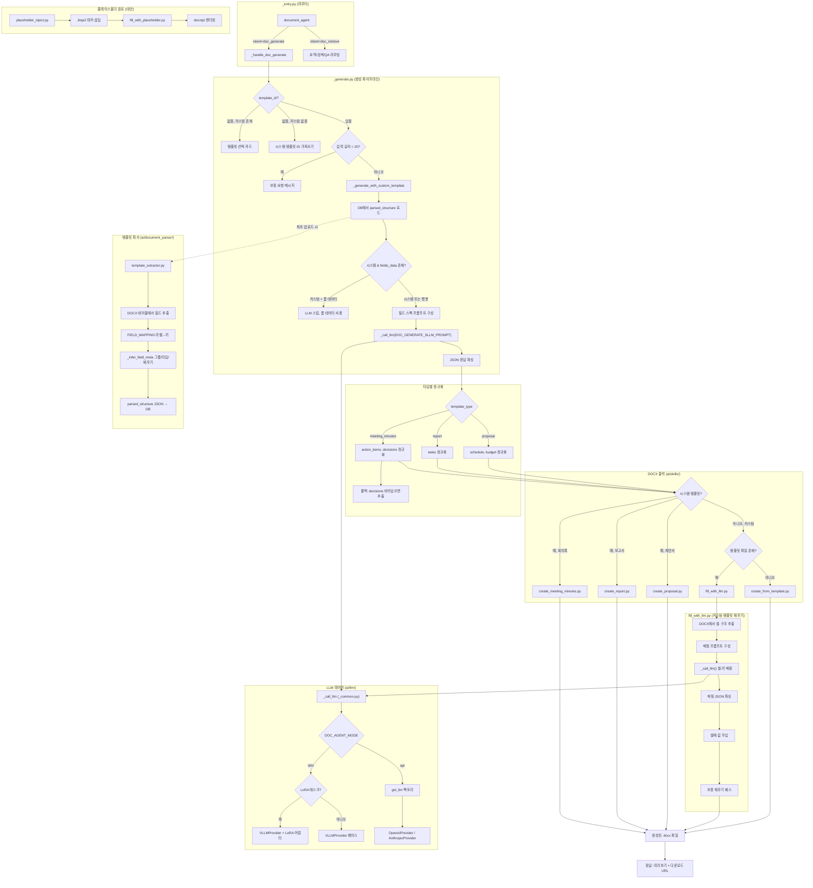

# 문서 생성 아키텍처 — 코드 리뷰

**리뷰어**: Code Architecture Reviewer (자동화)
**날짜**: 2026-03-25
**범위**: `ai/skills/`, `ai/agents/document/`, `ai/document_parser/`, `ai/llm/`, `ai/templates/`
**브랜치**: `feat/jiyong`

---

## 요약

문서 생성 시스템은 3종의 한국어 비즈니스 문서(회의록, 보고서, 제안서)를 다단계 파이프라인(템플릿 추출 → LLM 콘텐츠 생성 → DOCX 출력)으로 처리한다. 시스템 내장 템플릿과 사용자 업로드 DOCX 커스텀 템플릿을 모두 지원하며, LLM API(GPT/Claude)와 sLLM(vLLM + LoRA) 이중 경로 전략을 사용한다.

**장점**:
- LLM 추상화(`BaseLLM` + factory)가 깔끔하여 프로바이더 교체가 용이
- `template_extractor.py`의 한국어 라벨→키 매핑 시스템이 포괄적
- 폴백 체인이 잘 설계됨 (LLM 감지 → regex, LoRA → 베이스 모델 → API)
- 데이터 생성(LLM)과 문서 포맷팅(DOCX 빌더) 간 분리가 양호

**주요 우려사항**:
- 3개 DOCX 빌더 파일 간 대규모 코드 중복 (~80% 동일)
- `fill_with_llm.py`가 과도하게 복잡 (500줄 이상, 책임 혼재)
- `_generate.py`의 문서 타입별 정규화 로직이 확장에 불리
- `ai/templates/base.py`의 `BaseTemplate` 클래스가 완전한 죽은 코드 (모든 메서드가 `NotImplementedError`)

---

## 치명적 이슈 (반드시 수정)

### C1. DOCX 빌더 간 대규모 코드 중복

**파일**: `ai/skills/create_meeting_minutes.py`, `ai/skills/create_report.py`, `ai/skills/create_proposal.py`

각 파일이 동일한 헬퍼 함수를 독립적으로 정의:
- `_set_shading()` (3벌)
- `_set_valign()` (3벌)
- `set_row_height()` (3벌)
- `style_section_header()` (3벌)
- `style_label_cell()` (3벌)
- `style_value_cell()` (3벌)
- `_inject()` / `_inject_cell_text()` (3벌, 이름만 다름)
- `_add_title_line()` (3벌)
- 색상 상수 `_BLUE_HEADER`, `_BLUE_LIGHT`, `_BLUE_ALT`, `_NAVY_RGB`, `_WHITE_RGB` (3벌)

추가로 `create_from_template.py`가 `create_meeting_minutes.py`에서 헬퍼를 임포트하여, 임의의 빌더에 대한 암묵적 의존성 발생.

**영향**: 스타일 변경 시 3개 파일을 모두 수정해야 함. 버그 수정이 일관되지 않게 적용될 수 있음. `create_meeting_minutes.py` 리팩토링 시 `create_from_template.py`가 깨짐.

**권장 조치**: 공유 DOCX 스타일 유틸리티를 단일 모듈(`ai/skills/_docx_styles.py`)로 추출. 모든 빌더가 여기서 임포트.

### C2. 죽은 BaseTemplate 클래스

**파일**: `ai/templates/base.py`

`BaseTemplate` 클래스 계층 전체(`base.py`, `meeting_minutes.py`, `proposal.py`, `report.py`, `jd.py`)가 `TODO` 주석과 `raise NotImplementedError`만 포함. 실제 생성 파이프라인 어디에서도 임포트되지 않음.

**영향**: 오해를 유발하는 아키텍처. 신규 개발자가 문서 생성이 이 템플릿 클래스를 거친다고 착각할 수 있으나, 실제 파이프라인은 `ai/skills/`를 직접 사용.

**권장 조치**: 템플릿 클래스 패턴을 구현하여 생성 경로로 활용하거나, 죽은 파일을 삭제하고 실제 아키텍처를 문서화. 이미 `ai/skills/`에 동작하는 파이프라인이 있으므로, 삭제가 현실적.

### C3. `_call_llm`의 에러 삼킴

**파일**: `ai/agents/document/_common.py` (294-301줄)

```python
except Exception as e:
    logger.error("_call_llm | error: %s", e)
    import traceback
    traceback.print_exc()
    if os.getenv("DOC_AGENT_MODE", "api") == "mock":
        return _get_mock_response(user_prompt, json_mode)
    raise
```

비-mock 모드에서는 정상적으로 re-raise. 그러나 호출측인 `_generate.py` (584-586줄)에서 조용히 폴백:

```python
try:
    data = json.loads(generated_json_str)
except Exception:
    data = {"content": user_input}
```

LLM이 잘못된 JSON을 반환하면 생성된 콘텐츠 전체가 유실되고 원본 사용자 입력으로 대체됨. 로그도, 사용자 알림도 없음.

**권장 조치**: 실패한 JSON 파싱 시 원본 LLM 응답을 로깅. 구조적 JSON 복구 시도(마크다운 펜스 제거, `{...}` 패턴 탐색) 후 폴백. 사용자에게 생성 품질 저하 가능성 알림.

---

## 중요 개선사항 (수정 권장)

### I1. `_generate.py`의 하드코딩된 정규화 키

**파일**: `ai/agents/document/_generate.py` (602-723줄)

각 문서 타입마다 50줄 이상의 하드코딩된 키-튜플 정규화:
```python
_TASK_KEYS = ("task", "content", "item", "action", "할일", "내용", ...)
_DUE_KEYS  = ("due_date", "deadline", "기한", "due", "end_date", ...)
```

회의록(action_items), 보고서(tasks), 제안서(schedule + budget)에 반복 — 총 ~120줄의 거의 동일한 정규화 로직.

**권장 조치**: 하드코딩된 튜플 대신 선언적 스키마 매핑을 받는 범용 `normalize_array_field(items, field_schema)` 함수 생성. 3개 블록을 3개 함수 호출로 축소.

### I2. `fill_with_llm.py`의 과다한 책임

**파일**: `ai/skills/fill_with_llm.py` (~550줄)

단일 파일이 처리하는 작업:
1. DOCX 셀 구조 추출 (`_extract_cell_structure`)
2. 플레이스홀더 감지 (`_is_placeholder`)
3. 서브키-컬럼 매칭 (`_match_sub_keys_to_columns`)
4. LLM 프롬프트 구성 (`_build_mapping_prompt`)
5. 키 경로 해석 (`_resolve_key`)
6. 셀 주입 (`_inject_to_cell`)
7. 배열 확장을 위한 행 복제 (`_clone_row`)
8. 영한 키 역방향 매핑
9. 메인 오케스트레이션 함수 (`fill_docx_with_llm`)
10. 보충 채우기 패스

**권장 조치**: 최소 3개 모듈로 분리:
- `_docx_cell_extractor.py` — 구조 추출 및 셀 분석
- `_mapping_engine.py` — 키 매칭, 별칭 해석, LLM 프롬프트
- `fill_with_llm.py` — 오케스트레이션만 (위 모듈에서 임포트)

### I3. `fill_with_placeholder.py`와 `fill_with_llm.py` 간 강결합

**파일**: `ai/skills/fill_with_placeholder.py` (40줄)

```python
from ai.skills.fill_with_llm import _SUB_KEY_ALIASES
```

LLM 불필요한 "placeholder-only" 모듈이 LLM 기반 모듈의 내부 상수를 직접 임포트. `fill_with_llm.py` 변경 시 `fill_with_placeholder.py`가 깨질 수 있음.

**권장 조치**: `_SUB_KEY_ALIASES`를 공유 상수 모듈(`ai/skills/_constants.py`)로 이동.

### I4. `template_extractor.py`의 단일체 FIELD_MAPPING

**파일**: `ai/document_parser/template_extractor.py` (35-136줄)

모든 한국어 라벨을 영어 키로 매핑하는 100줄짜리 딕셔너리. 동작은 하지만, 새 문서 타입 추가 시 네임스페이스 분리 없이 이 단일 딕셔너리를 수정해야 함.

**권장 조치**: 문서 타입별로 매핑을 구성하거나, 최소한 섹션 주석 추가 및 매핑 키 유일성 검증.

### I5. `print()`와 `logger` 혼용

**파일**: `ai/skills/` 및 `ai/agents/document/`의 거의 모든 파일

대부분의 디버깅 출력이 `print()` 사용:
```python
print(f"[fill_with_llm] sLLM 매핑 요청 (key만)...")
print(f"[DocumentAgent] _handle_doc_generate | template_type={template_type}")
```

반면 `_common.py`와 `template_extractor.py`는 `logging.getLogger()`를 적절히 사용.

**권장 조치**: 모든 `print()` 호출을 `logger.info()` / `logger.debug()`로 교체. 프로덕션에서 로그 레벨 필터링 및 구조화 로깅 가능.

### I6. 주요 함수의 타입 힌트 누락

여러 핵심 함수에 반환 타입 힌트나 파라미터 타입이 없음:

- `create_meeting_minutes(output_path: str, data: dict)` — `data`는 `Optional[dict]`이어야 하고, 반환 타입 누락
- `inject_placeholders()` — `dict`를 반환하지만 구조가 타입으로 문서화되지 않음
- `_build_mapping_prompt()` — `tuple[str, str]`을 반환하지만 어노테이션 없음

**권장 조치**: 파이프라인을 흐르는 복잡한 dict에 대해 `TypedDict` 또는 dataclass 정의 추가 (필드 스펙, 채우기 결과, 생성 결과).

---

## 경미한 제안 (있으면 좋은 것)

### M1. `_is_placeholder` 정규식의 엣지 케이스

**파일**: `ai/skills/fill_with_llm.py` (49줄)

```python
return bool(re.match(r'^[\s...년월일시분]*$', text))
```

정규식 기반 플레이스홀더 감지가 한국어 날짜 단위만 포함된 셀에 대해 오탐할 수 있음. 위의 별도 검사가 대부분의 케이스를 완화하지만, 다양한 DOCX 템플릿 스타일에서 전반적으로 취약.

### M2. `create_from_template.py`의 하드코딩된 "작성/검토/승인" 행

생성되는 모든 문서에 3열 승인 푸터("작성", "검토", "승인")가 추가됨. 한국 비즈니스 관례이지만 모든 커스텀 템플릿에 적용되지 않을 수 있음.

### M3. 모델명 Context Variable

**파일**: `ai/agents/document/_common.py` (22-31줄)

마지막 모델명 추적에 `contextvars.ContextVar`를 사용한 것은 비동기 격리에 좋으나, 숨겨진 사이드 채널임. LLM 응답 메타데이터의 일부로 모델명을 반환하는 것을 고려.

### M4. `_retrieve_context`의 타임아웃 불일치

**파일**: `ai/agents/document/_common.py` (155, 170줄)

`asyncio.wait_for` 타임아웃은 120초로 설정되었으나, 경고 메시지는 "30초 초과"라고 표시. 로그 메시지가 실제 타임아웃 값과 일치해야 함.

### M5. 루프 내부 `lxml` 임포트

**파일**: `ai/skills/placeholder_inject.py` (142, 148줄)

```python
from lxml import etree  # for 루프 본문 내에서 임포트
```

파일 최상단으로 임포트 이동 필요.

---

## 아키텍처 고려사항

### 템플릿 처리 이중 경로의 복잡성

시스템에 두 가지 별개의 DOCX 생성 경로가 존재:

1. **시스템 빌더 경로**: `create_meeting_minutes.py` / `create_report.py` / `create_proposal.py` — `python-docx`로 DOCX를 처음부터 프로그래밍 방식으로 생성, 테이블 레이아웃과 스타일을 하드코딩.

2. **커스텀 템플릿 경로**: `placeholder_inject.py` + `fill_with_placeholder.py` 또는 `fill_with_llm.py` — 기존 DOCX를 열고, 빈 셀을 찾아 채움.

두 경로는 코드를 공유하지 않으며 다른 데이터 포맷을 사용. 시스템 빌더는 특정 키(`title`, `date`, `attendees`)가 있는 플랫 dict를 기대하고, 커스텀 경로는 `parsed_structure` 필드를 사용.

`_generate.py`의 `_generate_with_custom_template()` 함수가 문서 타입별 정규화로 두 경로를 연결하지만, 이 브릿지가 시스템에서 가장 복잡하고 취약한 부분.

**향후 권장**: 단일 경로로 수렴 고려 — 항상 템플릿 기반 채우기를 사용하거나(시스템 템플릿도 DOCX 파일로, `ai/templates/*.docx`에 이미 존재) 항상 프로그래밍 방식으로 생성. 현재 `ai/templates/회의록(기본템플릿).docx` 파일의 존재는 템플릿 기반 경로가 빌더를 대체할 의도였음을 시사.

### LLM 프로바이더 추상화는 잘 설계됨

`BaseLLM` → `OpenAIProvider` / `AnthropicProvider` / `VLLMProvider` 계층과 팩토리 패턴이 깔끔. `_common.py`의 `_call_llm()` 래퍼가 sLLM 전용 LoRA 라우팅을 추가하며, 이중 모드 전략에 적합.

LoRA 폴백 체인(LoRA 어댑터 → 베이스 모델 → API)이 견고. `DOC_AGENT_MODE` 환경변수 스위치는 좋은 운영 레버.

### 새 문서 타입 추가 시 확장성

새 문서 타입(예: 기안서, 계약서) 추가 시 현재 필요한 작업:
1. `template_extractor.py`의 `FIELD_MAPPING`에 항목 추가
2. `ai/skills/`에 새 `create_*.py` 빌더 추가
3. `_generate.py`에 정규화 로직 추가
4. `_generate.py`에 `_GENERATE_GUIDE` 항목 추가
5. `_generate.py`에 `GENERATION_FIELD_CONFIG` 항목 추가
6. `_generate.py`의 `DOC_TYPE_NAMES` 업데이트
7. `_detect_template_type()`의 정규식 업데이트

하나의 새 타입을 위해 7곳 수정. 레지스트리 패턴을 도입하면 1-2곳으로 축소 가능.

---

## 데이터 플로우 다이어그램



---

## 다음 단계

### 우선순위 1 (이번 스프린트)
1. **공유 DOCX 스타일 추출** → `ai/skills/_docx_styles.py` — 3배 중복 제거, ~30분 소요
2. **`_SUB_KEY_ALIASES` 이동** → 공유 상수 모듈 — 강결합 제거, ~10분
3. **JSON 파싱 폴백 로깅 수정** → `_generate.py` — 복구 시도 + 원본 응답 로깅 추가

### 우선순위 2 (다음 스프린트)
4. **범용 `normalize_array_field()` 생성** → 120줄 타입별 정규화 블록 대체
5. **`fill_with_llm.py` 분리** → 추출 + 매핑 + 오케스트레이션 모듈
6. **`print()`를 `logging`으로 교체** → `ai/skills/` 및 `ai/agents/document/` 전체

### 우선순위 3 (새 문서 타입 추가 시)
7. **문서 타입 레지스트리 설계** — 타입당 단일 설정 객체 (필드 설정, 정규화 스키마, 빌더 참조, 가이드 텍스트)
8. **죽은 `BaseTemplate` 계층 삭제** 또는 단일 생성 인터페이스로 구현
9. **DOCX 출력 전략 단일화** — 항상 템플릿 기반 채우기 또는 항상 프로그래밍 빌드 (두 경로 병존은 유지보수 비용 2배)

### 우선순위 4 (품질)
10. **TypedDict 정의 추가** — 필드 스펙, 채우기 결과, 생성 결과
11. **단위 테스트 추가** — `template_extractor.py` 필드 추출 (가장 핵심 파싱 로직)
12. **타임아웃 로그 메시지 수정** — `_retrieve_context` (30초라고 표시되나 실제 120초)
