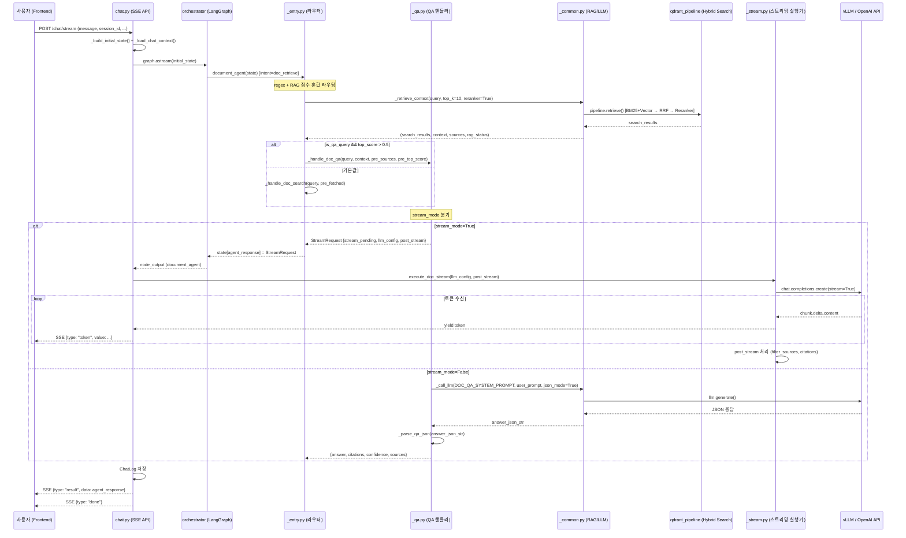

# Document QA 파이프라인 아키텍처 리뷰

**리뷰 대상**: 문서 질의응답(QA) 파이프라인 전체
**리뷰 일자**: 2026-03-25
**리뷰어**: Claude (PM 요청)

---

## Executive Summary

문서 QA 파이프라인은 `chat.py` (API) -> `_entry.py` (라우터) -> `_qa.py` (QA 핸들러) -> `_common.py` (RAG/LLM) -> `_stream.py` (스트리밍 실행기) 구조로 잘 분리되어 있다. StreamRequest 프로토콜(stream_pending + llm_config + post_stream)을 통해 스트리밍/비스트리밍 경로를 일관되게 처리하며, RAG 중복 호출 방지, context 크기 제한, LoRA fallback 등 실용적인 방어 코드가 잘 갖추어져 있다.

다만, **regex 기반 라우팅의 한계**, **confidence 계산의 비일관성**, **동기 RAG 호출의 블로킹 위험**, **에러 시 사용자 피드백 부재** 등 개선이 필요한 부분이 있다. 아래에서 우선순위별로 정리한다.

---

## Data Flow Diagram



---

## Critical Issues (반드시 수정)

### C-1. `_retrieve_context`의 동기 블로킹 호출

**파일**: `ai/agents/document/_common.py` L155-166

```python
search_results = await asyncio.wait_for(
    asyncio.get_running_loop().run_in_executor(
        None,
        lambda: pipeline.retrieve(...),
    ),
    timeout=120,
)
```

**문제점**:
- `pipeline.retrieve()`가 동기 함수여서 `run_in_executor`로 감쌌지만, 기본 `ThreadPoolExecutor`를 사용한다.
- Reranker(CrossEncoder)가 GPU/CPU 집약적이라 스레드 풀을 점유하면 다른 요청이 대기한다.
- 타임아웃이 120초로 설정되어 있지만, 로그 메시지에는 "30초 초과"라고 기록되어 있어 불일치.

**권장 조치**:
1. 전용 `ThreadPoolExecutor(max_workers=2-4)`를 생성하여 RAG 전용으로 사용
2. 타임아웃을 30초로 줄이고, 로그 메시지와 실제 값을 일치시킬 것
3. 장기적으로 `pipeline.retrieve()`를 `async`로 리팩토링 검토

### C-2. 비스트리밍 QA의 `model_name` 누락

**파일**: `ai/agents/document/_qa.py` L193-201

비스트리밍 경로의 반환 dict에 `model_name` 키가 없다. `_entry.py` L189에서 `get_last_model_name()`으로 보정하지만, `_call_llm` 내부에서 예외가 발생 후 fallback된 경우 `ContextVar`가 정확하지 않을 수 있다.

**권장 조치**: `_call_llm`이 `(result_text, model_name)` 튜플을 반환하도록 리팩토링하거나, 반환 dict에 `model_name`을 명시적으로 포함할 것.

### C-3. `_parse_qa_json` fallback 시 `confidence: None` 전파

**파일**: `ai/agents/document/_qa.py` L38

LLM이 JSON이 아닌 일반 텍스트로 응답한 경우 `confidence: None`이 반환된다. 이후 L181-189에서 `float(None)` 변환 시 `try/except`로 잡히지만, 최종 confidence가 `rag_top_score`에만 의존하게 되어 **LLM 응답 품질과 무관한 점수**가 표시된다.

**권장 조치**: fallback 시 `confidence`를 `0.5` 등 기본값으로 설정하고, 프론트엔드에 "추정 신뢰도"임을 표시할 것.

---

## Important Improvements (권장 수정)

### I-1. regex 기반 QA/search 라우팅의 한계

**파일**: `ai/agents/document/_search.py` `_needs_llm_answer()`

현재 의문형 패턴(`뭐야`, `어떻게`, `왜` 등)으로 QA를 판별하는데, 다음 케이스에서 오판 가능:
- "연차 규정 뭐야?" → QA로 가지만, 실제로는 judgment(규정 판단)에 더 적합
- "계약서 내용 알려줘" → "내용" + "알려줘" 매칭으로 QA인데, "자세히"가 없어서 search로 빠짐
- "출장비 절차" → "절차"가 regex에 있어 QA로 가지만, 단순 목록 검색이 나을 수 있음

**권장 조치**:
1. 단기: `_needs_llm_answer`의 패턴을 더 보수적으로 조정 (현재도 "기본값=search"로 안전하긴 함)
2. 중기: Intent 분류 모델이 `doc_qa` vs `doc_search` 세분화를 지원하면 regex 제거

### I-2. 스트리밍 vs 비스트리밍 프롬프트 불일치

**파일**: `ai/llm/prompts.py`

- 비스트리밍(`DOC_QA_SYSTEM_PROMPT`): JSON 형식 강제 (`answer`, `citations`, `confidence`)
- 스트리밍(`DOC_QA_STREAMING_PROMPT`): 자연어 답변 + `[참고: 문서제목]` 태그

이 차이로 인해:
- 비스트리밍은 구조화된 citations을 반환하지만, 스트리밍은 `_stream.py`에서 regex로 `[참고:]`를 파싱하여 sources를 필터링한다.
- 스트리밍 경로의 citations은 `_stream.py` L197-205에서 sources 기반으로 재구성하므로, LLM이 실제로 참조한 문서와 다를 수 있다.

**권장 조치**: 두 경로의 citations 품질 차이를 인지하고, 프론트엔드에서 스트리밍 citations에 "자동 매칭" 표시를 고려할 것.

### I-3. `_entry.py` RAG 선검색의 top_k 불일치

**파일**: `ai/agents/document/_entry.py` L98-101 vs `_qa.py` L89

- `_entry.py`: `top_k=10, use_reranker=True, score_threshold=0.1`
- `_qa.py` (자체 RAG): `top_k=5, use_reranker=True` (threshold 없음)

`_entry.py`에서 QA로 분기할 때 이미 검색한 context를 `pre_sources`로 넘기므로 QA 자체 RAG는 호출되지 않지만, `force_sub_type="qa"`로 직접 호출 시에는 top_k=5로 검색하여 결과 수가 다를 수 있다.

**권장 조치**: QA 자체 RAG의 top_k도 10으로 통일하거나, `_qa.py`에서 `_entry.py` 경유가 아닌 직접 호출 시에도 동일한 파라미터를 사용하도록 상수화할 것.

### I-4. 스트리밍 QA confidence 캡(0.85)의 의도 불명확

**파일**: `ai/agents/document/_qa.py` L162

```python
"confidence": round(min(rag_top_score, 0.85), 2),
```

스트리밍 경로에서는 LLM 응답 전이라 confidence를 RAG 점수 기반으로만 산정하면서 0.85로 캡한다. 주석에 "답변 정확도와 문서 매칭은 다름"이라고 적혀 있지만, 비스트리밍에서는 LLM+RAG 혼합으로 1.0까지 가능하므로 **같은 질문에 대해 스트리밍/비스트리밍 경로의 confidence가 다르게 표시**된다.

**권장 조치**: 스트리밍 완료 후 `_stream.py`의 post_stream에서 confidence를 재계산하거나, 프론트에서 스트리밍 시 confidence를 숨기는 것을 검토할 것.

### I-5. `_format_chat_context`의 content 절삭(200자)

**파일**: `ai/agents/document/_common.py` L108

```python
content = msg.get("content", "")[:200]
```

어시스턴트 응답이 긴 경우 200자로 잘리면 이전 대화 맥락이 불충분해질 수 있다. 특히 QA에서 이전 답변을 참조하는 후속 질문("아까 말한 금액이 얼마야?") 시 문제가 된다.

**권장 조치**:
- user 메시지는 200자, assistant 메시지는 400자 등 역할별 차등 적용
- 또는 token budget 기반으로 동적 조정

---

## Minor Suggestions (개선하면 좋은 사항)

### M-1. `print` vs `logger` 혼용

`_qa.py`, `_entry.py`, `_search.py`는 `print()`를 사용하고, `_common.py`, `_stream.py`는 `logger`를 사용한다. 프로덕션에서 `print`는 로그 레벨 제어가 불가능하므로 전부 `logger`로 통일하는 것이 바람직하다.

### M-2. `_qa.py` 비스트리밍 경로의 `model_name` 누락 (C-2 관련)

`_entry.py` L189에서 `get_last_model_name()`으로 보정하지만, 이 보정이 `_search.py` 결과(L183-184: "RAG (BM25+Vector)")와 동일 레벨에서 이루어지는 것이 좋다. QA 핸들러 자체에서 `model_name`을 반환하면 `_entry.py`의 보정 로직이 불필요해진다.

### M-3. `_build_sources`의 중복 제거 기준

**파일**: `ai/agents/document/_common.py` L188

`content[:100]`으로 중복을 판별하는데, 같은 문서의 다른 청크가 동일한 처음 100자를 가질 경우 하나가 누락될 수 있다. `document_id` + `chunk_index` 조합이 더 정확하다.

### M-4. `_stream.py`의 `_filter_sources` 키워드 매칭 정확도

**파일**: `ai/agents/document/_stream.py` L252-267

제목을 공백으로 분리하여 3자 이상 키워드만 추출 후, 답변 텍스트에 포함 여부를 확인한다. 한국어 제목은 공백이 적어 키워드가 1-2개뿐일 수 있고, "보고서"처럼 흔한 단어가 항상 매칭되어 필터링 효과가 떨어질 수 있다.

### M-5. `_qa.py` context 순회 시 빈 context 항목 무시

**파일**: `ai/agents/document/_qa.py` L126-131

`context` 리스트에 빈 문자열이 포함되어 있어도 `len(c)`가 0이라 MAX_CONTEXT_CHARS에 도달하지 않고 계속 추가된다. 실질적 문제는 아니지만 `if not c.strip(): continue` 가드를 추가하면 깔끔해진다.

---

## Architecture Considerations

### 1. StreamRequest 프로토콜의 장점

`stream_pending=True` + `llm_config` + `post_stream`으로 구성된 StreamRequest 프로토콜은 LangGraph 노드(document_agent)와 스트리밍 실행(chat.py)의 책임을 명확히 분리한다. Agent 노드는 "무엇을 스트리밍할지" 결정만 하고, 실제 스트리밍은 `_stream.py`에서 처리한다. 이 패턴은 다른 Agent(judgment_agent)에도 동일하게 적용되어 일관성이 있다.

### 2. RAG 중복 호출 방지

`_entry.py`에서 RAG를 한 번 호출하고 결과를 `pre_sources`/`pre_top_score`로 QA에 전달하는 설계는 불필요한 RAG 호출을 방지한다. 단, `force_sub_type="qa"` 직접 호출 시에는 이 최적화가 적용되지 않으므로 주의가 필요하다.

### 3. sLLM/API 이중 경로

`_common.py`의 `_call_llm`이 `DOC_AGENT_MODE` 환경변수로 sLLM과 API를 전환하는 구조는 LLM API 먼저 개발 -> sLLM 교체 전략에 부합한다. LoRA 어댑터 라우팅(`LORA_ADAPTER_NAMES`)과 fallback 체인(LoRA -> base -> API)이 잘 구성되어 있다.

### 4. 검색/QA/요약 분기의 구조

`_entry.py`의 라우팅 우선순위:
1. `force_sub_type` (후속 액션 버튼) -> 직접 분기
2. `document_content` 또는 `document_id` 또는 요약 키워드 -> summary
3. RAG 선검색 -> `_needs_llm_answer()` + `top_score > 0.5` -> QA
4. 기본값 -> search

이 구조는 명확하지만, 2번(요약)과 3번(QA)의 판별이 서로 독립적이라 "이 문서 내용 중 핵심이 뭐야?"처럼 요약과 QA가 겹치는 질문에서 요약이 우선된다. 현재는 요약 우선이 사용자 경험상 나은 선택이므로 합리적이다.

### 5. 확장성

새로운 sub_type(예: "compare" - 문서 비교)을 추가하려면:
1. `_entry.py`에 분기 조건 추가
2. 새 핸들러 파일(`_compare.py`) 생성
3. `_stream.py`에 해당 task의 post_stream 처리 추가
4. `prompts.py`에 프롬프트 상수 추가

각 핸들러가 독립 파일로 분리되어 있어 확장은 용이하다.

---

## Next Steps (우선순위)

| 우선순위 | 항목 | 이슈 ID | 담당 |
|---------|------|---------|------|
| P0 | C-1: `_retrieve_context` 타임아웃 불일치 수정 (120초 -> 30초 + 로그 메시지 일치) | - | 승언/지용 |
| P0 | C-2: 비스트리밍 QA `model_name` 명시적 반환 | - | 승언 |
| P1 | C-3: `_parse_qa_json` fallback confidence 기본값 설정 | - | 승언 |
| P1 | I-3: RAG 파라미터(top_k, threshold) 상수화 및 통일 | - | 지용 |
| P1 | I-4: 스트리밍/비스트리밍 confidence 계산 일관성 확보 | - | 승언/지용 |
| P2 | I-1: `_needs_llm_answer` 패턴 보완 (Intent 모델 세분화 시 제거 예정) | - | 지용 |
| P2 | I-2: 스트리밍 citations 품질 개선 (post_stream에서 재계산) | - | 승언 |
| P2 | I-5: `_format_chat_context` 역할별 content 절삭 차등 | - | 승언 |
| P3 | M-1: `print` -> `logger` 통일 | - | 승언 |
| P3 | M-3: `_build_sources` 중복 제거 기준 개선 | - | 승언 |
| P3 | M-4: `_filter_sources` 키워드 매칭 개선 | - | 승언 |

---

## 리뷰 대상 파일 목록

| 파일 | 역할 | 줄 수(대략) |
|------|------|-----------|
| `ai/agents/document/_qa.py` | QA 핸들러 | ~200 |
| `ai/agents/document/_entry.py` | 라우터 (분기 로직) | ~194 |
| `ai/agents/document/_common.py` | 공통 유틸 (LLM, RAG, 텍스트) | ~343 |
| `ai/agents/document/_stream.py` | 스트리밍 실행기 + 후처리 | ~250 |
| `ai/agents/document/_search.py` | 검색 핸들러 | ~117 |
| `ai/agents/document/_summary.py` | 요약 핸들러 | ~260 |
| `ai/rag/qdrant_pipeline.py` | RAG 파이프라인 (Hybrid+Reranker) | ~196 |
| `ai/rag/hybrid_search.py` | BM25+Vector RRF 합산 | ~200+ |
| `ai/rag/reranker.py` | Cross-Encoder 재정렬 | ~80+ |
| `ai/llm/prompts.py` | 시스템 프롬프트 상수 | ~250+ |
| `backend/app/api/v1/chat.py` | SSE 스트리밍 API | ~650+ |
