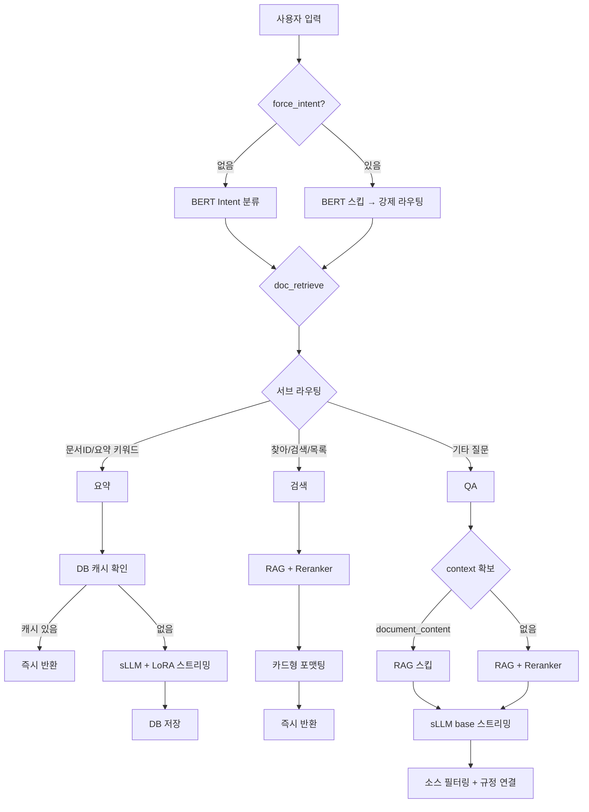
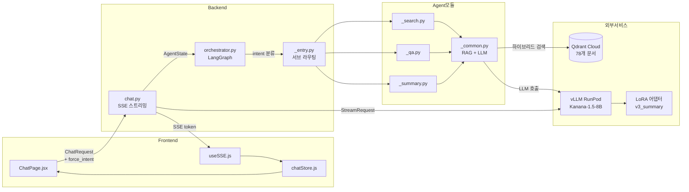

# 문서 Agent: 검색 / QA / 요약 파이프라인

> 챗봇에서 사용자가 자연어로 문서를 검색하고, 질문하고, 요약받을 수 있는 3종 파이프라인. sLLM(vLLM + LoRA) 온프레미스 환경에서 동작.

---

## [1] 핵심 구성요소

| 구성요소 | 역할 | 기술 |
|----------|------|------|
| **Intent 분류** | 사용자 입력 → 검색/QA/요약 라우팅 | ONNX 멀티라벨 BERT + regex 서브라우팅 |
| **RAG 파이프라인** | 문서 검색 (BM25 + Vector + Reranker) | Qdrant, BGE 임베딩, Cross-Encoder |
| **sLLM** | QA 답변 / 요약 생성 | Kanana-1.5-8B (vLLM), v3_summary LoRA |
| **StreamRequest** | agent↔chat.py 스트리밍 프로토콜 | llm_config + post_stream 규격 |
| **후속 액션** | 결과 카드 하단 버튼 (요약/질문/검색) | force_intent 강제 라우팅 |

---

## [2] 3종 기능 비교

| | 검색 | QA | 요약 |
|---|------|----|----|
| **목적** | 관련 문서 찾기 | 문서 기반 질의응답 | 문서 핵심 정리 |
| **LLM 사용** | 없음 (RAG only) | sLLM base | sLLM + v3_summary LoRA |
| **스트리밍** | 불필요 (즉시 반환) | 토큰 스트리밍 | 토큰 스트리밍 |
| **입력** | 자연어 질의 | 자연어 질문 | document_id 또는 자연어 |
| **출력** | sources 카드 리스트 | answer + citations + confidence | tags + summary |
| **Reranker** | 항상 적용 | 항상 적용 | 문서 식별 시만 |
| **DB 캐시** | 없음 | 없음 | summary + tags DB 저장 |
| **멀티턴** | 불필요 | chat_history 지원 | 불필요 |

---

## [3] 파이프라인 흐름

### 전체 흐름



### 검색 파이프라인

```
사용자: "보고서 찾아줘"
  → BERT: doc_retrieve (confidence 0.95)
  → regex: _is_pure_search("찾아") = True
  → RAG: BM25 + Vector → RRF → Reranker (top_k=10, threshold=0.1)
  → document_id 중복 제거
  → 카드형 메시지 포맷팅 (LLM 없음)
  → 즉시 반환 (stream_pending 없음)
```

### QA 파이프라인

```
사용자: "보안 정책 알려줘"
  → BERT: doc_retrieve
  → regex: 요약 아님, 검색 아님 → QA fallback
  → context 확보: ① document_content ② 기존 context ③ RAG 검색
  → chat_history → [이전 대화] 섹션 추가
  → StreamRequest 반환 (task="qa", filter_sources=True)
  → chat.py: vLLM base 모델 스트리밍 → 토큰 릴레이
  → post_stream: 소스 필터링 + 규정 연결
```

### 요약 파이프라인

```
사용자: 문서 선택 + "요약해줘"
  → BERT: doc_retrieve
  → regex: document_id 있음 → _is_summary = True
  → DB 캐시 체크 (summary + tags 있으면 즉시 반환)
  → 없으면 → StreamRequest (task="summary", update_summary_db=42)
  → chat.py: vLLM v3_summary LoRA 스트리밍
  → post_stream: DB 업데이트 (tags + summary 저장)
```

---

## [4] 시스템 아키텍처



### 데이터 흐름

| 단계 | From | To | 데이터 |
|------|------|----|--------|
| 1 | 프론트 | chat.py | `{message, document_id, force_intent}` |
| 2 | chat.py | orchestrator | `AgentState` (user_input, stream_mode, force_intent) |
| 3 | orchestrator | _entry.py | intent, force_sub_type |
| 4 | 핸들러 | Qdrant | RAG 검색 (BM25 + Vector) |
| 5 | 핸들러 | chat.py | `StreamRequest` (llm_config + post_stream) |
| 6 | chat.py | vLLM | 스트리밍 LLM 호출 |
| 7 | chat.py | 프론트 | SSE events (token → result → done) |

---

## [5] 완료된 기능

### 백엔드 파이프라인
- [x] 검색: RAG + Reranker + score_threshold + 카드형 포맷팅
- [x] QA: RAG → sLLM base → JSON 파싱 (citations + confidence)
- [x] QA: chat_history 멀티턴 지원
- [x] QA: document_content 있으면 RAG 스킵 (중복 호출 방지)
- [x] 요약: sLLM v3_summary LoRA → 태그 + 요약 생성
- [x] 요약: DB 캐시 (재요청 시 sLLM 스킵)
- [x] 요약: 문서 식별 (RAG → 1건 매칭 → DB 로드 / 다건 → doc_pick UI)

### StreamRequest 프로토콜
- [x] agent가 llm_config + post_stream 준비 → chat.py는 토큰 릴레이만
- [x] chat.py document_agent 블록 170줄 → ~40줄로 축소
- [x] 공통 헬퍼 4개 (`_get_vllm_client`, `_update_summary_db`, `_stream_regulation`, `_filter_sources`)

### force_intent 강제 라우팅
- [x] ChatRequest.force_intent 필드 추가
- [x] orchestrator: BERT 분류 스킵 (confidence=1.0)
- [x] _entry.py: force_sub_type → regex 스킵 → 핸들러 직행
- [x] document_content 있어도 QA 라우팅 가능 (기존 summary 강제 버그 해결)

### 프론트엔드 UI
- [x] 검색/QA/요약 카드별 후속 액션 버튼
- [x] 버튼 클릭 시 forceIntent + documentId 전달
- [x] 스트리밍 중 버튼 숨김 (isLastAndStreaming)
- [x] useChat/useSSE: sendMessage(text, options) 확장

### 버그 수정
- [x] sLLM 모드에서 QA가 API fallback으로 빠지던 문제 수정
- [x] QA 스트리밍/비스트리밍 프롬프트 불일치 해결 (prompts.py 통일)
- [x] summary DB 업데이트 코드 중복 제거 (agent + chat.py → 일원화)

---

## [6] 해결해야 할 문제

### 기술적 문제

| 문제 | 왜 문제인지 | 심각도 |
|------|------------|--------|
| **Reranker 초기 로드 30-400초** | 서버 시작 후 첫 검색이 수 분 걸림. 사용자 이탈 원인. | 높음 |
| **vLLM 콜드스타트** | RunPod 서버리스 특성상 첫 요청에 500 에러/타임아웃 발생. API fallback으로 커버 중이지만 API 없는 환경에서는 실패. | 높음 |
| **QA LoRA 미학습** | base 모델로 답변 생성 중. 파인튜닝된 모델 대비 답변 품질/형식 일관성 부족. | 중간 |
| **context 길이 미제한** | RAG 결과 7건이 그대로 프롬프트에 들어감. 긴 문서 7개면 토큰 초과 가능. | 중간 |

### UX 문제

| 문제 | 왜 문제인지 | 심각도 |
|------|------------|--------|
| **regex 서브라우팅 한계** | "이 문서 내용 정리해줘" → 요약? QA? 키워드만으로 판단하면 오분류 가능. force_intent 버튼으로 우회 가능하지만 첫 입력은 여전히 regex 의존. | 중간 |
| **document_content 있으면 무조건 요약** | 문서 선택 상태에서 자연어 입력하면 regex가 summary로 보냄. force_sub_type 없이는 QA 불가. | 중간 |
| **검색 결과에서 문서 선택 → 요약 연결 불완전** | SourceItem 클릭은 우측 패널 열기만 함. "이 문서 요약" 하려면 후속 버튼 필요. | 낮음 |

### 확장성 문제

| 문제 | 왜 문제인지 | 심각도 |
|------|------------|--------|
| **규정 문서 vs 일반 문서 미분리** | Qdrant에 `source=documents`로 통합 저장. 규정 QA와 일반 문서 QA가 섞임. | 중간 |
| **generate 파이프라인 미합류** | 검색/QA/요약은 StreamRequest 프로토콜 적용 완료. generate는 아직 구 방식. 통합 필요. | 중간 |
| **멀티 문서 요약 미지원** | 현재 1문서 요약만 가능. "최근 회의록 3개 요약해줘" 같은 요청 불가. | 낮음 |

---

## [7] 향후 발전 방향

1. **QA LoRA 학습** — 답변 품질/형식 일관성 향상, base 대비 응답 속도 개선
2. **generate 합류** — StreamRequest 프로토콜 적용, chat.py 통합
3. **context truncation** — RAG 결과를 토큰 예산 내에서 자동 잘라내기
4. **Reranker warm-up** — 서버 시작 시 미리 로드, 또는 경량 reranker 교체
5. **입력창 모드 칩** — `[🔍 검색] [❓ 질문] [📋 요약]` 칩으로 사용자가 직접 모드 선택

---

## [부록] 멘토링 데모용 테스트 문장

### 기본 템플릿 (시스템 기본 양식)

#### 회의록 (meeting_minutes)

> 필드: title, date, attendees, content, summary, decisions, action_items

**짧은 입력 (핵심만)**
```
3월 20일 AI팀 주간회의, 참석자 김철수 이영희 박민수.
LoRA v3 학습 완료 보고, vLLM 서빙 안정화 논의, 다음주 E2E 테스트 일정 확정.
```

**중간 입력 (상세)**
```
2025년 3월 18일 오전 10시, 개발팀 스프린트 리뷰 회의.
참석: 신지용(PM), 윤경은(AI), 진승언(AI), 안혜빈(백엔드), 문지영(프론트).
논의 내용: 1) Intent 분류 정확도 95% 달성 보고 2) 문서 생성 파이프라인 테스트 결과 공유
3) Google Calendar 연동 버그 수정 완료.
결정사항: LoRA v3를 운영 서버에 배포하기로 함, E2E 테스트는 3월 25일 시작.
후속조치: 김철수-vLLM 모니터링 대시보드 구축(3/22까지), 이영희-테스트 시나리오 작성(3/21까지).
```

**긴 입력 (회의 전문)**
```
일시: 2025년 3월 15일 14:00-16:00
장소: 본사 5층 대회의실
참석자: 마케팅팀 전원(8명) - 팀장 정수진, 기획 이도현 김서연, 디자인 박준영, 콘텐츠 최유진 한서윤, 데이터 강민호 오하은

안건 1: Q2 마케팅 캠페인 전략
- 지난 Q1 성과 리뷰: SNS 광고 CTR 3.2% (목표 2.5% 초과 달성), 전환율 1.8% (목표 2.0% 미달)
- Q2 목표: 전환율 2.5%로 상향, 예산 15% 증액 요청 예정
- 리타겟팅 캠페인 도입 제안 (강민호): A/B 테스트 후 본격 적용

안건 2: 신규 브랜드 런칭 일정
- 브랜드명 'NovaTech' 확정, 로고 디자인 최종 시안 3개 중 B안 채택
- 런칭 일정: 4월 15일 프레스 릴리즈, 4월 20일 SNS 캠페인 시작
- 인플루언서 협업 10건 계약 진행 중 (7건 완료, 3건 협상 중)

안건 3: 팀 내부 프로세스 개선
- 주간 보고서 템플릿 간소화 합의
- 슬랙 채널 정리: 프로젝트별 채널로 통합
- 디자인 리뷰 프로세스: 주 1회 금요일 오전으로 고정
```

#### 보고서 (report)

> 필드: title, date, author, overview, main_content, tasks, next_plan, issues

**짧은 입력**
```
3월 3주차 개발팀 주간보고. 작성자 신지용.
이번 주: 문서 Agent 검색/QA/요약 파이프라인 재설계 완료.
다음 주: E2E 테스트 및 프론트엔드 연동.
```

**중간 입력**
```
2025년 3월 업무보고서, AI개발팀, 작성자 진승언.
주요 성과: 1) LoRA v3 학습 데이터 1500건 구축 완료 2) 문서 생성 정확도 ROUGE-L 0.72 달성
3) 커스텀 템플릿 업로드 기능 구현.
진행 중: vLLM 서빙 안정화 작업 (RunPod 서버리스 → EC2 전환 검토).
이슈: sLLM 콜드스타트 지연 (첫 요청 10-15초), 해결 방안으로 warm-up 스크립트 검토 중.
다음 계획: QA용 LoRA 학습 데이터 수집, E2E 통합 테스트.
```

**긴 입력**
```
제목: 2025년 1분기 클라우드 인프라 전환 프로젝트 진행보고서
작성자: 안혜빈 / 인프라팀
보고 대상: CTO실

1. 개요
온프레미스 서버 환경을 AWS 클라우드로 전환하는 프로젝트의 1분기 진행 상황을 보고합니다.
전체 마이그레이션 대상 42개 서비스 중 18개(43%) 완료.

2. 주요 진행 사항
- DB 마이그레이션: PostgreSQL 5대 중 3대 RDS 전환 완료, 나머지 2대는 4월 중 예정
- 컨테이너화: 28개 서비스 Docker화 완료, ECS Fargate 배포 15건
- 모니터링: CloudWatch + Grafana 대시보드 구축, 알림 체계 설정 완료
- 보안: VPC 설계 완료, WAF 규칙 적용, IAM 정책 최소 권한 원칙 적용

3. 진행 중 업무
- 레거시 Java 서비스 3건 컨테이너화 (JVM 최적화 필요)
- CI/CD 파이프라인 GitHub Actions 전환 (현재 Jenkins)
- 비용 최적화: Reserved Instance 구매 검토 (예상 절감 30%)

4. 이슈 및 리스크
- DB 마이그레이션 시 다운타임 최소화 방안 필요 (블루-그린 배포 적용 예정)
- 레거시 시스템 의존성으로 일부 서비스 지연 가능성
- 예산 초과 우려: GPU 인스턴스 비용이 예상보다 40% 높음

5. 향후 계획 (Q2)
- 4월: 나머지 DB 마이그레이션 + CI/CD 전환 완료
- 5월: 성능 테스트 + 비용 최적화
- 6월: 최종 검증 + 온프레미스 해제
```

#### 제안서 (proposal)

> 필드: title, submit_date, purpose, content, expected_effect, schedule, budget, background, current_situation

**짧은 입력**
```
사내 AI 챗봇 도입 제안. 목적: 반복 업무 자동화로 생산성 30% 향상.
예산 5000만원, 3개월 개발 기간.
```

**중간 입력**
```
제안명: 스마트 오피스 회의실 예약 시스템 도입
배경: 현재 수기/이메일 기반 회의실 예약으로 더블부킹 월 평균 15건 발생.
목적: 실시간 예약 시스템 구축으로 회의실 활용률 90% 달성.
기대효과: 더블부킹 제로, 회의실 활용 데이터 기반 공간 최적화.
일정: 1단계-요구사항(2주), 2단계-개발(6주), 3단계-테스트(2주), 4단계-배포(1주).
예산: 소프트웨어 개발 3000만원, 하드웨어(디스플레이) 500만원, 유지보수 연 200만원.
```

**긴 입력**
```
제안명: 기업 문서 관리 AI 플랫폼 구축 제안서
제안사: 듀듀 AI Labs / 담당자: 신지용 / 제출일: 2025-03-22

1. 배경 및 현황
현재 기업 내 문서 관리는 공유 드라이브와 이메일 기반으로 운영되고 있습니다.
- 문서 검색 평균 소요 시간: 15분
- 규정 관련 질의 처리 시간: 평균 2시간 (담당 부서 확인 필요)
- 회의록 작성 소요 시간: 회의 시간의 50%
- 문서 버전 관리 미흡으로 연간 약 200건의 버전 충돌 발생

2. 제안 목적
AI 기반 문서 관리 플랫폼을 도입하여 문서 검색, 규정 판단, 회의록 자동 생성을 지원합니다.

3. 기대 효과
- 문서 검색 시간 15분 → 10초 (99% 단축)
- 규정 판단 자동화로 처리 시간 2시간 → 5분
- 회의록 자동 생성으로 작성 시간 80% 절감
- 연간 인건비 절감 예상: 약 2억원

4. 일정
- 1단계 (1개월): 설계 및 환경 세팅
- 2단계 (2개월): 기반 개발 + LLM API 연동
- 3단계 (2개월): Agent 개발 + 핵심 기능
- 4단계 (1개월): 데이터 수집 + 파인튜닝
- 5단계 (1개월): 통합 테스트
- 6단계 (1개월): 배포 및 마무리

5. 예산
- AI 모델 개발: 8,000만원
- 인프라 (AWS + GPU): 3,000만원
- 인건비 (5명 × 8개월): 24,000만원
- 기타 (라이선스, 교육): 2,000만원
- 총 예산: 3억 7,000만원
```

---

### 커스텀 템플릿 (사용자 업로드 양식 — 기본 템플릿과 필드가 다름)

> 커스텀 템플릿은 사용자가 DOCX 양식을 업로드하면 자동으로 필드를 추출하여 사용합니다.
> 아래는 커스텀 양식 시나리오별 테스트 문장입니다.

#### 커스텀 회의록 (필드: 회의명, 일시, 장소, 참석부서, 안건, 의결사항, 차기회의)

**짧은 입력**
```
경영전략회의, 3월 20일, 본사 임원회의실.
참석부서: 경영기획, 재무, 인사.
안건: 하반기 조직개편 방향. 의결: 4월 TF 구성하여 검토 착수.
```

**중간 입력**
```
회의명: 2025년 1차 이사회
일시: 2025-03-15 10:00
장소: 서울 본사 18층 이사회실
참석부서: 대표이사실, 경영지원본부, 법무팀, 감사위원회
안건: 1) 2024년 결산 승인 2) 2025년 사업계획 승인 3) 임원 인사안 의결
의결사항: 결산 원안 승인, 사업계획 수정 후 재상정(AI 투자 비율 상향 요청),
임원 인사안 3건 중 2건 승인 1건 보류.
차기회의: 2025-04-18 정기이사회
```

**긴 입력**
```
회의명: 글로벌 사업 확장 전략 워크숍 (2일차)
일시: 2025년 3월 12일 09:00-18:00
장소: 제주 ICC 컨퍼런스룸 A
참석부서: 해외사업부, 전략기획실, 법무팀, 마케팅본부, R&D센터

안건 1: 동남아 시장 진출 로드맵
- 베트남: 2025 Q3 법인 설립, 2026 Q1 서비스 런칭
- 인도네시아: 현지 파트너사 3곳 MOU 체결 완료, 합작법인 검토
- 태국: 시장 조사 진행 중, 2025 Q4 진출 여부 결정

안건 2: 현지화 전략
- 다국어 지원: 베트남어, 인도네시아어, 태국어 순차 적용
- 결제 시스템: 현지 간편결제 연동 필수 (GrabPay, OVO, TrueMoney)
- 고객 지원: 현지 CS 센터 구축 vs 아웃소싱 비교 분석 필요

의결사항:
1) 베트남 법인 설립 예산 12억 승인
2) 인도네시아 합작법인 구조 법무팀 검토 후 4월 재논의
3) 현지화 TF 구성 (해외사업부 리드, R&D 2명, 마케팅 1명)

차기회의: 2025-04-10 월례 해외사업 점검회의
```

#### 커스텀 보고서 (필드: 보고서명, 보고일, 보고자, 부서, 보고대상, 핵심성과, 리스크, 요청사항)

**짧은 입력**
```
주간 영업 실적 보고, 3월 3주차, 보고자 김영업, 영업1팀.
핵심성과: 신규 계약 3건 (총 2.4억). 리스크: 대형 고객 A사 계약 갱신 불확실.
```

**중간 입력**
```
보고서명: 2025년 1분기 고객만족도 조사 결과 보고
보고일: 2025-03-20
보고자: 박서비스 과장 / CS운영팀
보고대상: 서비스본부장

핵심성과:
- 전체 만족도 4.2/5.0 (전 분기 대비 0.3 상승)
- NPS 점수 +42 (업계 평균 +35 상회)
- 불만 접수 건수 전 분기 대비 28% 감소

리스크:
- 배송 관련 불만 여전히 1위 (전체 불만의 35%)
- 챗봇 응답 정확도 개선 필요 (현재 78%, 목표 90%)

요청사항: 배송 프로세스 개선 TF 구성, 챗봇 고도화 예산 추가 배정 요청
```

**긴 입력**
```
보고서명: 2025년 상반기 정보보안 위험평가 보고서
보고일: 2025-03-22
보고자: 강보안 팀장 / 정보보안팀
부서: IT인프라본부
보고대상: CISO (최고정보보안책임자)

핵심성과:
- 연간 보안 감사 통과 (ISO 27001 갱신 인증 완료)
- 피싱 메일 모의훈련 실시: 클릭률 8% → 3%로 개선 (직원 2,400명 대상)
- 취약점 스캔 결과: Critical 0건, High 3건 (모두 패치 완료), Medium 12건
- DLP 시스템 도입으로 민감정보 유출 시도 차단 47건

리스크:
1) 클라우드 전환 과정에서 임시 보안 예외 15건 존재 — 6월까지 해소 필요
2) 원격근무 확대로 개인 기기 접속 증가 — MDM 솔루션 적용률 현재 62%
3) 오픈소스 라이브러리 취약점 관리 체계 부재 — SCA 도구 도입 시급
4) 랜섬웨어 공격 시도 월 평균 23건 탐지 (전년 대비 180% 증가)

요청사항:
1) MDM 솔루션 전사 적용 예산 승인 (약 8,000만원)
2) SCA(Software Composition Analysis) 도구 도입 (연 3,000만원)
3) 보안 인력 2명 충원 요청 (클라우드 보안 전문가)
4) 전사 보안 교육 분기별 → 월별 확대
```

#### 커스텀 제안서 (필드: 프로젝트명, 제안일, 제안팀, 고객사, 문제정의, 솔루션, ROI분석, 구현단계, 필요자원)

**짧은 입력**
```
프로젝트: 사내 ERP 고도화. 고객사: 자사 경영지원본부.
문제: 10년된 ERP 시스템 성능 저하 및 유지보수 어려움.
솔루션: 클라우드 기반 신규 ERP 전환. ROI: 3년 내 투자비 회수.
```

**중간 입력**
```
프로젝트명: AI 기반 고객 이탈 예측 시스템
제안일: 2025-03-22
제안팀: 데이터분석팀
고객사: 마케팅본부

문제정의: 월 평균 고객 이탈률 5.2%, 이탈 사전 감지 불가로 사후 대응만 가능.
연간 이탈로 인한 매출 손실 약 30억원.

솔루션: 고객 행동 데이터 기반 ML 이탈 예측 모델 구축.
이탈 확률 80% 이상 고객에게 자동 리텐션 캠페인 발송.

ROI분석: 이탈률 5.2% → 3.5% 예상. 연간 매출 보전 효과 약 10억원.
개발 비용 2억원 대비 ROI 500%.

구현단계: 데이터 수집(1개월) → 모델 개발(2개월) → A/B 테스트(1개월) → 운영 적용(1개월)
필요자원: 데이터 엔지니어 2명, ML 엔지니어 1명, GPU 서버 1대
```

**긴 입력**
```
프로젝트명: 지능형 문서 관리 플랫폼(DUDE) 구축 제안
제안일: 2025-03-22
제안팀: AI개발팀 (PM: 신지용)
고객사: 전사 (경영지원본부 주관)

문제정의:
1) 문서 검색: 직원 1인당 하루 평균 45분을 문서 찾는데 소비 (전사 1,000명 기준 연 18,750시간)
2) 규정 판단: 규정 관련 질의 응대에 법무/인사팀 리소스의 30% 소모
3) 회의록: 회의 후 문서화에 평균 40분 소요, 지연 작성으로 내용 누락 빈번
4) 문서 품질: 템플릿 미준수, 표기 불일치, 누락 항목 등 품질 이슈 월 50건+

솔루션:
- RAG 기반 문서 검색: BM25 + Vector + Reranker 하이브리드 검색 (응답 10초 이내)
- 규정 판단 Agent: sLLM + LoRA로 규정 기반 yes/no/conditional 자동 판단
- 문서 생성 Agent: 자연어 입력 → 회의록/보고서/제안서 DOCX 자동 생성
- 규정 검증: 생성 문서의 규정 준수 여부 자동 체크

ROI분석:
- 문서 검색 시간 절감: 연 18,750시간 × 시급 3만원 = 5.6억원
- 규정 판단 자동화: 법무팀 리소스 30% 절감 = 1.2억원
- 회의록 자동화: 연 6,000시간 절감 = 1.8억원
- 문서 품질 향상: 재작업 감소로 연 0.4억원
- 총 연간 효과: 9.0억원 / 투자비 3.7억원 = ROI 243%

구현단계:
- 1단계 설계 (1개월): API 스키마, AgentState, DB 설계
- 2단계 기반개발 (2개월): LLM API 연동, RAG 구축, JWT 인증
- 3단계 Agent개발 (2개월): Intent 분류, 판단/문서/일정 Agent
- 4단계 파인튜닝 (1개월): 데이터 수집, LoRA 학습, vLLM 교체
- 5단계 통합테스트 (1개월): E2E 테스트, 성능 평가
- 6단계 배포 (1개월): AWS 배포, 모니터링

필요자원:
- 인력: PM 1명, AI 엔지니어 2명, 백엔드 1명, 프론트엔드 1명 (8개월)
- 인프라: AWS EC2 (t3.xlarge), RDS, S3, RunPod GPU (A100)
- 외부 서비스: Qdrant Cloud, OpenAI API (초기), HuggingFace
- 라이선스: GitHub Enterprise, Figma
```
