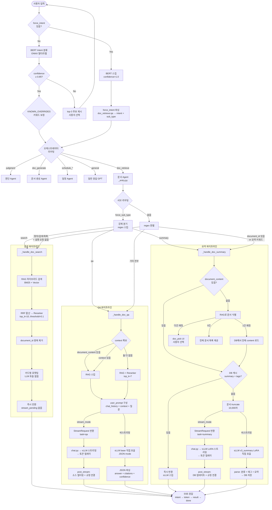
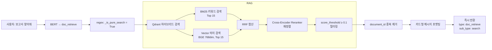
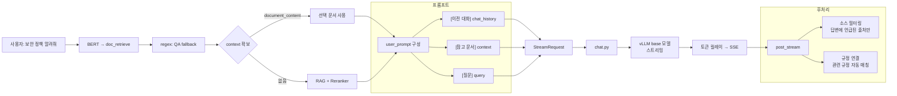
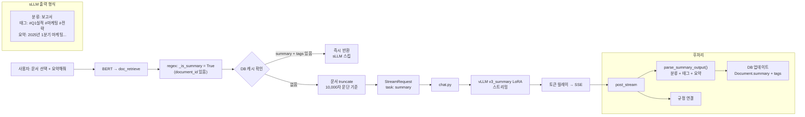
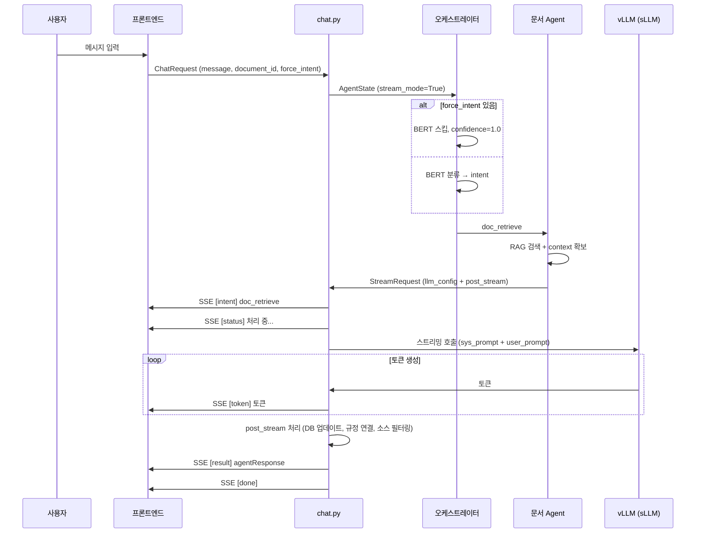

# 문서 Agent 파이프라인: Intent 분류 → 오케스트레이터 → 검색 / QA / 요약

## 전체 파이프라인

```mermaid
flowchart TD
    User([사용자 입력]) --> FI{force_intent<br/>있음?}

    FI -->|Yes| Skip[BERT 스킵<br/>confidence=1.0]
    FI -->|No| BERT[BERT Intent 분류<br/>ONNX 멀티라벨]

    Skip --> ParseForce[force_intent 파싱<br/>doc_retrieve:qa → intent + sub_type]
    BERT --> Conf{confidence<br/>≥ 0.85?}

    Conf -->|No| Clarify[top-3 후보 제시<br/>사용자 선택]
    Conf -->|Yes| Override{KNOWN_OVERRIDES<br/>키워드 보정}

    Clarify --> User
    Override --> Route

    ParseForce --> Route{오케스트레이터<br/>라우팅}

    Route -->|judgment| JA[판단 Agent]
    Route -->|doc_generate| DG[문서 생성 Agent]
    Route -->|schedule_*| SA[일정 Agent]
    Route -->|general| GR[일반 응답 GPT]
    Route -->|doc_retrieve| Entry[문서 Agent<br/>_entry.py]

    Entry --> SubRoute{서브 라우팅}

    SubRoute -->|force_sub_type| Forced[강제 분기<br/>regex 스킵]
    SubRoute -->|없음| Regex[regex 판별]

    Forced -->|summary| SUM
    Forced -->|search| SEARCH
    Forced -->|qa| QA

    Regex -->|document_id 있음<br/>or 요약 키워드| SUM
    Regex -->|찾아/검색/목록<br/>+ 설명 요청 없음| SEARCH
    Regex -->|기타 전부| QA

    subgraph 검색 파이프라인
        SEARCH[_handle_doc_search] --> S1[RAG 하이브리드 검색<br/>BM25 + Vector]
        S1 --> S2[RRF 합산 → Reranker<br/>top_k=10, threshold=0.1]
        S2 --> S3[document_id 중복 제거]
        S3 --> S4[카드형 포맷팅<br/>LLM 호출 없음]
        S4 --> S5[즉시 반환<br/>stream_pending 없음]
    end

    subgraph QA 파이프라인
        QA[_handle_doc_qa] --> Q1{context 확보}
        Q1 -->|document_content 있음| Q2[RAG 스킵]
        Q1 -->|context 있음| Q2
        Q1 -->|둘 다 없음| Q3[RAG + Reranker<br/>top_k=7]
        Q2 --> Q4[user_prompt 구성<br/>chat_history + context + 질문]
        Q3 --> Q4
        Q4 -->|stream_mode| Q5[StreamRequest 반환<br/>task=qa]
        Q4 -->|비스트리밍| Q6[sLLM base 직접 호출<br/>JSON mode]
        Q5 --> Q7[chat.py → vLLM 스트리밍<br/>→ 토큰 릴레이]
        Q7 --> Q8[post_stream:<br/>소스 필터링 + 규정 연결]
        Q6 --> Q9[JSON 파싱<br/>answer + citations + confidence]
    end

    subgraph 요약 파이프라인
        SUM[_handle_doc_summary] --> M1{document_content<br/>있음?}
        M1 -->|없음| M2[RAG로 문서 식별]
        M2 -->|1건 매칭| M3[DB에서 전체 content 로드]
        M2 -->|다건 매칭| M4[doc_pick UI<br/>사용자 선택]
        M2 -->|0건| M5[전체 문서 목록 제공]
        M1 -->|있음| M6{DB 캐시<br/>summary + tags?}
        M3 --> M6
        M6 -->|있음| M7[즉시 반환<br/>sLLM 스킵]
        M6 -->|없음| M8[문서 truncate<br/>10,000자]
        M8 -->|stream_mode| M9[StreamRequest 반환<br/>task=summary]
        M8 -->|비스트리밍| M10[sLLM v3_summary LoRA<br/>직접 호출]
        M9 --> M11[chat.py → vLLM LoRA 스트리밍<br/>→ 토큰 릴레이]
        M11 --> M12[post_stream:<br/>DB 업데이트 + 규정 연결]
        M10 --> M13[parse: 분류 + 태그 + 요약<br/>→ DB 저장]
    end

    S5 --> Result
    Q8 --> Result
    Q9 --> Result
    M7 --> Result
    M12 --> Result
    M13 --> Result

    Result([SSE 응답<br/>intent → token → result → done])
```

## 검색 파이프라인 상세

```mermaid
flowchart LR
    A[사용자: 보고서 찾아줘] --> B[BERT → doc_retrieve]
    B --> C[regex: _is_pure_search = True]
    C --> D[Qdrant 하이브리드 검색]

    subgraph RAG
        D --> D1[BM25 키워드 검색<br/>Top 15]
        D --> D2[Vector 의미 검색<br/>BGE 768dim, Top 15]
        D1 --> D3[RRF 합산]
        D2 --> D3
        D3 --> D4[Cross-Encoder Reranker<br/>재정렬]
        D4 --> D5[score_threshold ≥ 0.1<br/>필터링]
    end

    D5 --> E[document_id 중복 제거]
    E --> F[카드형 메시지 포맷팅]
    F --> G[즉시 반환<br/>type: doc_retrieve<br/>sub_type: search]
```

## QA 파이프라인 상세

```mermaid
flowchart LR
    A[사용자: 보안 정책 알려줘] --> B[BERT → doc_retrieve]
    B --> C[regex: QA fallback]
    C --> D{context 확보}

    D -->|document_content| E1[선택 문서 사용]
    D -->|없음| E2[RAG + Reranker]

    E1 --> F[user_prompt 구성]
    E2 --> F

    subgraph 프롬프트
        F --> F1["[이전 대화] chat_history"]
        F --> F2["[참고 문서] context"]
        F --> F3["[질문] query"]
    end

    F1 --> G[StreamRequest]
    F2 --> G
    F3 --> G

    G --> H[chat.py]
    H --> I[vLLM base 모델<br/>스트리밍]
    I --> J[토큰 릴레이 → SSE]
    J --> K[post_stream]

    subgraph 후처리
        K --> K1[소스 필터링<br/>답변에 언급된 출처만]
        K --> K2[규정 연결<br/>관련 규정 자동 매칭]
    end
```

## 요약 파이프라인 상세

```mermaid
flowchart LR
    A[사용자: 문서 선택 + 요약해줘] --> B[BERT → doc_retrieve]
    B --> C["regex: _is_summary = True<br/>(document_id 있음)"]
    C --> D{DB 캐시 확인}

    D -->|summary + tags 있음| E[즉시 반환<br/>sLLM 스킵]

    D -->|없음| F[문서 truncate<br/>10,000자 문단 기준]
    F --> G[StreamRequest<br/>task: summary]
    G --> H[chat.py]
    H --> I[vLLM v3_summary LoRA<br/>스트리밍]
    I --> J[토큰 릴레이 → SSE]
    J --> K[post_stream]

    subgraph 후처리
        K --> K1["parse_summary_output()<br/>분류 + 태그 + 요약"]
        K1 --> K2[DB 업데이트<br/>Document.summary + tags]
        K --> K3[규정 연결]
    end

    subgraph "sLLM 출력 형식"
        L["분류: 보고서<br/>태그: #Q1실적 #마케팅 #전략<br/>요약: 2025년 1분기 마케팅..."]
    end
```

## StreamRequest 프로토콜 (agent ↔ chat.py)

```mermaid
sequenceDiagram
    participant User as 사용자
    participant FE as 프론트엔드
    participant Chat as chat.py
    participant Orch as 오케스트레이터
    participant Agent as 문서 Agent
    participant vLLM as vLLM (sLLM)

    User->>FE: 메시지 입력
    FE->>Chat: ChatRequest (message, document_id, force_intent)
    Chat->>Orch: AgentState (stream_mode=True)

    alt force_intent 있음
        Orch->>Orch: BERT 스킵, confidence=1.0
    else
        Orch->>Orch: BERT 분류 → intent
    end

    Orch->>Agent: doc_retrieve

    Agent->>Agent: RAG 검색 + context 확보
    Agent->>Chat: StreamRequest (llm_config + post_stream)

    Chat->>FE: SSE [intent] doc_retrieve
    Chat->>FE: SSE [status] 처리 중...

    Chat->>vLLM: 스트리밍 호출 (sys_prompt + user_prompt)

    loop 토큰 생성
        vLLM->>Chat: 토큰
        Chat->>FE: SSE [token] 토큰
    end

    Chat->>Chat: post_stream 처리 (DB 업데이트, 규정 연결, 소스 필터링)
    Chat->>FE: SSE [result] agentResponse
    Chat->>FE: SSE [done]
```
