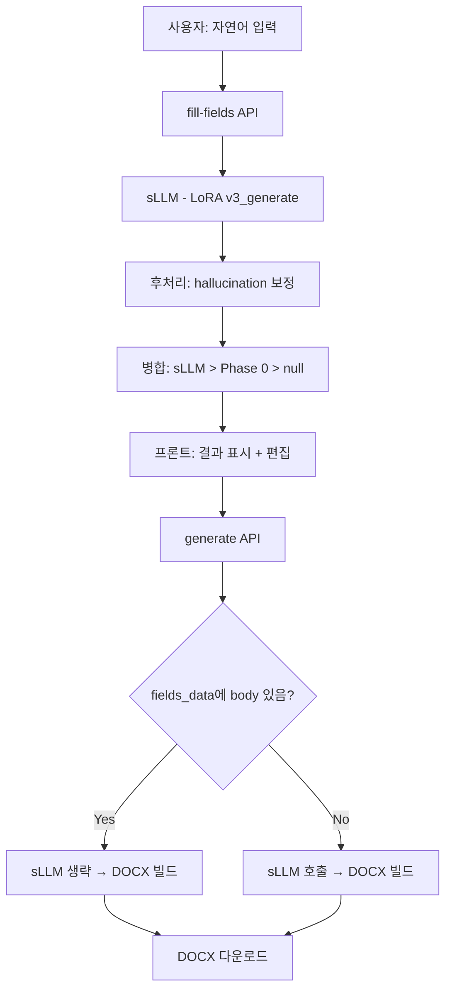
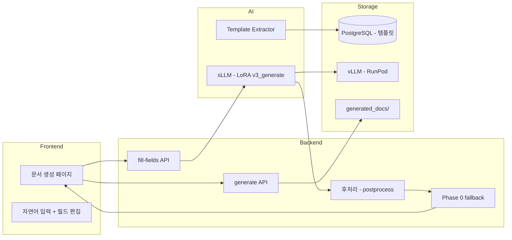

# 문서 생성 기능 (Template System)

> 사용자가 자연어를 입력하면, sLLM(LoRA)이 양식의 필드를 자동으로 채워 DOCX 문서를 생성한다.

---

## 1. 핵심 구성요소

| 구성요소 | 역할 | 기술 |
|---------|------|------|
| Template Extractor | DOCX 양식에서 필드 자동 추출 | python-docx, 규칙 기반 |
| sLLM (LoRA v3_generate) | 자연어 → JSON 필드 채우기 | Kanana 1.5 8B + LoRA, vLLM |
| Phase 0 | 날짜/담당자 등 규칙 기반 fallback | Python datetime, User 객체 |
| 후처리 (Postprocess) | hallucination 보정 | 날짜 연도 검증, 빈값 보충 |
| DOCX Builder | JSON → DOCX 파일 생성 | python-docx |
| Frontend | 자연어 입력 + 결과 편집 UI | React, Zustand |

---

## 2. Template System

### 기본 템플릿 (System Template)

- **목적**: 회의록/보고서/제안서 3종 — 검증된 고정 양식
- **필드**: 영어 키 (`title`, `date`, `attendees`, `content`, ...)
- **DOCX 생성**: 전용 빌더 스크립트 (`create_meeting_minutes.py`, `create_report.py`, `create_proposal.py`)
- **사용 흐름**: 프론트 폼 입력 → `/generate` API → sLLM 생성 → 전용 빌더 → DOCX

### 커스텀 템플릿 (Custom Template)

- **목적**: 사용자가 아무 DOCX 양식을 업로드 → 필드 자동 추출 → AI가 채움
- **필드**: 한글 키 (`제출처`, `제안배경`, `현황분석`, ...)  — 양식에서 동적 추출
- **DOCX 생성**: 범용 레이아웃 빌더 (`create_generic_document()`)
- **사용 흐름**: DOCX 업로드 → 필드 추출 → 자연어 입력 → `/fill-fields` → sLLM → 결과 편집 → `/generate` → DOCX

### 비교

| | 기본 템플릿 | 커스텀 템플릿 |
|---|---|---|
| 양식 | 우리가 만든 고정 양식 | 사용자가 업로드한 아무 DOCX |
| 필드 키 | 영어 (`title`, `date`) | 한글 (`제출처`, `제안배경`) |
| 필드 추출 | DB seed (고정) | `template_extractor.py` (자동) |
| sLLM 호출 | `/generate`에서 1회 | `/fill-fields`에서 1회 → `/generate`에서 생략 |
| DOCX 빌더 | 전용 스크립트 (3종) | 범용 `create_generic_document()` |
| 프론트 UI | DynamicForm (폼 입력) | freeText → AI 채움 → 전체 필드 편집 |

---

## 3. 실제 흐름 (Pipeline)

### 커스텀 템플릿 파이프라인

```
사용자 → 자연어 입력 → [AI 문서 작성] 클릭
                ↓
         fill-fields API
                ↓
      전체 필드를 sLLM에 전달
      (학습 형식 그대로, 정규화 없음)
                ↓
      후처리: 날짜 hallucination → today 교체
              빈 담당자 → user.name 보충
                ↓
      병합: sLLM 결과 > Phase 0 fallback > null
                ↓
      프론트에 결과 표시 (AI/입력필요 태그)
      사용자가 확인 + 수정
                ↓
         [문서 생성] 클릭
                ↓
      generate API (sLLM 재호출 없이 데이터 직접 사용)
                ↓
      범용 DOCX 빌더 → 다운로드
```

### Flowchart



---

## 4. 시스템 아키텍처



### 데이터 흐름

| 단계 | 입력 | 처리 | 출력 |
|------|------|------|------|
| 업로드 | DOCX 양식 파일 | `extract_template_fields()` | fields (키, 라벨, type, group) → DB |
| 필드 채우기 | 자연어 텍스트 | sLLM + Phase 0 + 후처리 | `{필드키: 값}` JSON |
| 문서 생성 | fields_data JSON | `create_generic_document()` | DOCX 파일 |

---

## 5. 완료된 기능

- [x] DOCX 양식 필드 자동 추출 (`template_extractor.py` v3)
- [x] sLLM(LoRA v3_generate)으로 전체 필드 생성
- [x] 구어체/불릿/형식체 모두 지원 (정규화 불필요)
- [x] Phase 0 fallback (날짜→today, 담당자→user.name, 부서→user.team)
- [x] hallucination 후처리 (날짜 연도 보정, 빈 담당자 보충)
- [x] fill-fields → generate sLLM 이중 호출 제거
- [x] 한글 키 DOCX 매칭 (`_find_data_key` — 추출기 정규화 재사용)
- [x] 배열 데이터 테이블 행 주입 (`_inject_array_to_table`)
- [x] 범용 DOCX 레이아웃 빌더 (`create_generic_document`)
- [x] 프론트: 자연어 입력 → AI 채움 → 전체 필드 편집 → DOCX 생성
- [x] E2E 테스트 (Playwright + API)

---

## 6. 해결해야 할 문제

### 기술적 문제

| 문제 | 왜 문제인가 | 영향 |
|------|-----------|------|
| **sLLM 15개 이상 필드에서 meta 추출 약화** | 학습 데이터가 6~10개 필드 기준. 17개 보내면 meta(날짜/이름) 추출률 급락 | 제안서(17필드)에서 제출처/제안사 못 채움 → 사용자가 직접 입력 |
| **날짜 hallucination** | sLLM이 학습 데이터의 날짜(2023년)를 그대로 출력 | 후처리로 보정 중이나 "제안기간" 같은 자유 형식 날짜는 못 잡음 |
| **sLLM cold start 60초** | RunPod 서버리스 환경, warm pool 미설정 | 첫 호출 시 사용자 대기 시간 길어짐 |

### UX 문제

| 문제 | 왜 문제인가 |
|------|-----------|
| **범용 DOCX 레이아웃 품질** | 기본 템플릿(전용 빌더) 대비 완성도 낮음. 섹션 간 빈 공간, 배열 렌더링 등 개선 필요 |
| **"입력 필요" 필드 안내 부족** | sLLM이 못 채운 필드가 뭔지는 표시되지만, 왜 못 채웠는지 사용자가 모름 |
| **짧은 입력(3줄 이하) 시 body 0개** | 최소 입력 가이드 없이 빈 결과 반환 → 사용자 혼란 |

### 확장성 문제

| 문제 | 왜 문제인가 |
|------|-----------|
| **원본 양식 레이아웃 보존 불가** | 현재 범용 레이아웃으로 대체. 사용자의 원본 디자인(로고, 특수 레이아웃) 유지 못 함 |
| **문서 유형 확장** | 회의록/보고서/제안서 외 계약서, 인사문서 등은 sLLM 학습 데이터 없음 |

---

## 7. 향후 발전 방향

1. **sLLM 학습 데이터 보강** — 구어체 입력 + 다양한 필드 수(12~20개) 샘플 추가
2. **원본 양식 채우기 고도화** — 복합 테이블, 병합 셀, 플레이스홀더 처리 개선
3. **챗봇 연동** — "제안서 써줘" → 정보 부족 시 2턴 대화로 meta 수집 → 생성
4. **키 체계 통일** — 기본 템플릿도 한글 키로 전환, DOCX 빌더 리팩토링
5. **RunPod warm pool** — cold start 60초 → 5초 이하로 단축

## [부록] 테스트 문장

### 기본 템플릿 (시스템 기본 양식)

#### 회의록 (meeting_minutes)

> 필드: title, date, attendees, content, summary, decisions, action_items

**짧은 입력 (핵심만)**
```
3월 20일 AI팀 주간회의, 참석자 김철수 이영희 박민수.
LoRA v3 학습 완료 보고, vLLM 서빙 안정화 논의, 다음주 E2E 테스트 일정 확정.
```

**중간 입력 (상세)**
```
2025년 3월 18일 오전 10시, 개발팀 스프린트 리뷰 회의.
참석: 신지용(PM), 윤경은(AI), 진승언(AI), 안혜빈(백엔드), 문지영(프론트).
논의 내용: 1) Intent 분류 정확도 95% 달성 보고 2) 문서 생성 파이프라인 테스트 결과 공유
3) Google Calendar 연동 버그 수정 완료.
결정사항: LoRA v3를 운영 서버에 배포하기로 함, E2E 테스트는 3월 25일 시작.
후속조치: 김철수-vLLM 모니터링 대시보드 구축(3/22까지), 이영희-테스트 시나리오 작성(3/21까지).
```

**긴 입력 (회의 전문)**
```
일시: 2025년 3월 15일 14:00-16:00
장소: 본사 5층 대회의실
참석자: 마케팅팀 전원(8명) - 팀장 정수진, 기획 이도현 김서연, 디자인 박준영, 콘텐츠 최유진 한서윤, 데이터 강민호 오하은

안건 1: Q2 마케팅 캠페인 전략
- 지난 Q1 성과 리뷰: SNS 광고 CTR 3.2% (목표 2.5% 초과 달성), 전환율 1.8% (목표 2.0% 미달)
- Q2 목표: 전환율 2.5%로 상향, 예산 15% 증액 요청 예정
- 리타겟팅 캠페인 도입 제안 (강민호): A/B 테스트 후 본격 적용

안건 2: 신규 브랜드 런칭 일정
- 브랜드명 'NovaTech' 확정, 로고 디자인 최종 시안 3개 중 B안 채택
- 런칭 일정: 4월 15일 프레스 릴리즈, 4월 20일 SNS 캠페인 시작
- 인플루언서 협업 10건 계약 진행 중 (7건 완료, 3건 협상 중)

안건 3: 팀 내부 프로세스 개선
- 주간 보고서 템플릿 간소화 합의
- 슬랙 채널 정리: 프로젝트별 채널로 통합
- 디자인 리뷰 프로세스: 주 1회 금요일 오전으로 고정
```

#### 보고서 (report)

> 필드: title, date, author, overview, main_content, tasks, next_plan, issues

**짧은 입력**
```
3월 3주차 개발팀 주간보고. 작성자 신지용.
이번 주: 문서 Agent 검색/QA/요약 파이프라인 재설계 완료.
다음 주: E2E 테스트 및 프론트엔드 연동.
```

**중간 입력**
```
2025년 3월 업무보고서, AI개발팀, 작성자 진승언.
주요 성과: 1) LoRA v3 학습 데이터 1500건 구축 완료 2) 문서 생성 정확도 ROUGE-L 0.72 달성
3) 커스텀 템플릿 업로드 기능 구현.
진행 중: vLLM 서빙 안정화 작업 (RunPod 서버리스 → EC2 전환 검토).
이슈: sLLM 콜드스타트 지연 (첫 요청 10-15초), 해결 방안으로 warm-up 스크립트 검토 중.
다음 계획: QA용 LoRA 학습 데이터 수집, E2E 통합 테스트.
```

**긴 입력**
```
제목: 2025년 1분기 클라우드 인프라 전환 프로젝트 진행보고서
작성자: 안혜빈 / 인프라팀
보고 대상: CTO실

1. 개요
온프레미스 서버 환경을 AWS 클라우드로 전환하는 프로젝트의 1분기 진행 상황을 보고합니다.
전체 마이그레이션 대상 42개 서비스 중 18개(43%) 완료.

2. 주요 진행 사항
- DB 마이그레이션: PostgreSQL 5대 중 3대 RDS 전환 완료, 나머지 2대는 4월 중 예정
- 컨테이너화: 28개 서비스 Docker화 완료, ECS Fargate 배포 15건
- 모니터링: CloudWatch + Grafana 대시보드 구축, 알림 체계 설정 완료
- 보안: VPC 설계 완료, WAF 규칙 적용, IAM 정책 최소 권한 원칙 적용

3. 진행 중 업무
- 레거시 Java 서비스 3건 컨테이너화 (JVM 최적화 필요)
- CI/CD 파이프라인 GitHub Actions 전환 (현재 Jenkins)
- 비용 최적화: Reserved Instance 구매 검토 (예상 절감 30%)

4. 이슈 및 리스크
- DB 마이그레이션 시 다운타임 최소화 방안 필요 (블루-그린 배포 적용 예정)
- 레거시 시스템 의존성으로 일부 서비스 지연 가능성
- 예산 초과 우려: GPU 인스턴스 비용이 예상보다 40% 높음

5. 향후 계획 (Q2)
- 4월: 나머지 DB 마이그레이션 + CI/CD 전환 완료
- 5월: 성능 테스트 + 비용 최적화
- 6월: 최종 검증 + 온프레미스 해제
```

#### 제안서 (proposal)

> 필드: title, submit_date, purpose, content, expected_effect, schedule, budget, background, current_situation

**짧은 입력**
```
사내 AI 챗봇 도입 제안. 목적: 반복 업무 자동화로 생산성 30% 향상.
예산 5000만원, 3개월 개발 기간.
```

**중간 입력**
```
제안명: 스마트 오피스 회의실 예약 시스템 도입
배경: 현재 수기/이메일 기반 회의실 예약으로 더블부킹 월 평균 15건 발생.
목적: 실시간 예약 시스템 구축으로 회의실 활용률 90% 달성.
기대효과: 더블부킹 제로, 회의실 활용 데이터 기반 공간 최적화.
일정: 1단계-요구사항(2주), 2단계-개발(6주), 3단계-테스트(2주), 4단계-배포(1주).
예산: 소프트웨어 개발 3000만원, 하드웨어(디스플레이) 500만원, 유지보수 연 200만원.
```

**긴 입력**
```
제안명: 기업 문서 관리 AI 플랫폼 구축 제안서
제안사: 듀듀 AI Labs / 담당자: 신지용 / 제출일: 2025-03-22

1. 배경 및 현황
현재 기업 내 문서 관리는 공유 드라이브와 이메일 기반으로 운영되고 있습니다.
- 문서 검색 평균 소요 시간: 15분
- 규정 관련 질의 처리 시간: 평균 2시간 (담당 부서 확인 필요)
- 회의록 작성 소요 시간: 회의 시간의 50%
- 문서 버전 관리 미흡으로 연간 약 200건의 버전 충돌 발생

2. 제안 목적
AI 기반 문서 관리 플랫폼을 도입하여 문서 검색, 규정 판단, 회의록 자동 생성을 지원합니다.

3. 기대 효과
- 문서 검색 시간 15분 → 10초 (99% 단축)
- 규정 판단 자동화로 처리 시간 2시간 → 5분
- 회의록 자동 생성으로 작성 시간 80% 절감
- 연간 인건비 절감 예상: 약 2억원

4. 일정
- 1단계 (1개월): 설계 및 환경 세팅
- 2단계 (2개월): 기반 개발 + LLM API 연동
- 3단계 (2개월): Agent 개발 + 핵심 기능
- 4단계 (1개월): 데이터 수집 + 파인튜닝
- 5단계 (1개월): 통합 테스트
- 6단계 (1개월): 배포 및 마무리

5. 예산
- AI 모델 개발: 8,000만원
- 인프라 (AWS + GPU): 3,000만원
- 인건비 (5명 × 8개월): 24,000만원
- 기타 (라이선스, 교육): 2,000만원
- 총 예산: 3억 7,000만원
```

---

### 커스텀 템플릿 (사용자 업로드 양식 — 기본 템플릿과 필드가 다름)

> 커스텀 템플릿은 사용자가 DOCX 양식을 업로드하면 자동으로 필드를 추출하여 사용합니다.
> 아래는 커스텀 양식 시나리오별 테스트 문장입니다.

#### 커스텀 회의록 (필드: 회의명, 일시, 장소, 참석부서, 안건, 의결사항, 차기회의)

**짧은 입력**
```
경영전략회의, 3월 20일, 본사 임원회의실.
참석부서: 경영기획, 재무, 인사.
안건: 하반기 조직개편 방향. 의결: 4월 TF 구성하여 검토 착수.
```

**중간 입력**
```
회의명: 2025년 1차 이사회
일시: 2025-03-15 10:00
장소: 서울 본사 18층 이사회실
참석부서: 대표이사실, 경영지원본부, 법무팀, 감사위원회
안건: 1) 2024년 결산 승인 2) 2025년 사업계획 승인 3) 임원 인사안 의결
의결사항: 결산 원안 승인, 사업계획 수정 후 재상정(AI 투자 비율 상향 요청),
임원 인사안 3건 중 2건 승인 1건 보류.
차기회의: 2025-04-18 정기이사회
```

**긴 입력**
```
회의명: 글로벌 사업 확장 전략 워크숍 (2일차)
일시: 2025년 3월 12일 09:00-18:00
장소: 제주 ICC 컨퍼런스룸 A
참석부서: 해외사업부, 전략기획실, 법무팀, 마케팅본부, R&D센터

안건 1: 동남아 시장 진출 로드맵
- 베트남: 2025 Q3 법인 설립, 2026 Q1 서비스 런칭
- 인도네시아: 현지 파트너사 3곳 MOU 체결 완료, 합작법인 검토
- 태국: 시장 조사 진행 중, 2025 Q4 진출 여부 결정

안건 2: 현지화 전략
- 다국어 지원: 베트남어, 인도네시아어, 태국어 순차 적용
- 결제 시스템: 현지 간편결제 연동 필수 (GrabPay, OVO, TrueMoney)
- 고객 지원: 현지 CS 센터 구축 vs 아웃소싱 비교 분석 필요

의결사항:
1) 베트남 법인 설립 예산 12억 승인
2) 인도네시아 합작법인 구조 법무팀 검토 후 4월 재논의
3) 현지화 TF 구성 (해외사업부 리드, R&D 2명, 마케팅 1명)

차기회의: 2025-04-10 월례 해외사업 점검회의
```

#### 커스텀 보고서 (필드: 보고서명, 보고일, 보고자, 부서, 보고대상, 핵심성과, 리스크, 요청사항)

**짧은 입력**
```
주간 영업 실적 보고, 3월 3주차, 보고자 김영업, 영업1팀.
핵심성과: 신규 계약 3건 (총 2.4억). 리스크: 대형 고객 A사 계약 갱신 불확실.
```

**중간 입력**
```
보고서명: 2025년 1분기 고객만족도 조사 결과 보고
보고일: 2025-03-20
보고자: 박서비스 과장 / CS운영팀
보고대상: 서비스본부장

핵심성과:
- 전체 만족도 4.2/5.0 (전 분기 대비 0.3 상승)
- NPS 점수 +42 (업계 평균 +35 상회)
- 불만 접수 건수 전 분기 대비 28% 감소

리스크:
- 배송 관련 불만 여전히 1위 (전체 불만의 35%)
- 챗봇 응답 정확도 개선 필요 (현재 78%, 목표 90%)

요청사항: 배송 프로세스 개선 TF 구성, 챗봇 고도화 예산 추가 배정 요청
```

**긴 입력**
```
보고서명: 2025년 상반기 정보보안 위험평가 보고서
보고일: 2025-03-22
보고자: 강보안 팀장 / 정보보안팀
부서: IT인프라본부
보고대상: CISO (최고정보보안책임자)

핵심성과:
- 연간 보안 감사 통과 (ISO 27001 갱신 인증 완료)
- 피싱 메일 모의훈련 실시: 클릭률 8% → 3%로 개선 (직원 2,400명 대상)
- 취약점 스캔 결과: Critical 0건, High 3건 (모두 패치 완료), Medium 12건
- DLP 시스템 도입으로 민감정보 유출 시도 차단 47건

리스크:
1) 클라우드 전환 과정에서 임시 보안 예외 15건 존재 — 6월까지 해소 필요
2) 원격근무 확대로 개인 기기 접속 증가 — MDM 솔루션 적용률 현재 62%
3) 오픈소스 라이브러리 취약점 관리 체계 부재 — SCA 도구 도입 시급
4) 랜섬웨어 공격 시도 월 평균 23건 탐지 (전년 대비 180% 증가)

요청사항:
1) MDM 솔루션 전사 적용 예산 승인 (약 8,000만원)
2) SCA(Software Composition Analysis) 도구 도입 (연 3,000만원)
3) 보안 인력 2명 충원 요청 (클라우드 보안 전문가)
4) 전사 보안 교육 분기별 → 월별 확대
```

#### 커스텀 제안서 (필드: 프로젝트명, 제안일, 제안팀, 고객사, 문제정의, 솔루션, ROI분석, 구현단계, 필요자원)

**짧은 입력**
```
프로젝트: 사내 ERP 고도화. 고객사: 자사 경영지원본부.
문제: 10년된 ERP 시스템 성능 저하 및 유지보수 어려움.
솔루션: 클라우드 기반 신규 ERP 전환. ROI: 3년 내 투자비 회수.
```

**중간 입력**
```
프로젝트명: AI 기반 고객 이탈 예측 시스템
제안일: 2025-03-22
제안팀: 데이터분석팀
고객사: 마케팅본부

문제정의: 월 평균 고객 이탈률 5.2%, 이탈 사전 감지 불가로 사후 대응만 가능.
연간 이탈로 인한 매출 손실 약 30억원.

솔루션: 고객 행동 데이터 기반 ML 이탈 예측 모델 구축.
이탈 확률 80% 이상 고객에게 자동 리텐션 캠페인 발송.

ROI분석: 이탈률 5.2% → 3.5% 예상. 연간 매출 보전 효과 약 10억원.
개발 비용 2억원 대비 ROI 500%.

구현단계: 데이터 수집(1개월) → 모델 개발(2개월) → A/B 테스트(1개월) → 운영 적용(1개월)
필요자원: 데이터 엔지니어 2명, ML 엔지니어 1명, GPU 서버 1대
```

**긴 입력**
```
프로젝트명: 지능형 문서 관리 플랫폼(DUDE) 구축 제안
제안일: 2025-03-22
제안팀: AI개발팀 (PM: 신지용)
고객사: 전사 (경영지원본부 주관)

문제정의:
1) 문서 검색: 직원 1인당 하루 평균 45분을 문서 찾는데 소비 (전사 1,000명 기준 연 18,750시간)
2) 규정 판단: 규정 관련 질의 응대에 법무/인사팀 리소스의 30% 소모
3) 회의록: 회의 후 문서화에 평균 40분 소요, 지연 작성으로 내용 누락 빈번
4) 문서 품질: 템플릿 미준수, 표기 불일치, 누락 항목 등 품질 이슈 월 50건+

솔루션:
- RAG 기반 문서 검색: BM25 + Vector + Reranker 하이브리드 검색 (응답 10초 이내)
- 규정 판단 Agent: sLLM + LoRA로 규정 기반 yes/no/conditional 자동 판단
- 문서 생성 Agent: 자연어 입력 → 회의록/보고서/제안서 DOCX 자동 생성
- 규정 검증: 생성 문서의 규정 준수 여부 자동 체크

ROI분석:
- 문서 검색 시간 절감: 연 18,750시간 × 시급 3만원 = 5.6억원
- 규정 판단 자동화: 법무팀 리소스 30% 절감 = 1.2억원
- 회의록 자동화: 연 6,000시간 절감 = 1.8억원
- 문서 품질 향상: 재작업 감소로 연 0.4억원
- 총 연간 효과: 9.0억원 / 투자비 3.7억원 = ROI 243%

구현단계:
- 1단계 설계 (1개월): API 스키마, AgentState, DB 설계
- 2단계 기반개발 (2개월): LLM API 연동, RAG 구축, JWT 인증
- 3단계 Agent개발 (2개월): Intent 분류, 판단/문서/일정 Agent
- 4단계 파인튜닝 (1개월): 데이터 수집, LoRA 학습, vLLM 교체
- 5단계 통합테스트 (1개월): E2E 테스트, 성능 평가
- 6단계 배포 (1개월): AWS 배포, 모니터링

필요자원:
- 인력: PM 1명, AI 엔지니어 2명, 백엔드 1명, 프론트엔드 1명 (8개월)
- 인프라: AWS EC2 (t3.xlarge), RDS, S3, RunPod GPU (A100)
- 외부 서비스: Qdrant Cloud, OpenAI API (초기), HuggingFace
- 라이선스: GitHub Enterprise, Figma
```