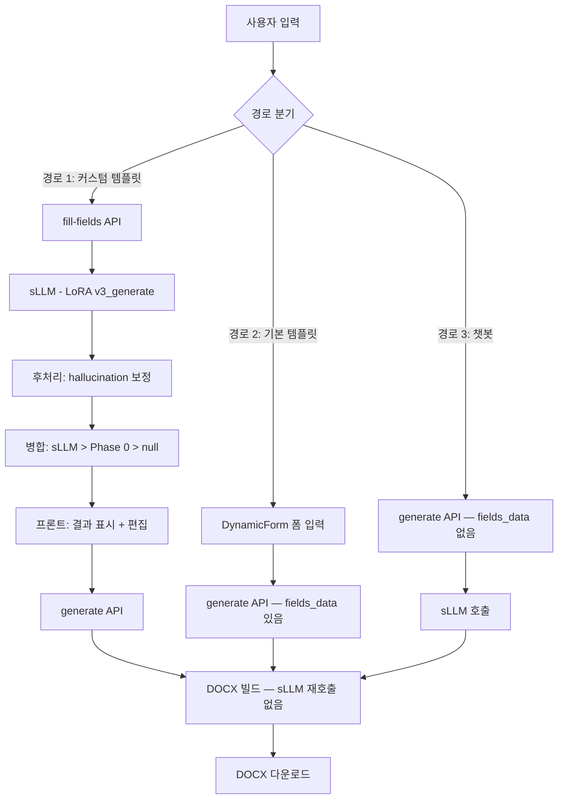
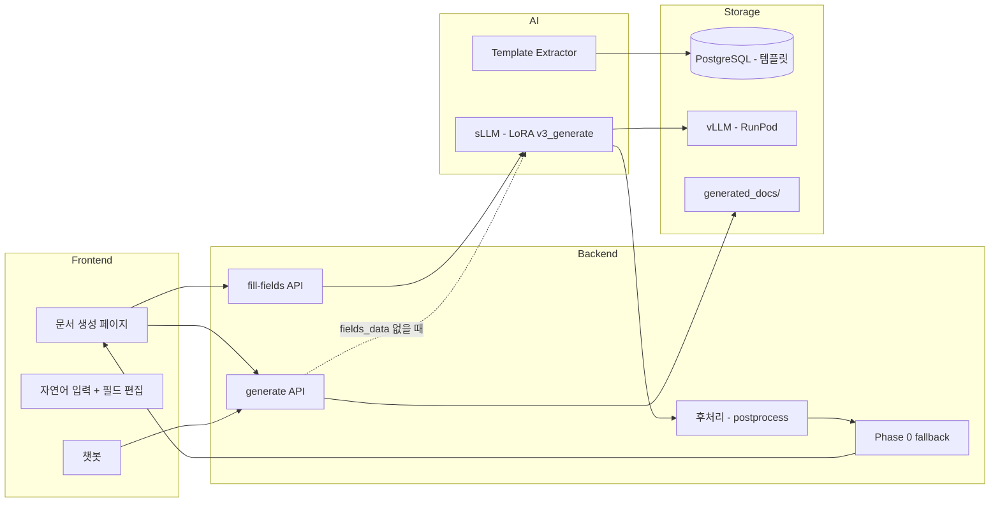

# 문서 생성 기능 (Template System)

> 사용자가 자연어를 입력하면, sLLM(LoRA)이 양식의 필드를 자동으로 채워 DOCX 문서를 생성한다.

---

## 1. 핵심 구성요소

| 구성요소 | 역할 | 기술 |
|---------|------|------|
| Template Extractor | DOCX 양식에서 필드 자동 추출 | python-docx, 규칙 기반 |
| sLLM (LoRA v3_generate) | 자연어 → JSON 필드 채우기 | Kanana 1.5 8B + LoRA, vLLM |
| Phase 0 | 날짜/담당자 등 규칙 기반 fallback | Python datetime, User 객체 |
| 후처리 (Postprocess) | hallucination 보정 | 날짜 연도 검증, 빈값 보충 |
| DOCX Builder | JSON → DOCX 파일 생성 | python-docx |
| Frontend | 자연어 입력 + 결과 편집 UI | React, Zustand |

---

## 2. Template System

### 기본 템플릿 (System Template)

- **목적**: 회의록/보고서/제안서 3종 — 검증된 고정 양식
- **필드**: 영어 키 (`title`, `date`, `attendees`, `content`, ...)
- **DOCX 생성**: 전용 빌더 스크립트 (`create_meeting_minutes.py`, `create_report.py`, `create_proposal.py`)
- **사용 흐름**: 프론트 폼 입력(DynamicForm) → `/generate` API → fields_data 있으므로 sLLM 생략 → 전용 빌더 → DOCX

### 커스텀 템플릿 (Custom Template)

- **목적**: 사용자가 아무 DOCX 양식을 업로드 → 필드 자동 추출 → AI가 채움
- **필드**: 한글 키 (`제출처`, `제안배경`, `현황분석`, ...)  — 양식에서 동적 추출
- **DOCX 생성**: 범용 레이아웃 빌더 (`create_generic_document()`)
- **사용 흐름**: DOCX 업로드 → 필드 추출 → 자연어 입력 → `/fill-fields` → sLLM → 결과 편집 → `/generate` → DOCX

### 비교

| | 기본 템플릿 | 커스텀 템플릿 |
|---|---|---|
| 양식 | 우리가 만든 고정 양식 | 사용자가 업로드한 아무 DOCX |
| 필드 키 | 영어 (`title`, `date`) | 한글 (`제출처`, `제안배경`) |
| 필드 추출 | DB seed (고정) | `template_extractor.py` (자동) |
| sLLM 호출 | 사용자가 폼 입력 → `/generate`는 DOCX 빌드만 | `/fill-fields`에서 1회 → `/generate`는 DOCX 빌드만 |
| DOCX 빌더 | 전용 스크립트 (3종) | 범용 `create_generic_document()` |
| 프론트 UI | DynamicForm (폼 입력) | freeText → AI 채움 → 전체 필드 편집 |

---

## 3. 실제 흐름 (Pipeline)

### 커스텀 템플릿 파이프라인 (경로 1)

```
사용자 → 자연어 입력 → [AI 문서 작성] 클릭
                ↓
         fill-fields API
                ↓
      전체 필드를 sLLM에 전달
      (학습 형식 그대로, 정규화 없음)
                ↓
      후처리: 날짜 hallucination → today 교체
              빈 담당자 → user.name 보충
                ↓
      병합: sLLM 결과 > Phase 0 fallback > null
                ↓
      프론트에 결과 표시 (AI/입력필요 태그)
      사용자가 확인 + 수정
                ↓
         [문서 생성] 클릭
                ↓
      generate API — fields_data 있으므로 sLLM 재호출 없음
                ↓
      범용 DOCX 빌더 → 다운로드
```

### 챗봇/기본 템플릿 파이프라인 (경로 2)

```
챗봇 대화 → "제안서 써줘" → generate API
                ↓
      fields_data 없음 → sLLM 호출 (필드 생성)
                ↓
      DOCX 빌더 → 다운로드
```

### Flowchart



---

## 4. 시스템 아키텍처



### 데이터 흐름

| 단계 | 입력 | 처리 | 출력 |
|------|------|------|------|
| 업로드 | DOCX 양식 파일 | `extract_template_fields()` | fields (키, 라벨, type, group) → DB |
| 필드 채우기 | 자연어 텍스트 | sLLM + Phase 0 + 후처리 | `{필드키: 값}` JSON |
| 문서 생성 | fields_data JSON | `create_generic_document()` | DOCX 파일 |

---

## 5. 완료된 기능

- [x] DOCX 양식 필드 자동 추출 (`template_extractor.py` v3)
- [x] sLLM(LoRA v3_generate)으로 전체 필드 생성
- [x] 구어체/불릿/형식체 모두 지원 (정규화 불필요)
- [x] Phase 0 fallback (날짜→today, 담당자→user.name, 부서→user.team)
- [x] hallucination 후처리 (날짜 연도 보정, 빈 담당자 보충)
- [x] fill-fields → generate 경로 분리 (fields_data 있으면 DOCX만, 없으면 sLLM 호출)
- [x] 한글 키 DOCX 매칭 (`_find_data_key` — 추출기 정규화 재사용)
- [x] 배열 데이터 테이블 행 주입 (`_inject_array_to_table`)
- [x] 범용 DOCX 레이아웃 빌더 (`create_generic_document`)
- [x] 프론트: 자연어 입력 → AI 채움 → 전체 필드 편집 → DOCX 생성
- [x] E2E 테스트 (Playwright + API)

---

## 6. 해결해야 할 문제

### 기술적 문제

| 문제 | 왜 문제인가 | 영향 |
|------|-----------|------|
| **sLLM 15개 이상 필드에서 meta 추출 약화** | 학습 데이터가 6~10개 필드 기준. 17개 보내면 meta(날짜/이름) 추출률 급락 | 제안서(17필드)에서 제출처/제안사 못 채움 → 사용자가 직접 입력 |
| **날짜 hallucination** | sLLM이 학습 데이터의 날짜(2023년)를 그대로 출력 | 후처리로 보정 중이나 "제안기간" 같은 자유 형식 날짜는 못 잡음 |
| **sLLM cold start 60초** | RunPod 서버리스 환경, warm pool 미설정 | 첫 호출 시 사용자 대기 시간 길어짐 |

### UX 문제

| 문제 | 왜 문제인가 |
|------|-----------|
| **범용 DOCX 레이아웃 품질** | 기본 템플릿(전용 빌더) 대비 완성도 낮음. 섹션 간 빈 공간, 배열 렌더링 등 개선 필요 |
| **"입력 필요" 필드 안내 부족** | sLLM이 못 채운 필드가 뭔지는 표시되지만, 왜 못 채웠는지 사용자가 모름 |
| **짧은 입력(3줄 이하) 시 body 0개** | 최소 입력 가이드 없이 빈 결과 반환 → 사용자 혼란 |

### 확장성 문제

| 문제 | 왜 문제인가 |
|------|-----------|
| **기본/커스텀 키 체계 이원화** | 기본(영어 키) vs 커스텀(한글 키) — `_find_data_key`로 양쪽 호환하지만 코드 복잡도 증가 |
| **원본 양식 레이아웃 보존 불가** | 현재 범용 레이아웃으로 대체. 사용자의 원본 디자인(로고, 특수 레이아웃) 유지 못 함 |
| **문서 유형 확장** | 회의록/보고서/제안서 외 계약서, 인사문서 등은 sLLM 학습 데이터 없음 |

---

## 7. 향후 발전 방향

1. **sLLM 학습 데이터 보강** — 구어체 입력 + 다양한 필드 수(12~20개) 샘플 추가
2. **원본 양식 채우기 고도화** — 복합 테이블, 병합 셀, 플레이스홀더 처리 개선
3. **챗봇 연동** — "제안서 써줘" → 정보 부족 시 2턴 대화로 meta 수집 → 생성
4. **키 체계 통일** — 기본 템플릿도 한글 키로 전환, DOCX 빌더 리팩토링
5. **RunPod warm pool** — cold start 60초 → 5초 이하로 단축
