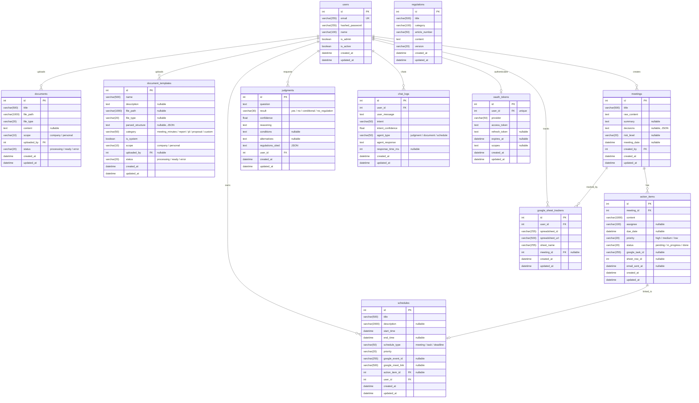

# WorkFlow Agent — ERD (Entity Relationship Diagram)

> 11개 테이블 | PostgreSQL 16 | Alembic 마이그레이션 적용 완료

## 테이블 관계 요약

| FK | From | To | 관계 |
|----|------|----|------|
| `documents.uploaded_by` | documents | users | N:1 |
| `document_templates.uploaded_by` | document_templates | users | N:1 (nullable) |
| `meetings.created_by` | meetings | users | N:1 |
| `action_items.meeting_id` | action_items | meetings | N:1 |
| `schedules.user_id` | schedules | users | N:1 |
| `schedules.action_item_id` | schedules | action_items | N:1 (nullable) |
| `judgments.user_id` | judgments | users | N:1 |
| `chat_logs.user_id` | chat_logs | users | N:1 |
| `oauth_tokens.user_id` | oauth_tokens | users | 1:1 |
| `google_sheet_trackers.user_id` | google_sheet_trackers | users | N:1 |
| `google_sheet_trackers.meeting_id` | google_sheet_trackers | meetings | N:1 (nullable) |

## 독립 테이블

| 테이블 | 설명 |
|--------|------|
| `regulations` | FK 없음 — RAG 검색 대상, 별도 임베딩 |
