# WorkFlow Agent — ERD (Entity Relationship Diagram)

> 11개 테이블 | PostgreSQL 16 | Alembic Rev: `ff4b6e2ab2e5`

---

## ER Diagram

```mermaid
erDiagram
    users {
        int id PK "AUTO INCREMENT"
        varchar email UK "NOT NULL, INDEX"
        varchar hashed_password "NOT NULL"
        varchar name "NOT NULL"
        boolean is_admin "DEFAULT false"
        boolean is_active "DEFAULT true"
        datetime created_at "server_default now()"
        datetime updated_at "server_default now(), onupdate"
    }

    documents {
        int id PK "AUTO INCREMENT"
        varchar title "NOT NULL"
        varchar file_path "NOT NULL"
        varchar file_type "NOT NULL (pdf/docx/txt)"
        text content "NULLABLE"
        varchar scope "DEFAULT company"
        int uploaded_by FK "NOT NULL → users.id"
        varchar status "DEFAULT processing"
        datetime created_at "server_default now()"
        datetime updated_at "server_default now(), onupdate"
    }

    document_templates {
        int id PK "AUTO INCREMENT"
        varchar name "NOT NULL"
        text description "NULLABLE"
        varchar file_path "NULLABLE"
        varchar file_type "NULLABLE (docx/pdf)"
        text parsed_structure "NULLABLE, JSON"
        varchar category "DEFAULT custom"
        boolean is_system "DEFAULT false"
        varchar scope "DEFAULT company"
        int uploaded_by FK "NULLABLE → users.id"
        varchar status "DEFAULT ready"
        datetime created_at "server_default now()"
        datetime updated_at "server_default now(), onupdate"
    }

    regulations {
        int id PK "AUTO INCREMENT"
        varchar title "NOT NULL"
        varchar category "NOT NULL"
        varchar article_number "NOT NULL"
        text content "NOT NULL"
        varchar version "DEFAULT 1.0"
        datetime created_at "server_default now()"
        datetime updated_at "server_default now(), onupdate"
    }

    meetings {
        int id PK "AUTO INCREMENT"
        varchar title "NOT NULL"
        text raw_content "NOT NULL"
        text summary "NULLABLE"
        jsonb decisions "NULLABLE"
        varchar risk_level "NULLABLE"
        datetime meeting_date "NULLABLE"
        int created_by FK "NOT NULL → users.id"
        datetime created_at "server_default now()"
        datetime updated_at "server_default now(), onupdate"
    }

    action_items {
        int id PK "AUTO INCREMENT"
        int meeting_id FK "NOT NULL → meetings.id"
        varchar content "NOT NULL"
        varchar assignee "NULLABLE, 표시용"
        int assignee_id FK "NULLABLE → users.id"
        datetime due_date "NULLABLE"
        varchar priority "DEFAULT medium"
        varchar status "DEFAULT pending"
        varchar google_task_id "NULLABLE"
        int sheet_row_id "NULLABLE"
        datetime email_sent_at "NULLABLE"
        datetime created_at "server_default now()"
        datetime updated_at "server_default now(), onupdate"
    }

    schedules {
        int id PK "AUTO INCREMENT"
        varchar title "NOT NULL"
        varchar description "NULLABLE"
        datetime start_time "NOT NULL"
        datetime end_time "NULLABLE"
        varchar schedule_type "NOT NULL"
        varchar priority "DEFAULT medium"
        varchar google_event_id "NULLABLE"
        varchar google_meet_link "NULLABLE"
        int action_item_id FK "NULLABLE → action_items.id"
        int user_id FK "NOT NULL → users.id"
        datetime created_at "server_default now()"
        datetime updated_at "server_default now(), onupdate"
    }

    judgments {
        int id PK "AUTO INCREMENT"
        text question "NOT NULL"
        varchar result "NOT NULL"
        float confidence "NOT NULL"
        text reasoning "NOT NULL"
        text conditions "NULLABLE"
        text alternatives "NULLABLE"
        jsonb regulations_cited "NOT NULL"
        int user_id FK "NOT NULL → users.id"
        datetime created_at "server_default now()"
        datetime updated_at "server_default now(), onupdate"
    }

    chat_logs {
        int id PK "AUTO INCREMENT"
        varchar session_id "NOT NULL, INDEX"
        int user_id FK "NOT NULL → users.id"
        text user_message "NOT NULL"
        varchar intent "NOT NULL"
        float intent_confidence "NOT NULL"
        varchar agent_type "NOT NULL"
        text agent_response "NOT NULL"
        int response_time_ms "NULLABLE"
        datetime created_at "server_default now()"
        datetime updated_at "server_default now(), onupdate"
    }

    oauth_tokens {
        int id PK "AUTO INCREMENT"
        int user_id FK "NOT NULL, UNIQUE → users.id"
        varchar provider "NOT NULL"
        text access_token "NOT NULL, 암호화"
        text refresh_token "NULLABLE"
        datetime expires_at "NULLABLE"
        text scopes "NULLABLE, 콤마구분"
        datetime created_at "server_default now()"
        datetime updated_at "server_default now(), onupdate"
    }

    google_sheet_trackers {
        int id PK "AUTO INCREMENT"
        int user_id FK "NOT NULL → users.id"
        varchar spreadsheet_id "NOT NULL"
        varchar spreadsheet_url "NOT NULL"
        varchar sheet_name "DEFAULT Action Items"
        int meeting_id FK "NULLABLE → meetings.id"
        datetime created_at "server_default now()"
        datetime updated_at "server_default now(), onupdate"
    }

    %% === Relationships ===
    users ||--o{ documents : "uploads"
    users ||--o{ document_templates : "uploads"
    users ||--o{ meetings : "creates"
    users ||--o{ schedules : "owns"
    users ||--o{ judgments : "requests"
    users ||--o{ chat_logs : "chats"
    users ||--o| oauth_tokens : "authenticates"
    users ||--o{ google_sheet_trackers : "tracks"
    users ||--o{ action_items : "assigned_to"

    meetings ||--o{ action_items : "has"
    meetings ||--o{ google_sheet_trackers : "tracked_by"

    action_items ||--o| schedules : "linked_to"
```



---

## 테이블별 상세

### 1. users — 사용자

| 컬럼 | 타입 | 제약 | 기본값 | 설명 |
|------|------|------|--------|------|
| id | INTEGER | PK, AUTO INCREMENT | - | |
| email | VARCHAR(255) | NOT NULL, UNIQUE, INDEX | - | 로그인 ID |
| hashed_password | VARCHAR(255) | NOT NULL | - | bcrypt 해시 |
| name | VARCHAR(100) | NOT NULL | - | 표시 이름 |
| is_admin | BOOLEAN | NOT NULL | `false` | 관리자 여부 |
| is_active | BOOLEAN | NOT NULL | `true` | 활성 상태 |
| created_at | DATETIME | NOT NULL | `now()` | |
| updated_at | DATETIME | NOT NULL | `now()` | 자동 갱신 |

### 2. documents — 업로드 문서

| 컬럼 | 타입 | 제약 | 기본값 | 설명 |
|------|------|------|--------|------|
| id | INTEGER | PK, AUTO INCREMENT | - | |
| title | VARCHAR(500) | NOT NULL | - | 문서 제목 |
| file_path | VARCHAR(1000) | NOT NULL | - | 저장 경로 (S3 or local) |
| file_type | VARCHAR(20) | NOT NULL | - | `pdf` / `docx` / `txt` |
| content | TEXT | NULLABLE | - | 추출된 텍스트 (파싱 완료 후) |
| scope | VARCHAR(10) | NOT NULL | `company` | `company` / `personal` |
| uploaded_by | INTEGER | FK → users.id | - | 업로더 |
| status | VARCHAR(20) | NOT NULL | `processing` | `processing` / `ready` / `error` |
| created_at | DATETIME | NOT NULL | `now()` | |
| updated_at | DATETIME | NOT NULL | `now()` | 자동 갱신 |

### 3. document_templates — 문서 템플릿

| 컬럼 | 타입 | 제약 | 기본값 | 설명 |
|------|------|------|--------|------|
| id | INTEGER | PK, AUTO INCREMENT | - | |
| name | VARCHAR(500) | NOT NULL | - | 템플릿 이름 |
| description | TEXT | NULLABLE | - | 설명 |
| file_path | VARCHAR(1000) | NULLABLE | - | 업로드 파일 경로 |
| file_type | VARCHAR(20) | NULLABLE | - | `docx` / `pdf` |
| parsed_structure | TEXT | NULLABLE | - | AI 추출 양식 구조 (JSON) |
| category | VARCHAR(50) | NOT NULL | `custom` | `meeting_minutes` / `report` / `jd` / `proposal` / `custom` |
| is_system | BOOLEAN | NOT NULL | `false` | `true` = 기본 제공 4종 |
| scope | VARCHAR(10) | NOT NULL | `company` | `company` / `personal` |
| uploaded_by | INTEGER | FK → users.id, NULLABLE | - | 시스템 템플릿은 NULL |
| status | VARCHAR(20) | NOT NULL | `ready` | `processing` / `ready` / `error` |
| created_at | DATETIME | NOT NULL | `now()` | |
| updated_at | DATETIME | NOT NULL | `now()` | 자동 갱신 |

### 4. regulations — 규정 문서

| 컬럼 | 타입 | 제약 | 기본값 | 설명 |
|------|------|------|--------|------|
| id | INTEGER | PK, AUTO INCREMENT | - | |
| title | VARCHAR(500) | NOT NULL | - | 규정명 |
| category | VARCHAR(100) | NOT NULL | - | `정보보안` / `인사` / `개발 가이드라인` 등 |
| article_number | VARCHAR(50) | NOT NULL | - | 조항 번호 (예: 제3조 2항) |
| content | TEXT | NOT NULL | - | 조항 본문 |
| version | VARCHAR(20) | NOT NULL | `1.0` | 규정 버전 |
| created_at | DATETIME | NOT NULL | `now()` | |
| updated_at | DATETIME | NOT NULL | `now()` | 자동 갱신 |

> FK 없음 — RAG 파이프라인(Qdrant + BM25)에서 별도 임베딩하여 검색

### 5. meetings — 회의

| 컬럼 | 타입 | 제약 | 기본값 | 설명 |
|------|------|------|--------|------|
| id | INTEGER | PK, AUTO INCREMENT | - | |
| title | VARCHAR(500) | NOT NULL | - | 회의 제목 |
| raw_content | TEXT | NOT NULL | - | 원본 회의 내용 |
| summary | TEXT | NULLABLE | - | AI 요약 결과 |
| decisions | **JSONB** | NULLABLE | - | 결정사항 (DB 레벨 JSON 쿼리 가능) |
| risk_level | VARCHAR(20) | NULLABLE | - | `높음` / `중간` / `낮음` |
| meeting_date | DATETIME | NULLABLE | - | 회의 일시 |
| created_by | INTEGER | FK → users.id | - | 작성자 |
| created_at | DATETIME | NOT NULL | `now()` | |
| updated_at | DATETIME | NOT NULL | `now()` | 자동 갱신 |

**decisions JSONB 구조:**
```json
["MFA 도입 결정", "보안 교육 분기별 실시", "외부 감사 추진"]
```

### 6. action_items — 액션 아이템

| 컬럼 | 타입 | 제약 | 기본값 | 설명 |
|------|------|------|--------|------|
| id | INTEGER | PK, AUTO INCREMENT | - | |
| meeting_id | INTEGER | FK → meetings.id | - | 소속 회의 |
| content | VARCHAR(1000) | NOT NULL | - | 할 일 내용 |
| assignee | VARCHAR(100) | NULLABLE | - | 담당자 표시 이름 (외부인 포함) |
| assignee_id | INTEGER | **FK → users.id, NULLABLE** | - | 내부 사용자 FK (외부인은 NULL) |
| due_date | DATETIME | NULLABLE | - | 기한 |
| priority | VARCHAR(20) | NOT NULL | `medium` | `high` / `medium` / `low` |
| status | VARCHAR(20) | NOT NULL | `pending` | `pending` / `in_progress` / `done` |
| google_task_id | VARCHAR(255) | NULLABLE | - | Google Tasks 연동 ID |
| sheet_row_id | INTEGER | NULLABLE | - | Google Sheets 행 번호 |
| email_sent_at | DATETIME | NULLABLE | - | 알림 메일 발송 시각 |
| created_at | DATETIME | NOT NULL | `now()` | |
| updated_at | DATETIME | NOT NULL | `now()` | 자동 갱신 |

> `assignee`(문자열) = 외부인 포함 표시용, `assignee_id`(FK) = 내부 사용자 조회용

### 7. schedules — 일정

| 컬럼 | 타입 | 제약 | 기본값 | 설명 |
|------|------|------|--------|------|
| id | INTEGER | PK, AUTO INCREMENT | - | |
| title | VARCHAR(500) | NOT NULL | - | 일정 제목 |
| description | VARCHAR(2000) | NULLABLE | - | 상세 설명 |
| start_time | DATETIME | NOT NULL | - | 시작 시각 |
| end_time | DATETIME | NULLABLE | - | 종료 시각 |
| schedule_type | VARCHAR(50) | NOT NULL | - | `meeting` / `task` / `deadline` |
| priority | VARCHAR(20) | NOT NULL | `medium` | 우선순위 |
| google_event_id | VARCHAR(255) | NULLABLE | - | Google Calendar 이벤트 ID |
| google_meet_link | VARCHAR(500) | NULLABLE | - | Google Meet 링크 |
| action_item_id | INTEGER | FK → action_items.id, NULLABLE | - | 연결된 액션 아이템 |
| user_id | INTEGER | FK → users.id | - | 소유자 |
| created_at | DATETIME | NOT NULL | `now()` | |
| updated_at | DATETIME | NOT NULL | `now()` | 자동 갱신 |

### 8. judgments — 판단 이력

| 컬럼 | 타입 | 제약 | 기본값 | 설명 |
|------|------|------|--------|------|
| id | INTEGER | PK, AUTO INCREMENT | - | |
| question | TEXT | NOT NULL | - | 사용자 질문 |
| result | VARCHAR(30) | NOT NULL | - | `yes` / `no` / `conditional` / `no_regulation` |
| confidence | FLOAT | NOT NULL | - | 판단 신뢰도 (0.0~1.0) |
| reasoning | TEXT | NOT NULL | - | 판단 근거 |
| conditions | TEXT | NULLABLE | - | 조건부 판단 시 조건 |
| alternatives | TEXT | NULLABLE | - | 대안 제시 |
| regulations_cited | **JSONB** | NOT NULL | - | 참조 규정 (DB 레벨 JSON 쿼리 가능) |
| user_id | INTEGER | FK → users.id | - | 질문자 |
| created_at | DATETIME | NOT NULL | `now()` | |
| updated_at | DATETIME | NOT NULL | `now()` | 자동 갱신 |

**regulations_cited JSONB 구조:**
```json
[
  {"title": "정보보안 규정", "article": "제15조 3항", "content": "..."},
  {"title": "개인정보 처리방침", "article": "제8조", "content": "..."}
]
```

### 9. chat_logs — 채팅 로그

| 컬럼 | 타입 | 제약 | 기본값 | 설명 |
|------|------|------|--------|------|
| id | INTEGER | PK, AUTO INCREMENT | - | |
| session_id | VARCHAR(50) | **NOT NULL, INDEX** | - | 대화 세션 UUID (스레드 구분용) |
| user_id | INTEGER | FK → users.id | - | 사용자 |
| user_message | TEXT | NOT NULL | - | 사용자 입력 |
| intent | VARCHAR(50) | NOT NULL | - | 분류된 Intent |
| intent_confidence | FLOAT | NOT NULL | - | Intent 신뢰도 (0.0~1.0) |
| agent_type | VARCHAR(50) | NOT NULL | - | `judgment` / `document` / `schedule` |
| agent_response | TEXT | NOT NULL | - | Agent 응답 |
| response_time_ms | INTEGER | NULLABLE | - | 응답 소요시간 (밀리초) |
| created_at | DATETIME | NOT NULL | `now()` | |
| updated_at | DATETIME | NOT NULL | `now()` | 자동 갱신 |

> `session_id`로 같은 대화 스레드 그룹핑 → "이전 대화 목록" UI 구현 가능

**Intent 종류 (7개):**
`judgment` / `doc_generate` / `doc_search` / `meeting_generate` / `schedule_add` / `schedule_view` / `general`

### 10. oauth_tokens — OAuth 토큰

| 컬럼 | 타입 | 제약 | 기본값 | 설명 |
|------|------|------|--------|------|
| id | INTEGER | PK, AUTO INCREMENT | - | |
| user_id | INTEGER | FK → users.id, UNIQUE | - | 사용자당 1개 |
| provider | VARCHAR(50) | NOT NULL | - | `google` |
| access_token | TEXT | NOT NULL | - | 암호화 저장 |
| refresh_token | TEXT | NULLABLE | - | 갱신 토큰 |
| expires_at | DATETIME | NULLABLE | - | 만료 시각 |
| scopes | TEXT | NULLABLE | - | 콤마 구분 (예: `calendar,tasks,gmail_send,sheets`) |
| created_at | DATETIME | NOT NULL | `now()` | |
| updated_at | DATETIME | NOT NULL | `now()` | 자동 갱신 |

### 11. google_sheet_trackers — 스프레드시트 추적

| 컬럼 | 타입 | 제약 | 기본값 | 설명 |
|------|------|------|--------|------|
| id | INTEGER | PK, AUTO INCREMENT | - | |
| user_id | INTEGER | FK → users.id | - | 소유자 |
| spreadsheet_id | VARCHAR(255) | NOT NULL | - | Google Sheets ID |
| spreadsheet_url | VARCHAR(500) | NOT NULL | - | 시트 URL |
| sheet_name | VARCHAR(255) | NOT NULL | `Action Items` | 시트 탭 이름 |
| meeting_id | INTEGER | FK → meetings.id, NULLABLE | - | 연결된 회의 |
| created_at | DATETIME | NOT NULL | `now()` | |
| updated_at | DATETIME | NOT NULL | `now()` | 자동 갱신 |

---

## FK 관계 요약

| FK 컬럼 | From 테이블 | To 테이블 | 관계 | 비고 |
|---------|------------|----------|------|------|
| `uploaded_by` | documents | users | N:1 | NOT NULL |
| `uploaded_by` | document_templates | users | N:1 | NULLABLE (시스템 템플릿) |
| `created_by` | meetings | users | N:1 | NOT NULL |
| `meeting_id` | action_items | meetings | N:1 | NOT NULL |
| `assignee_id` | action_items | users | N:1 | NULLABLE (외부인은 NULL) |
| `user_id` | schedules | users | N:1 | NOT NULL |
| `action_item_id` | schedules | action_items | N:1 | NULLABLE |
| `user_id` | judgments | users | N:1 | NOT NULL |
| `user_id` | chat_logs | users | N:1 | NOT NULL |
| `user_id` | oauth_tokens | users | 1:1 | UNIQUE |
| `user_id` | google_sheet_trackers | users | N:1 | NOT NULL |
| `meeting_id` | google_sheet_trackers | meetings | N:1 | NULLABLE |

---

## Agent ↔ 테이블 매핑

| Agent | READ | WRITE | 테이블 |
|-------|:----:|:-----:|--------|
| **Orchestrator** (지용) | O | O | `chat_logs` |
| **Judgment Agent** (경은) | O | O | `judgments`, `regulations` (READ only) |
| **Document Agent** (승언) | O | O | `documents`, `document_templates`, `meetings` |
| **Schedule Agent** (혜빈) | O | O | `schedules`, `action_items`, `oauth_tokens`, `google_sheet_trackers` |
| **Auth** (혜빈) | O | O | `users`, `oauth_tokens` |

---

## 인덱스

| 테이블 | 컬럼 | 타입 |
|--------|------|------|
| users | email | UNIQUE INDEX |
| chat_logs | session_id | INDEX |
| oauth_tokens | user_id | UNIQUE CONSTRAINT |

---

## 변경 이력

| 날짜 | Alembic Rev | 변경 내용 |
|------|-------------|----------|
| 2026-02-11 | `77cfec3c68a0` | Initial tables — 11개 테이블 생성 |
| 2026-02-11 | `ff4b6e2ab2e5` | session_id 추가, assignee_id FK 추가, TEXT→JSONB 변경 |
