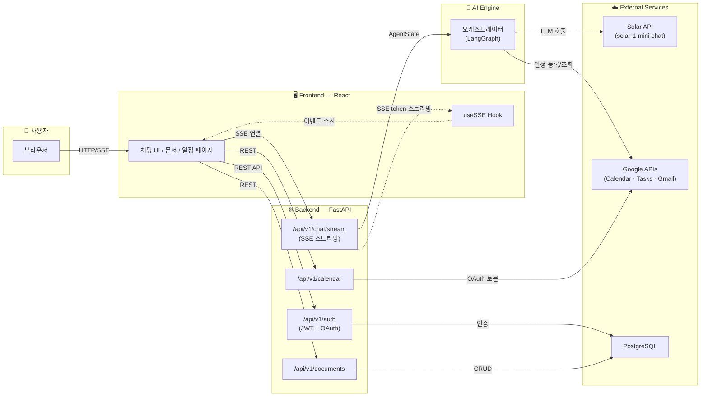
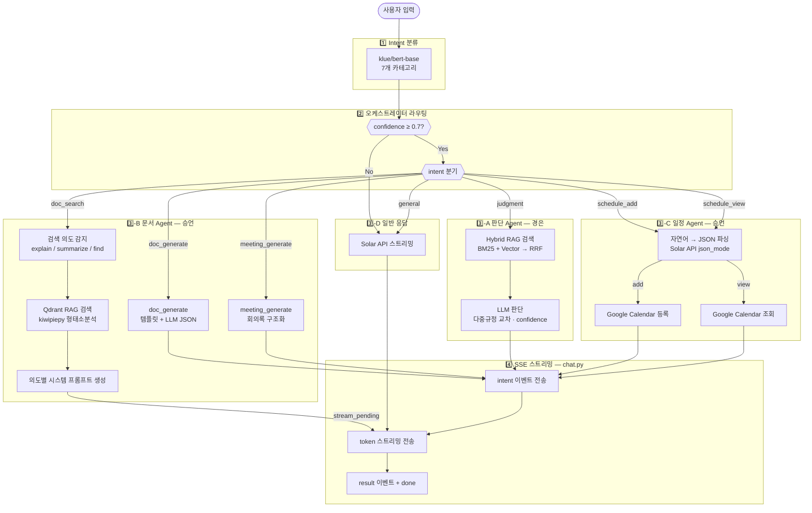

# WorkFlow Agent (듀듀) — 멘토링 현황 보고

> 2026-02-15 (토) | PM 신지용

---

## 1. 프로젝트 개요

**한 줄 소개**: 사내 규정 판단 + 문서 자동 생성 + 일정 관리를 하나의 AI 챗봇으로 통합한 업무 지원 에이전트

**핵심 기능 3가지**:
1. **규정 판단** — 사내 규정을 RAG로 검색하고, LLM이 근거 기반 판단 + confidence 점수 제공
2. **문서 자동 생성** — 회의록/보고서/JD/제안서 템플릿 기반 AI 작성, 문서 요약/검색
3. **일정 관리** — Google Calendar/Tasks/Gmail/Sheets 양방향 동기화, AI 일정 제안

---

## 2. 팀 구성

| 이름 | 역할 | 담당 영역 |
|------|------|-----------|
| 신지용 | **PM** | Intent 분류, 오케스트레이터, 프로젝트 관리 |
| 윤경은 | AI 서브 | RAG 파이프라인, 판단 Agent, LLM API 모듈 |
| 진승언 | AI 리드 | 문서 Agent, Docling 파서, 템플릿 시스템 |
| 안혜빈 | Backend | DB, 인증, Google Services, 문서 API |
| 문지영 | Frontend | React UI 전체 (10페이지, 63컴포넌트) |

---

## 3. 기술 스택 & 아키텍처

| 영역 | 기술 |
|------|------|
| AI/ML | LangGraph, GPT/Claude API (현재), ChromaDB + BM25 (Hybrid RAG + RRF), kiwipiepy 형태소분석 |
| Intent 분류 | klue/bert-base 파인튜닝 (Eval F1 98.63%, Adv F1 91.67%) |
| sLLM (예정) | Kanana-1.5-8B + LoRA → vLLM 서빙 |
| Backend | FastAPI + SSE, PostgreSQL 16, SQLAlchemy + Alembic, JWT + AES-256, Google OAuth 2.0 |
| Frontend | React (Vite), Zustand, Tailwind + shadcn/ui, FullCalendar, framer-motion |
| Infra | Docker, GitHub Actions, AWS (EC2 + S3 + RDS) 예정 |

**아키텍처 흐름**:
```
사용자 입력 → Intent 분류 (BERT) → 오케스트레이터 (LangGraph)
  ├─ judgment  → RAG 검색 → LLM 판단 → 구조화 JSON 응답
  ├─ doc_*     → 문서 Agent → RAG 검색 → 의도별 응답 (SSE 스트리밍)
  └─ schedule  → 일정 Agent → 자연어 파싱 → Google Calendar 연동
```

### 외부 시스템 흐름 (사용자 관점)

> 사용자 → 프론트엔드 → 백엔드 → AI 엔진 → 외부 서비스



### 내부 시스템 흐름 (AI 엔진 상세)

> Intent 분류 → 조건부 라우팅 → Agent별 처리 파이프라인



### README 아키텍처 vs 현재 코드 (PR #46 반영)

| # | 항목 | README (설계 목표) | 현재 코드 | 비고 |
|---|------|-------------------|-----------|------|
| 1 | RAG Reranker | `bge-reranker-v2-m3` → Top 5 | Qdrant 파이프라인에서 **비활성화**, RRF로 대체 | 성능 병목(~15초). `reranker.py` 존재, 경은 파이프라인은 사용 중. 최종 판단은 경은 |
| 2 | 형태소 분석 | 언급 없음 | `kiwipiepy` 도입 | 신규 추가. README 반영 필요 |
| 3 | 일정 Agent | 혜빈 담당 | 승언이 AI 로직 구현, 혜빈은 Google Services | 역할 분담 변경 |
| 4 | LLM API | GPT/Claude API | 테스트용 Solar API 사용 중 | **설계 유지** — Solar는 임시, GPT/Claude 전환 예정 |
| 5 | 문서 Agent | 템플릿 렌더링/요약/검색 | `doc_search` SSE 완료, **템플릿 렌더링 미구현** (`render()`/`to_docx()`/`to_pdf()` 전부 TODO) | 검색은 고도화됨. 렌더링은 승언 작업 남음 |

> README 업데이트는 별도 작업으로 진행 예정 — 4번(LLM API)은 설계대로 유지

---

## 4. 개발 전략

**"LLM API 먼저 → sLLM은 나중에"**

```
[현재] GPT/Claude API로 전체 기능 구현 + 동작 확인
  → input/output 형태 확정
  → 확정된 형태로 데이터 수집 (4단계)
  → LoRA 파인튜닝 → sLLM(vLLM)으로 모델만 교체
```

- Agent 코드는 LLM 호출 인터페이스만 바꾸면 되는 구조 (#39 공통 모듈)
- sLLM 베이스 모델은 **Kanana-1.5-8B** 선정 완료 (벤치마크 1위)

---

## 5. 진행 현황 요약

### 마일스톤별 완료율

| 마일스톤 | 완료 | 전체 | 완료율 | 상태 |
|----------|------|------|--------|------|
| 1단계: 설계 및 환경 세팅 | 6 | 6 | **100%** | 완료 |
| 2단계: 기반 개발 + LLM API | 6 | 7 | **86%** | 진행 중 |
| 3단계: Agent 개발 + 핵심 기능 | 7 | 13 | **54%** | 진행 중 (핵심) |
| 4단계: 데이터 수집 + 파인튜닝 | 0 | 6 | 0% | 미착수 (계획대로) |
| 5단계: 통합 및 테스트 | 0 | 4 | 0% | 미착수 |
| 6단계: 배포 및 마무리 | 0 | 1 | 0% | 미착수 |
| **전체** | **19** | **37** | **51%** | — |

> 4단계(파인튜닝)는 전략상 기능 완성 후 진행 예정이므로, 실질 진행률은 **1~3단계 기준 19/26 = 73%**

### GitHub 이슈 현황 (2/14 기준)

- 전체 이슈: 41개 (테스트 1개 제외 40개)
- **Closed: 20개** / Open: 18개 (+ Epic 1, 테스트 1)

---

## 6. 팀원별 주요 성과

### 신지용 (PM)
- Intent 학습 데이터 1,868개 구축 (7카테고리, 3차 증강)
- BERT 파인튜닝 v1.0~v1.4 + 실험 5 (3모델 153회 그리드 서치)
- **최종 모델**: klue/bert-base, Eval F1 98.63%, Adversarial F1 91.67%
- 오케스트레이터 async 전환, main 브랜치 보호 설정

### 윤경은 (AI 서브)
- 3개 모델 벤치마크 → **Kanana-1.5-8B** 선정
- RAG 파이프라인 8파일 구현 (Hybrid Search + Reranker), 18개 테스트 PASSED
- 판단 Agent 고도화: 다중 규정 교차 판단, confidence 보정, SSE 스트리밍, **27개 테스트 PASSED**
- LLM API 공통 모듈 (GPT/Claude 양쪽 지원)

### 진승언 (AI 리드)
- Docling + PaddleOCR 텍스트 추출기 구현
- Document Agent: 검색 의도 감지 (설명/요약/찾기) + SSE 스트리밍
- Schedule Agent 구현: 자연어 → 구조화 파싱 → Google Calendar 등록/조회
- RAG 최적화: Qdrant 파이프라인에서 Reranker 비활성화 (30초→수초), kiwipiepy 도입, 모델 pre-loading
- doc_search 시스템 프롬프트 개선 + intent 우선순위 조정

### 안혜빈 (Backend)
- DB 11개 테이블 + Alembic 마이그레이션
- JWT 인증 + Google OAuth 소셜 로그인
- Google Services 4종 (Calendar/Tasks/Gmail/Sheets) 양방향 동기화
- 문서 업로드 API 11개 엔드포인트, 텍스트 추출 (PDF/DOCX/TXT)

### 문지영 (Frontend)
- **10개 페이지, 63개 컴포넌트** 전체 구현
- 다크 모드, 인쇄, 글씨 크기 조절, 드래그&드롭, 대화 세션 관리
- Google Calendar 실제 연동 (Mock 제거)
- ESLint 0 errors, 반응형 디자인, 접근성 개선

---

## 7. 현재 이슈 & 다음 단계

### 진행 중인 핵심 작업 (3단계)

| 이슈 | 담당 | 상태 |
|------|------|------|
| #6 오케스트레이터 + SSE | 지용 | async 전환 완료, SSE 연동 남음 |
| #17 문서 Agent 구현 | 승언 | doc_search 스트리밍 완료, 템플릿 시스템 남음 |
| #22 일정 Agent API | 승언/혜빈 | Schedule Agent 기본 구현 완료 (PR #46), 고도화 예정 |
| #40 document_agent LLM 연동 | 승언 | Solar API 스트리밍 연동 완료 (PR #46) |

### 알려진 이슈

- Google 로그인 500 에러 (프론트→백엔드 URL 불일치) → 혜빈/지영 수정 중
- eslint 버전 충돌 (@eslint/js@10 vs eslint@9) → `--legacy-peer-deps`로 우회 중
- Intent Classifier 모델 weights(423MB) → 로컬에만 존재, 팀 공유 방법 필요
- RAG Reranker 성능 병목(~15초) → Qdrant 파이프라인에서 **비활성화**, RRF 융합으로 대체 (PR #46). 경은 파이프라인은 Reranker 유지 중 — 최종 방향은 경은과 논의 필요
- RAG 형태소 분석기 konlpy → kiwipiepy 변경 (Java 의존성 제거)

### 2주 로드맵

```
2/15~2/19  3단계 마무리 (오케스트레이터, 문서 Agent, 일정 Agent)
           프론트-백엔드 실제 연동 (Mock → API 교체)
2/20~2/23  4단계 데이터 수집 + LoRA 파인튜닝 (판단 1,000건, 문서 1,700건)
           vLLM 서빙 환경 구축
2/24~2/26  5단계 E2E 통합 테스트, 성능 평가 리포트
2/27~      6단계 AWS 배포 + 최종 QA
```
